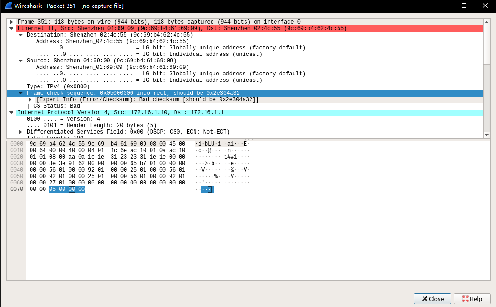
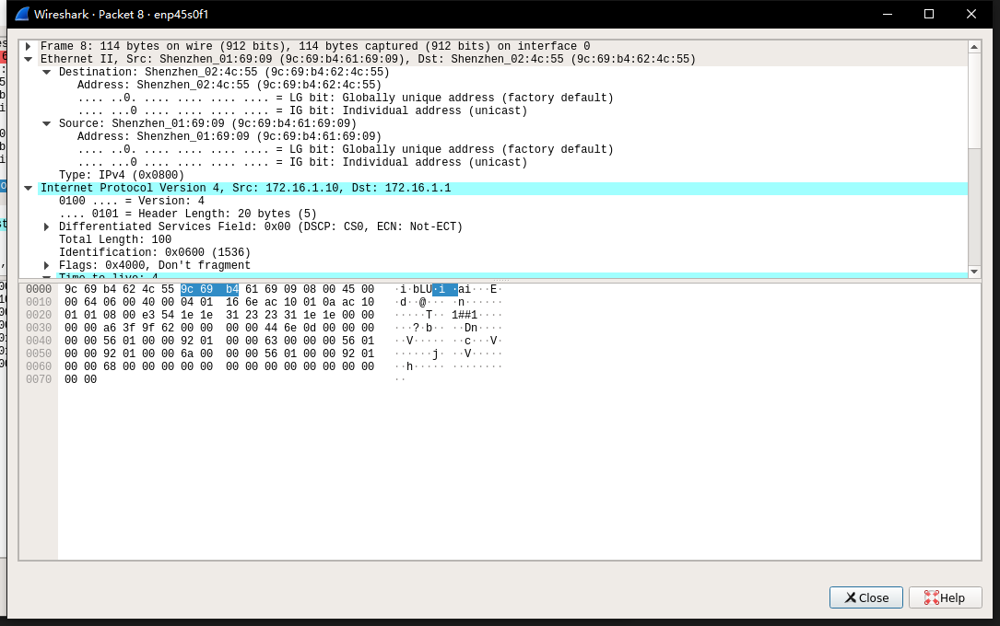
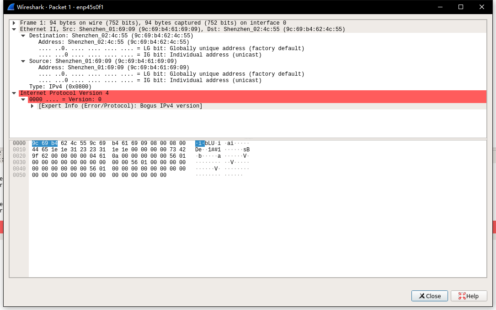

[toc]
# alloc_icmp_package函数修改

1. 删除没用的注释；
2. alloc_skb分配SKB数据大小改为只有data_len，不应该包含本身结构体的大小；
3. data_len大小改为2 + SIZE_MAC_HDR + SIZE_IP_HDR + SIZE_ICMP_HDR + sizeof(struct chkhdr);，去掉SIZE_FCS_HDR，在构造报文时，不需要包含此大小；
4. SKB中的data指针地址，要保证最后指在网络层头地址。

## FCS Status : Bad


这是由于之前构造代码时，添加了SIZE_FCS_HDR，导致wireshark误认为最后四个字节为FCS校验码，因此报错。去除生成的报文中的SIZE_FCS_HDR，即可生成正常的ICMP报文。


## bogus IPv4 version
在修改此函数时，误删除了一行代码，`skb_push(skb, SIZE_IP_HDR);`，在得到传输层的指针后，需要再添加上述代码，使`skb->data`指针再次移到网络层头所在的地址，具体原因未知。


修改了函数参数调用，之前函数参数调用为第一行，修改了link_info结构体，添加了icmp_seq变量做为ICMP中Seq参数传入。

``` c?linenums
skb = alloc_icmp_package(ch.code, ch.type, nic_list[k].ip, link_list[k].ip, &ch);
skb = alloc_icmp_package(ch.type, link_list[k].icmp_seq++, nic_list[k].ip, link_list[k].ip, &ch);
```