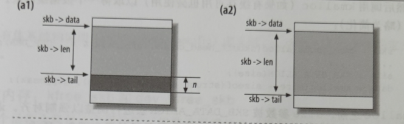
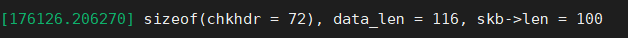

[toc]

# 管理函数
## skb_put

## skb_push

## skb_pull


## skb_reserve


# SK_Buff data和tail指针问题
网络报文真正发送的数据报文时data指针和tail指针中间的部分，即使head和data中间有空间，发送也不会去考虑

# SK_Buff中的len成员变量

``` c?linenums
skb->len = skb->data - skb->tail;
```

``` c?linenums
// data_len = 2 + 14 +20 + 8 + 72;
data_len =  2 + SIZE_MAC_HDR + SIZE_IP_HDR + SIZE_ICMP_HDR + sizeof(struct chkhdr);
// skb->len = 20+8+72 = 100
// 由于测试代码将data指针移到了网络层，因此不加上2和14字节。
```

