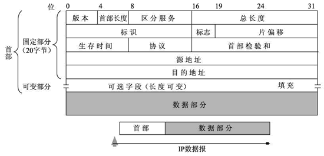

# 报文协议栈

# 以太网帧格式

# IP数据报格式

1) 版本（version）
占 4 位，表示 IP 协议的版本。通信双方使用的 IP 协议版本必须一致。目前广泛使用的IP协议版本号为 4，即 IPv4。
2) 首部长度（网际报头长度IHL）
占 4 位，可表示的最大十进制数值是 15。这个字段所表示数的单位是 32 位字长（1 个 32 位字长是 4 字节）。因此，当 IP 的首部长度为 1111 时（即十进制的 15），首部长度就达到 60 字节。当 IP 分组的首部长度不是 4 字节的整数倍时，必须利用最后的填充字段加以填充。数据部分永远在 4 字节的整数倍开始，这样在实现 IP 协议时较为方便。首部长度限制为 60 字节的缺点是，长度有时可能不够用，之所以限制长度为 60 字节，是希望用户尽量减少开销。最常用的首部长度就是 20 字节（即首部长度为 0101），这时不使用任何选项。
 3) 区分服务（tos）
也被称为服务类型，占 8 位，用来获得更好的服务。这个字段在旧标准中叫做服务类型，但实际上一直没有被使用过。1998 年 IETF 把这个字段改名为区分服务（Differentiated Services，DS）。只有在使用区分服务时，这个字段才起作用。
4) 总长度（totlen）
首部和数据之和，单位为字节。总长度字段为 16 位，因此数据报的最大长度为 2^16-1=65535 字节。
5) 标识（identification）
用来标识数据报，占 16 位。IP 协议在存储器中维持一个计数器。每产生一个数据报，计数器就加 1，并将此值赋给标识字段。当数据报的长度超过网络的 MTU，而必须分片时，这个标识字段的值就被复制到所有的数据报的标识字段中。具有相同的标识字段值的分片报文会被重组成原来的数据报。
6) 标志（flag）
占 3 位。第一位未使用，其值为 0。第二位称为 DF（不分片），表示是否允许分片。取值为 0 时，表示允许分片；取值为 1 时，表示不允许分片。第三位称为 MF（更多分片），表示是否还有分片正在传输，设置为 0 时，表示没有更多分片需要发送，或数据报没有分片。
7) 片偏移（offsetfrag）
占 13 位。当报文被分片后，该字段标记该分片在原报文中的相对位置。片偏移以 8 个字节为偏移单位。所以，除了最后一个分片，其他分片的偏移值都是 8 字节（64 位）的整数倍。
8) 生存时间（TTL）
表示数据报在网络中的寿命，占 8 位。该字段由发出数据报的源主机设置。其目的是防止无法交付的数据报无限制地在网络中传输，从而消耗网络资源。路由器在转发数据报之前，先把 TTL 值减 1。若 TTL 值减少到 0，则丢弃这个数据报，不再转发。因此，TTL 指明数据报在网络中最多可经过多少个路由器。TTL 的最大数值为 255。若把 TTL 的初始值设为 1，则表示这个数据报只能在本局域网中传送。 
9) 协议
表示该数据报文所携带的数据所使用的协议类型，占 8 位。该字段可以方便目的主机的 IP 层知道按照什么协议来处理数据部分。不同的协议有专门不同的协议号。例如，TCP 的协议号为 6，UDP 的协议号为 17，ICMP 的协议号为 1。
10) 首部检验和（checksum）
用于校验数据报的首部，占 16 位。数据报每经过一个路由器，首部的字段都可能发生变化（如TTL），所以需要重新校验。而数据部分不发生变化，所以不用重新生成校验值。
11) 源地址
表示数据报的源 IP 地址，占 32 位。
12) 目的地址
表示数据报的目的 IP 地址，占 32 位。该字段用于校验发送是否正确。
13) 可选字段
该字段用于一些可选的报头设置，主要用于测试、调试和安全的目的。这些选项包括严格源路由（数据报必须经过指定的路由）、网际时间戳（经过每个路由器时的时间戳记录）和安全限制。
14) 填充
由于可选字段中的长度不是固定的，使用若干个 0 填充该字段，可以保证整个报头的长度是 32 位的整数倍。
15) 数据部分
表示传输层的数据，如保存 TCP、UDP、ICMP 或 IGMP 的数据。数据部分的长度不固定。

# 引用
[TCP/IP协议入门教程](http://c.biancheng.net/tcp_ip/)