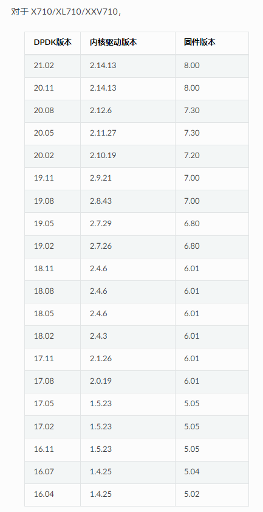
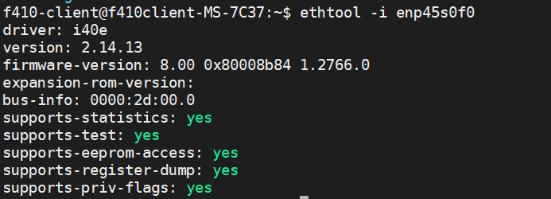

[toc]

# DPDK中CPU相关概念
##  lcore

指eal线程，采用pthread创建，并设置了CPU亲和性。我感觉dpdk把这个概念搞混淆了，有时指逻辑核，有时指线程。不过大部分是指线程。

## lcore_id 

逻辑核标识，可以通过top d1 或cat /proc/cpuinfo 看到的核，这种包括物理核和超线程的核，判断是否为超线程核，可以看/proc/cpuinfo文件中相应的核sibling是不是大于cpu cores，如果是则为超线程核，但超线程对于我们编程是透明的。在/proc/cpuinfo/中Physical id 和core id相同是超线程。

每个eal线程，会存储每线程变量RTE_PER_LCORE(_lcore_id) 存储逻辑核id. 设置亲和力，应该是lcore_id.

## core_id

该逻辑核在物理核中的标识，如果是超线程的话，core_id存在相同的情况。通过/sys/devices/system/cpu/cpuX/topology/core_id 可以看到，也可以通过/proc/cpuinfo中查到，前面一种便于编程。在线程的绑定CPU亲和性方面没有用。

## socket_id

在DPDK中不同于物理核的socket,应该是numa的标识。查看文件/sys/devices/system/nodeX/cpu.


# NIC initialization faild: eth_i40e_dev_init(): Failed to init adminq: -66 

## Check if the DPDK is compatible with the NIC

 1. [DPDK SUPPORTED HARDWARE](https://core.dpdk.org/supported/)
 2. [DPDK INTEL NIC](https://core.dpdk.org/supported/nics/intel/)
 3. [DPDK X710](https://doc.dpdk.org/guides/nics/i40e.html)



## select the appropriate DPDK,Driver and Firmware version

Since DPDK version 20.11(LTS) is selected,the driver version is 2.14.13 and firmware version is 8.00.

## download source code and insmod igb_uio
kernel: The module igb_uio has been moved to the git repository [dpdk-kmods](https://git.dpdk.org/dpdk-kmods/) in a new directory linux/igb_uio.

``` bash
sudo modprobe uio
sudo insmoigb_uio.ko
```
##  Intel® X710/XL710 Gigabit Ethernet Controller VF Infrastructure
In a virtualized environment, the programmer can enable a maximum of 128 Virtual Functions (VF) globally per Intel® X710/XL710 Gigabit Ethernet Controller NIC device. The Physical Function in host could be either configured by the Linux* i40e driver (in the case of the Linux Kernel-based Virtual Machine [KVM]) or by DPDK PMD PF driver. When using both DPDK PMD PF/VF drivers, the whole NIC will be taken over by DPDK based application.


``` bash
#  Using Linux* i40e driver
rmmod i40e (To remove the i40e module)
insmod i40e.ko max_vfs=2,2 (To enable two Virtual Functions per port)
```

``` bash
# Using the DPDK PMD PF i40e driver:
# Kernel Params: iommu=pt, intel_iommu=on

modprobe uio
insmod igb_uio
./dpdk-devbind.py -b igb_uio bb:ss.f
echo 2 > /sys/bus/pci/devices/0000\:bb\:ss.f/max_vfs (To enable two VFs on a specific PCI device)
```

Launch the DPDK testpmd/example or your own host daemon application using the DPDK PMD library.

Virtual Function enumeration is performed in the following sequence by the Linux* pci driver for a dual-port NIC. When you enable the four Virtual Functions with the above command, the four enabled functions have a Function# represented by (Bus#, Device#, Function#) in sequence starting from 0 to 3. However:

- Virtual Functions 0 and 2 belong to Physical Function 0
- Virtual Functions 1 and 3 belong to Physical Function 1

> Note:
> 
> The above is an important consideration to take into account when targeting specific packets to a selected port.
> 
> For Intel® X710/XL710 Gigabit Ethernet Controller, queues are in pairs. One queue pair means one receive queue and one transmit queue. The default number of queue pairs per VF is 4, and can be 16 in maximum.

https://doc.dpdk.org/guides-20.11/nics/intel_vf.html?highlight=x710

##  Modify IOMMU
Since the VFIO driver depends on the IOMMU,the boot parameters in grub need to be modified.

Check if iommu is running:

``` bash
$ cat /proc/cmdline | grep iommu=pt
$ cat /proc/cmdline | grep intel_iommu=on
```


# Running dpdk-pmdinfo.py shows No module named 'elftools'

``` bash
**root@f410client-MS-7C37:/home/f410-client/lzy/dpdk/dpdk-stable-20.11.4/usertools# ls
cpu_layout.py    dpdk-hugepages.py  dpdk-telemetry-client.py  meson.build
dpdk-devbind.py  dpdk-pmdinfo.py    dpdk-telemetry.py
root@f410client-MS-7C37:/home/f410-client/lzy/dpdk/dpdk-stable-20.11.4/usertools#
root@f410client-MS-7C37:/home/f410-client/lzy/dpdk/dpdk-stable-20.11.4/usertools# ./dpdk-pmdinfo.py -h
Traceback (most recent call last):
  File "./dpdk-pmdinfo.py", line 15, in <module>
    from elftools.common.exceptions import ELFError
ModuleNotFoundError: No module named 'elftools'**
```

The query shows that elftools is a module for python,so you have to download it with pip or pip3. But pip3 cannot locate the elftools module.

``` python

pip3 install pyelftools

```

# ERROR: Target does not have the DPDK UIO Kernel Module.  To fix, please try to rebuild target.

This is because the version of DPDK no longer provides igb_uio driver directly, you need to download source code and compile it before you can use it.