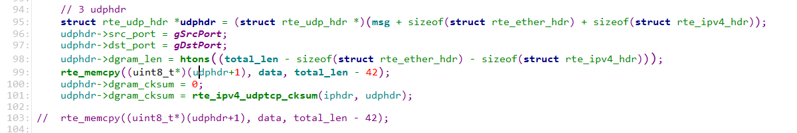
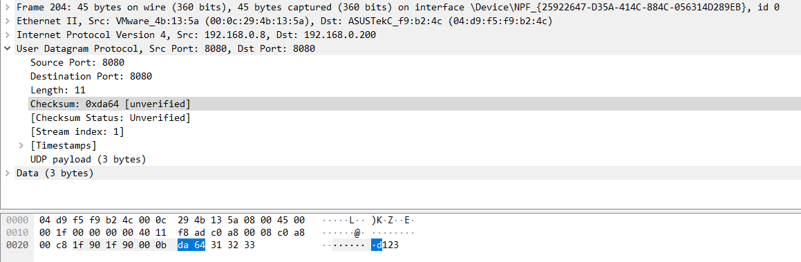
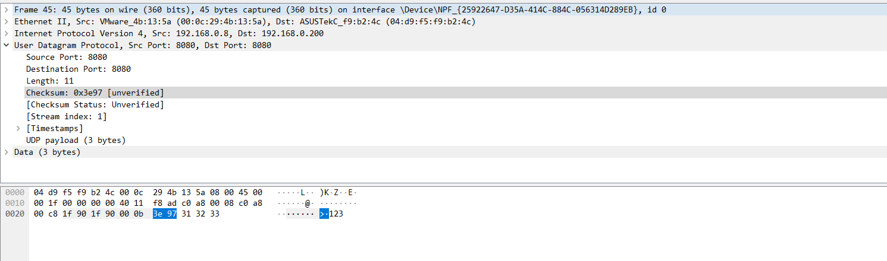

# DPDK接收与发送过程的实现


## UDP报文封装，先填数据部分再计算校验和




如果先填写数据data，在计算校验和，对端可以成功接收到该报文。若99行注释，103行打开，则对端不能讲该报文上发到应用层，但是网卡可以抓到该报文。





通过报文抓到的两种不同的报文分析，数据的部分会影响到UDP的checksum的计算。

# 接收


# ARP报文
封装ARP报文过程中gLocalMac的赋值，不能直接使用eth或者arp报文的目的MAC，因此需要通过网卡口获得本地MAC才可。

``` c
if(ethhdr->ether_type == rte_cpu_to_be_16(RTE_ETHER_TYPE_ARP)){
	struct rte_arp_hdr *arphdr = rte_pktmbuf_mtod_offset(mbufs[i], struct rte_arp_hdr *, sizeof(struct rte_ether_hdr));
	if(arphdr->arp_data.arp_tip == gLocalIp){	/* 发送到本地的ARP报文 */
		struct rte_mbuf *mbuf =  send_arp(mbuf_pool, gLocalMac, arphdr->arp_data.arp_sha.addr_bytes, arphdr->arp_data.arp_tip, arphdr->arp_data.arp_sip);
		rte_eth_tx_burst(gDpdkPortId, 0, &mbuf, 1);
		rte_pktmbuf_free(mbuf);
		rte_pktmbuf_free(mbufs[i]);
	}
continue;
}


static int encode_arp_pkt(uint8_t *msg, uint8_t *src_mac, uint8_t *dst_mac, uint32_t sip, uint32_t dip)
{
	// 1 ethhdr
	struct rte_ether_hdr *ethhdr = (struct rte_ether_hdr *)msg;
	rte_memcpy(ethhdr->s_addr.addr_bytes, src_mac, RTE_ETHER_ADDR_LEN);
	rte_memcpy(ethhdr->d_addr.addr_bytes, dst_mac, RTE_ETHER_ADDR_LEN);
	ethhdr->ether_type = htons(RTE_ETHER_TYPE_ARP);

	// 2 arphdr
	struct rte_arp_hdr *arphdr = (struct rte_arp_hdr *)(ethhdr+1);
	arphdr->arp_hardware = htons(1);
	arphdr->arp_protocol = htons(RTE_ETHER_TYPE_IPV4);
	arphdr->arp_hlen = RTE_ETHER_ADDR_LEN;	// 硬件地址长度
	arphdr->arp_plen = sizeof(uint32_t);	//	协议的长度
	arphdr->arp_opcode = htons(2);
	rte_memcpy(arphdr->arp_data.arp_sha.addr_bytes, src_mac, RTE_ETHER_ADDR_LEN); 
	rte_memcpy(arphdr->arp_data.arp_tha.addr_bytes, dst_mac, RTE_ETHER_ADDR_LEN); 
	arphdr->arp_data.arp_sip = sip;
	arphdr->arp_data.arp_tip = dip;

	return 0;
}

static struct rte_mbuf * send_arp(struct rte_mempool *mbuf_pool, uint8_t *src_mac, uint8_t *dst_mac, uint32_t sip, uint32_t dip){

	const unsigned total_length = sizeof(struct rte_ether_hdr) + sizeof(struct rte_arp_hdr);
	
	struct rte_mbuf *mbuf = rte_pktmbuf_alloc(mbuf_pool);
	if(!mbuf){
		rte_exit(EXIT_FAILURE, "send_arp rte_pktmbuf_alloc faild!\n");
	}
	mbuf->pkt_len = total_length;
	mbuf->data_len = total_length;
	uint8_t *pkt_data = rte_pktmbuf_mtod(mbuf, uint8_t *);
	encode_arp_pkt(pkt_data, src_mac, dst_mac, sip, dip);
	return mbuf;
}
```