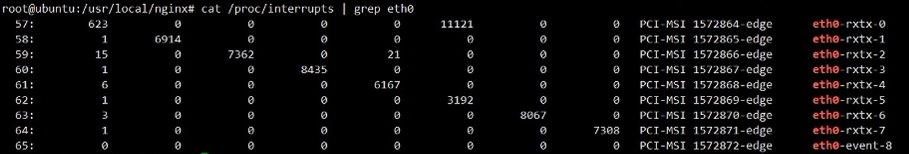

# vmware配置问题

## E1000 与 VMXNET3
VMXNET3网卡
``` bash

king@ubuntu:~$ cat /proc/interrupts | grep eth0
  56:          0          0          0          0          0          0          0          0          0          0          0          0          0          0          0          0   PCI-MSI 1572864-edge      eth0-rxtx-0
  57:          0          0          0          0          0          0          0          0          0          0          0          0          0          0          0          0   PCI-MSI 1572865-edge      eth0-rxtx-1
  58:          0          0          0          0          0          0          0          0          0          0          0          0          0          0          0          0   PCI-MSI 1572866-edge      eth0-rxtx-2
  59:          0          0          0          0          0          0          0          0          0          0          0          0          0          0          0          0   PCI-MSI 1572867-edge      eth0-rxtx-3
  60:          0          0          0          0          0          0          0          0          0          0          0          0          0          0          0          0   PCI-MSI 1572868-edge      eth0-rxtx-4
  61:          0          0          0          0          0          0          0          0          0          0          0          0          0          0          0          0   PCI-MSI 1572869-edge      eth0-rxtx-5
  62:          0          0          0          0          0          0          0          0          0          0          0          0          0          0          0          0   PCI-MSI 1572870-edge      eth0-rxtx-6
  63:          0          0          0          0          0          0          0          0          0          0          0          0          0          0          0          0   PCI-MSI 1572871-edge      eth0-rxtx-7
  64:          0          0          0          0          0          0          0          0          0          0          0          0          0          0          0          0   PCI-MSI 1572872-edge      eth0-event-8
```

E1000网卡
``` bahs

king@ubuntu:~$ cat /proc/interrupts | grep eth2
  19:          7       3617          0          0          0          0          0          0          0         55          0          0          0          0          0          0   IO-APIC   19-fasteoi   eth2
```

## 网卡名字 ens 和 eth区别

ens是虚拟网卡，eth是物理网卡；在使用DPDK时，要将ens修改为eth。

# CPU亲和性


``` bash
king@ubuntu:~$ cat /proc/irq/56/
affinity_hint      eth0-rxtx-0/       node               smp_affinity       smp_affinity_list  spurious

# 查看56号中断绑在某个CPU上
king@ubuntu:~$ cat /proc/irq/56/smp_affinity
00000000,00000000,00000000,00000400

# 把网卡的56-63号中断绑定在1-8的CPU
king@ubuntu:~$ echo 01 > /proc/irq/56/smp_affinity
king@ubuntu:~$ echo 02 > /proc/irq/57/smp_affinity
king@ubuntu:~$ echo 04 > /proc/irq/58/smp_affinity
king@ubuntu:~$ echo 08 > /proc/irq/59/smp_affinity
king@ubuntu:~$ echo 10 > /proc/irq/60/smp_affinity
king@ubuntu:~$ echo 20 > /proc/irq/61/smp_affinity
king@ubuntu:~$ echo 40 > /proc/irq/62/smp_affinity
king@ubuntu:~$ echo 80 > /proc/irq/63/smp_affinity

```



# dpdk-setup.sh

``` bash
root@ubuntu:/home/king/share/dpdk/dpdk-stable-19.08.2/examples/recv_send# ./../../usertools/dpdk-setup.sh
------------------------------------------------------------------------------
 RTE_SDK exported as /home/king/share/dpdk/dpdk-stable-19.08.2
------------------------------------------------------------------------------
----------------------------------------------------------
 Step 1: Select the DPDK environment to build
----------------------------------------------------------
[1] arm64-armada-linuxapp-gcc
[2] arm64-armada-linux-gcc
[3] arm64-armv8a-linuxapp-clang
[4] arm64-armv8a-linuxapp-gcc
[5] arm64-armv8a-linux-clang
[6] arm64-armv8a-linux-gcc
[7] arm64-bluefield-linuxapp-gcc
[8] arm64-bluefield-linux-gcc
[9] arm64-dpaa2-linuxapp-gcc
[10] arm64-dpaa2-linux-gcc
[11] arm64-dpaa-linuxapp-gcc
[12] arm64-dpaa-linux-gcc
[13] arm64-octeontx2-linuxapp-gcc
[14] arm64-octeontx2-linux-gcc
[15] arm64-stingray-linuxapp-gcc
[16] arm64-stingray-linux-gcc
[17] arm64-thunderx2-linuxapp-gcc
[18] arm64-thunderx2-linux-gcc
[19] arm64-thunderx-linuxapp-gcc
[20] arm64-thunderx-linux-gcc
[21] arm64-xgene1-linuxapp-gcc
[22] arm64-xgene1-linux-gcc
[23] arm-armv7a-linuxapp-gcc
[24] arm-armv7a-linux-gcc
[25] i686-native-linuxapp-gcc
[26] i686-native-linuxapp-icc
[27] i686-native-linux-gcc
[28] i686-native-linux-icc
[29] ppc_64-power8-linuxapp-gcc
[30] ppc_64-power8-linux-gcc
[31] x86_64-native-bsdapp-clang
[32] x86_64-native-bsdapp-gcc
[33] x86_64-native-freebsd-clang
[34] x86_64-native-freebsd-gcc
[35] x86_64-native-linuxapp-clang
[36] x86_64-native-linuxapp-gcc
[37] x86_64-native-linuxapp-icc
[38] x86_64-native-linux-clang
[39] x86_64-native-linux-gcc
[40] x86_64-native-linux-icc
[41] x86_x32-native-linuxapp-gcc
[42] x86_x32-native-linux-gcc

----------------------------------------------------------
 Step 2: Setup linux environment
----------------------------------------------------------
[43] Insert IGB UIO module
[44] Insert VFIO module
[45] Insert KNI module
[46] Setup hugepage mappings for non-NUMA systems
[47] Setup hugepage mappings for NUMA systems
[48] Display current Ethernet/Baseband/Crypto device settings
[49] Bind Ethernet/Baseband/Crypto device to IGB UIO module
[50] Bind Ethernet/Baseband/Crypto device to VFIO module
[51] Setup VFIO permissions

----------------------------------------------------------
 Step 3: Run test application for linux environment
----------------------------------------------------------
[52] Run test application ($RTE_TARGET/app/test)
[53] Run testpmd application in interactive mode ($RTE_TARGET/app/testpmd)

----------------------------------------------------------
 Step 4: Other tools
----------------------------------------------------------
[54] List hugepage info from /proc/meminfo

----------------------------------------------------------
 Step 5: Uninstall and system cleanup
----------------------------------------------------------
[55] Unbind devices from IGB UIO or VFIO driver
[56] Remove IGB UIO module
[57] Remove VFIO module
[58] Remove KNI module
[59] Remove hugepage mappings

[60] Exit Script
```