[toc]
# 消除keil C51中未调用函数的警告
第一步：使用LX51
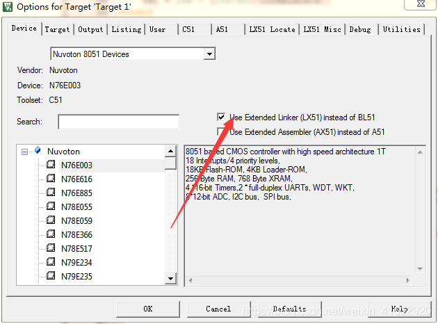

第二步：点击LX51 Misc,在下方Misc controls的内容框写上“REMOVEUNUSED”点击OK重新编译即可
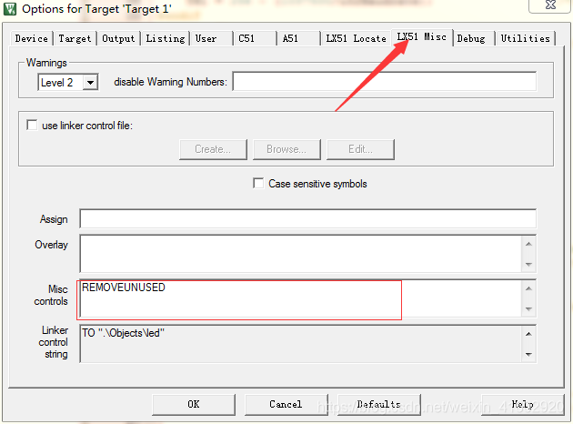


# UART
## Serial port interface internal structure
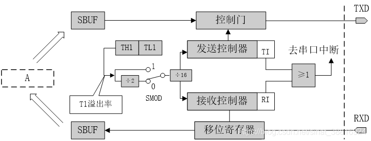
SBUF：51单片机中的特殊寄存器，串行数据缓冲器（一个接收一个发送），两个其实是共用的一个地址99H，但是两个在物理上面是分开的。
当发送使用时，就采用SBUF=XXX; 
当接收使用时，采用XXX=SBUF；

T1溢出率：T1计时器的溢出频率（就是计时器每次低位计满向高位进位时间的倒数）
用处：用于计算波特率（每秒传输二进制代码的位数）

## Control registers of the serial port（SCON）
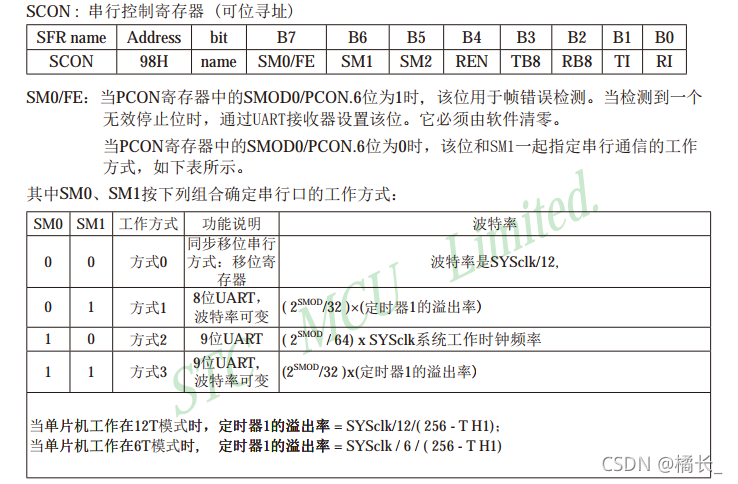

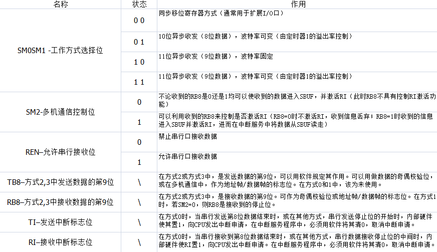

## SM0 and SM1 Operating mode selection bits
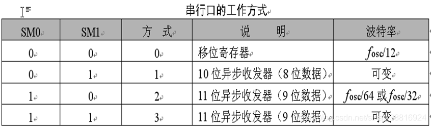

## PCON
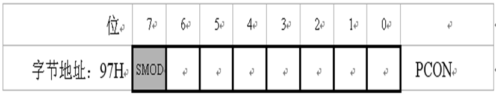

SMOD（PCON.7）  波特率倍增位。在串行口方式1、方式2、方式3时，波特率与SMOD有关，当SMOD=1时，波特率提高一倍。复位时，SMOD=0。 

## Baud rate calculations
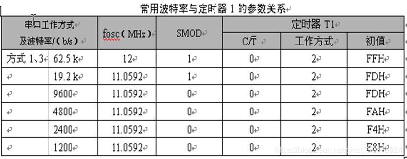

### 方式0的波特率配置

方式0的波特率计算公式如下：

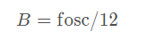

其中B是波特率，fosc是晶振的频率。
### 方式2的波特率配置
方式2的波特率计算公式如下：


其中B是波特率，fosc是晶振的频率,SMOD是PCON寄存器最高位。

### 方式1和3的波特率配置
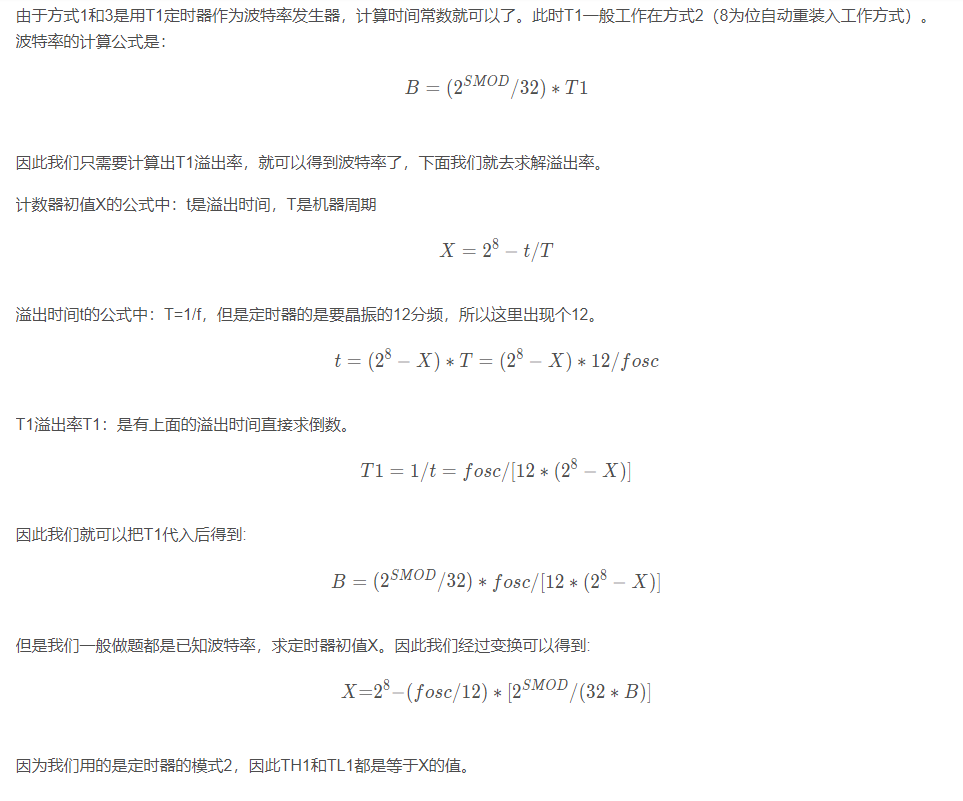

## uart.c

``` c
#include "usart.h"

u8 recv_buf[20];
char recv_nb = 0;
u8 rx_flag = 0;

/* 12MHz 2400 */
void uart_init(void)
{
	u8 str[20] = {0};
	
	TMOD=0x20;    //定时器工作方式，选择了定时器1，工作方式2 八位初值自动重装的8位定时器。          
	TH1=0xf3;     //定时器1初值,设置波特率为2400 晶振12MHZ 
	TL1=0xf3;  
	TR1=1;        //开启定时器1  
	
	SM0=0;  
	SM1=1;        //10位异步接收，（8位数据）波特率可变  
	REN=1;        //允许串行口接收位  
	EA=1;         //允许中断（总闸）
	ES=1;         //允许串口中断 	
	
	sprintf(str, "uart ok!\r\n");
	uart_sendstring(str);
}

/* 接受中断，发送轮询 */
void uart_handler() interrupt 4  
{
	u8 chr = 0;
	
	if(RI){
		RI = 0;
		chr = SBUF;
		/* 接受指令，以\r\n做为结束标志位 */
		if(chr == '\n' && recv_buf[recv_nb-1] == '\r' || recv_nb == 20){
			rx_flag = 1;
			recv_buf[recv_nb-1] = '\0';
			ES=0;		/* 关闭串口中断 */
		}
		recv_buf[recv_nb++] = chr;

//		RI=0;		/* 接收数据，手动将RI清0 */
//		chr = SBUF;  //取出数据  
//		SBUF = chr;  //把数据加1后再发送给计算机
		
	}
	
//	if(TI){
//		TI = 0;
//	}
}

/* 接受数组和接受长度重置、接受标志位清除、接受中断开启等 */
void uart_reset(void)
{
	recv_nb = 0;
	rx_flag = 0;
	memset(recv_buf, 0, sizeof(recv_buf));
	ES=1;	
}

/* 发送一个数据 */
void uart_sendbyte(u8 byte)
{
	SBUF = byte;
	while(!TI);
	TI = 0;				/* 此处TI清0和中断清0，只能存在一个 */
}

/* 发送字符串 */
void uart_sendstring(u8* str)
{
	while(*str != '\0'){
		uart_sendbyte(*str++);
	}
}


```

## uart.h

``` c
#ifndef __USART_H__
#define __USART_H__

#include "common.h"

extern u8 recv_buf[20];
extern char recv_nb;
extern u8 rx_flag;

void uart_init(void);
void uart_reset(void);

void uart_sendbyte(char byte);
void uart_sendstring(char* str);

#endif

```

## main.c

``` c
#include "common.h"

u8 str[20] = {0};

void main(void)
{
	uart_init();

	while(1){
		
		if(rx_flag){
			sprintf(recv_buf, "strlen(recv_buf)=%d\r\n", strlen(recv_buf));
			uart_sendstring(recv_buf);
			uart_reset();
		}
		delay200ms();
	}
}

```

# LCD1602 
## Schematic

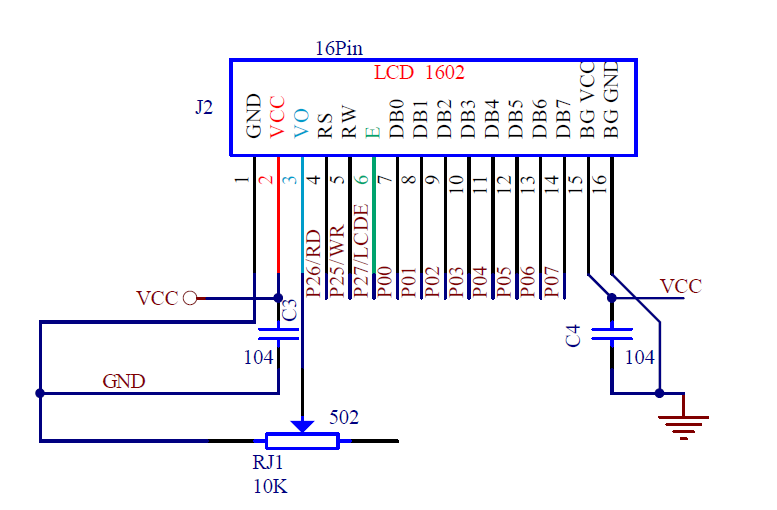
## lcd1602.c

``` c
#include "lcd1602.h"

//忙检测函数，判断bit7是0，允许执行；1禁止
void read_busy()           
{
    unsigned char sta;
    LCD1602_DB = 0xff;
    LCD1602_RS = 0;
    LCD1602_RW = 1;
    do
    {
			LCD1602_EN = 1;
			sta = LCD1602_DB;
			LCD1602_EN = 0;    //使能，用完就拉低，释放总线
    }while(sta & 0x80);
}

//写命令
void lcd1602_write_cmd(unsigned char cmd)
{
    read_busy();
    LCD1602_RS = 0;
    LCD1602_RW = 0;
    LCD1602_DB = cmd;
    LCD1602_EN = 1;
    LCD1602_EN = 0;    
}

//写数据
void lcd1602_write_data(unsigned char dat)   
{
      read_busy();
      LCD1602_RS = 1;
      LCD1602_RW = 0;
      LCD1602_DB = dat;
      LCD1602_EN = 1;
      LCD1602_EN = 0;
}

//设置坐标
void lcd_set_cursor(unsigned char x,unsigned char y)  
{
    unsigned char addr;
    if(y == 0)
        addr = 0x00 + x;
    else
        addr = 0x40 + x;
    
    lcd1602_write_cmd(addr|0x80);
}

 //显示字符串
void lcd_show_str(unsigned char x,unsigned char y,unsigned char *str)
{
    lcd_set_cursor(x,y);      //当前字符的坐标
    while(*str != '\0')
    {
        lcd1602_write_data(*str++);
    }
}

//1602初始化
void lcd1602_init()              
{
    lcd1602_write_cmd(0x38);    //打开，5*8,8位数据
    lcd1602_write_cmd(0x0c);
    lcd1602_write_cmd(0x06);
    lcd1602_write_cmd(0x01);    //清屏   
}

void lcd_clear(void)
{
	lcd1602_write_cmd(0x01);    //清屏 
}


```
## lcd1602.h

``` c
#ifndef __LCD1602_H_
#define __LCD1602_H_

/**********************************
包含头文件
**********************************/
#include <common.h>

//---重定义关键词---//
#ifndef uchar
	#define uchar unsigned char
#endif

#ifndef uint 
	#define uint unsigned int
#endif

/**********************************
PIN口定义
**********************************/
#define LCD1602_DB  P0
sbit LCD1602_RS = P2^6;
sbit LCD1602_RW = P2^5;
sbit LCD1602_EN = P2^7;

/**********************************
函数声明
**********************************/

void read_busy(void);           //忙检测函数，判断bit7是0，允许执行；1禁止
void lcd1602_write_cmd(unsigned char cmd);     //写命令
void lcd1602_write_data(unsigned char dat);   //写数据
void lcd_set_cursor(unsigned char x,unsigned char y);  //坐标显示
void lcd_show_str(unsigned char x,unsigned char y,unsigned char *str);     //显示字符串
void lcd1602_init(void);			//1602初始化
void lcd_clear(void);				//清屏函数	 

#endif

```
## main.c

``` c	
#include "common.h"

unsigned char PuZh[]=" hello world! ";

/*******************************************************************************
* 函 数 名         : main
* 函数功能		   : 主函数
* 输    入         : 无
* 输    出         : 无
*******************************************************************************/
void main(void)
{
	lcd1602_init();
	lcd_clear();
	lcd_show_str(0,0,PuZh);
	while(1);
			
```