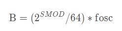

# 消除keil C51中未调用函数的警告
第一步：使用LX51


第二步：点击LX51 Misc,在下方Misc controls的内容框写上“REMOVEUNUSED”点击OK重新编译即可


# UART
## Serial port interface internal structure

SBUF：51单片机中的特殊寄存器，串行数据缓冲器（一个接收一个发送），两个其实是共用的一个地址99H，但是两个在物理上面是分开的。
当发送使用时，就采用SBUF=XXX; 
当接收使用时，采用XXX=SBUF；

T1溢出率：T1计时器的溢出频率（就是计时器每次低位计满向高位进位时间的倒数）
用处：用于计算波特率（每秒传输二进制代码的位数）

## Control registers of the serial port（SCON）


## SM0 and SM1 Operating mode selection bits


## PCON


SMOD（PCON.7）  波特率倍增位。在串行口方式1、方式2、方式3时，波特率与SMOD有关，当SMOD=1时，波特率提高一倍。复位时，SMOD=0。 

## Baud rate calculations


### 方式0的波特率配置

方式0的波特率计算公式如下：


其中B是波特率，fosc是晶振的频率。
### 方式2的波特率配置
方式2的波特率计算公式如下：


其中B是波特率，fosc是晶振的频率,SMOD是PCON寄存器最高位。

### 方式1和3的波特率配置


## uart.c

``` c
#include "usart.h"

char recv_buf[20];
char recv_nb = 0;
u8 rx_flag = 0;

/* 方式1 9600 T1-8位自动重装 */
void uart_init(void)
{
	TMOD=0x20;    //定时器工作方式，选择了定时器1，工作方式2 八位初值自动重装的8位定时器。          
	TH1=0xfd;     //定时器1初值,设置波特率为9600 晶振11.0529MHZ 
	TL1=0xfd;  
	TR1=1;        //开启定时器1  
	
	SM0=0;  
	SM1=1;        //10位异步接收，（8位数据）波特率可变  
	REN=1;        //允许串行口接收位  
	EA=1;         //允许中断（总闸）
	ES=1;         //允许串口中断  	
}

/* 接受中断，发送轮询 */
void uart_handler() interrupt 4  
{
	char chr = 0;
	
	if(RI){
		chr = SBUF;
		if(chr == '\n' && recv_buf[recv_nb-1] == '\r' || recv_nb == 20){
			rx_flag = 1;
			recv_buf[recv_nb-1] = '\0';
			ES=0;		/* 关闭串口终端 */
		}
		recv_buf[recv_nb++] = chr;
		//接收数据，手动将RI清0
		RI=0;
	}
	
	if(TI){
		
		TI = 0;
	}
}

/* 发送一个数据 */
void uart_sendByte(char byte)
{
		SBUF = byte;
    while(!TI);
    TI = 0;
}


/* 发送字符串 */
void uart_sendstring(char* str)
{
	while(*str){
		uart_sendByte(*str++);
	}
}

```

## uart.h

``` c
#ifndef __USART_H__
#define __USART_H__

#include "common.h"

extern char recv_buf[20];
extern char recv_nb;
extern u8 rx_flag;

void uart_init(void);
void uart_sendByte(char byte);
void uart_sendstring(char* str);

#endif

```
