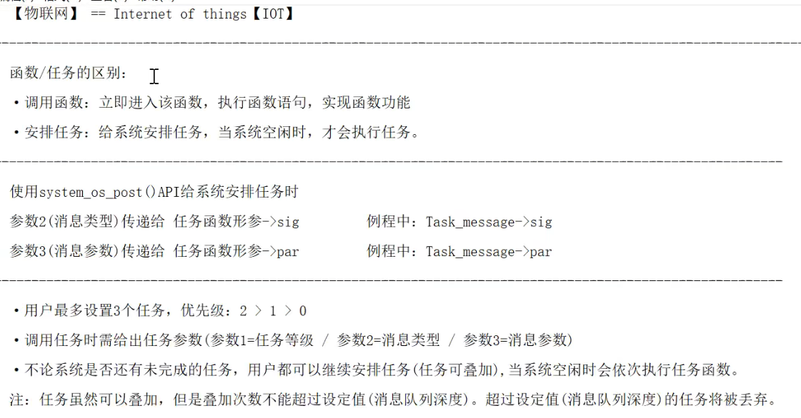

[toc]

# ESP8266程序下载
## flash布局
本设计采用无操作系统进行编程测试，使用不支持云端升级的non-FOTA固件。


## 下载地址
由于该开发板外部Flash容量为4096KB，也就是4MB，由于读写必须是扇区为单位进行操作，扇区上图说明中可以得到为4KB，因此最该开发板最后一个扇区地址为0X3FF000，因此采用对应下图的下载地址。


## ESP8266 Download Tool
烧录程序时，如果处于等待同步模式，则需要切换ESP8266从程序运行模式到程序下载模式中。


当板子引脚GPIO0为低电平时为串口下载模式，根据原理图可知，BOOT按键按下后，系统进入下载模式，因此等待程序下载，默认情况下，引脚接高电平则为程序运行模式。


# sdk编程—程序架构


# UART编程


代码中需要注意的一点是，os_printf用的是系统串口打印，波特率为74880，而uart0_sendStr波特率为串口初始化函数配置。

``` c?linenums
user_init(void)
{
	uart_init(BIT_RATE_9600, BIT_RATE_9600);
	os_printf("\r\n--------------------------------------------\r\n");
	os_printf("SDK	version:	%s	\r\n",	system_get_sdk_version()); //串口打印SDK版本信息
	uart0_sendStr("\r\nHello World!\r\n");
	os_printf("\r\n--------------------------------------------\r\n");
}
```


# Makefile
如果修改代码文件对应的路径，则需要进行makefile的编译修改，具体过程参考。
[【物联网教程】基于ESP8266(WIFI) - P14 物联网教程_14_MakeFile](https://www.bilibili.com/video/BV1dJ411S723?p=14&vd_source=85143ebef149f78ad6d9c01fb85eb64b)

# Watch Dog


如果不执行`system_soft_wdt_feed`函数，则系统会进行不断重启复位，因此需要进行经常喂狗保持系统稳定。

``` c?linenums
void ICACHE_FLASH_ATTR user_init(void)
{
	uart_init(115200,115200);	// 初始化串口波特率
	os_delay_us(10000);			// 等待串口稳定
	os_printf("\r\n=================================================\r\n");
	os_printf("\t Project:\t%s\r\n", ProjectName);
	os_printf("\t SDK version:\t%s", system_get_sdk_version());
	os_printf("\r\n=================================================\r\n");
	while(1)
	{
		system_soft_wdt_feed();		// 喂狗，防止复位
	}
}
```

# Delay

添加了了 ICACHE_FLASH_ATTR 的代码通常⽐比使⽤用 IRAM_ATTR 标记的代码执⾏行行得慢。然而，像⼤大多数嵌入式平台⼀样， ESP8266 的 iRAM 空间有限，因此建议⼀般代码添加ICACHE_FLASH_ATTR，仅对执⾏行行效率要求⾼高的代码添加 IRAM_ATTR宏。

``` c?linenums
#include "user_interface.h"
#include "osapi.h"

// 毫秒延时函数(不要延时太久)
//===========================================
void ICACHE_FLASH_ATTR delay_ms(u32 C_time)
{	for(;C_time>0;C_time--)
	{ (1000);}
}

```


# GPIO_Output
根据原理图控制LED灯亮，则需要配置GPIO4为低电平，根据乐鑫的技术文档2.2章GPIO寄存器说明，需要先将GPIO4配置为GPIO功能，代码为第11行。

``` c?linenums
void ICACHE_FLASH_ATTR user_init(void)
{
	u8 F_LED = 0 ;		// LED状态标志位
	uart_init(115200,115200);	// 初始化串口波特率
	os_delay_us(10000);			// 等待串口稳定
	os_printf("\r\n=================================================\r\n");
	os_printf("\t Project:\t%s\r\n", ProjectName);
	os_printf("\t SDK version:\t%s", system_get_sdk_version());
	os_printf("\r\n=================================================\r\n");

	// 管脚功能选择(注意：参数1【PIN_NAME】管脚名、参数2【FUNC】管脚功能)
	//--------------------------------------------------------------------------
	PIN_FUNC_SELECT(PERIPHS_IO_MUX_GPIO4_U,	FUNC_GPIO4);	// GPIO4设为IO口

	// 将相应管脚设为输出模式，并输出对应电平(参数1【gpio_no】、参数2：输出电平)
	//--------------------------------------------------------------------------
	GPIO_OUTPUT_SET(GPIO_ID_PIN(4),1);			// IO4 = 1(高电平)

	// 注意：【PIN_NAME】、【FUNC】、【gpio_no】不要混淆
	//…………………………………………………………………………………………………
	//·【PIN_NAME】		管脚名称		"PERIPHS_IO_MUX_" + "管脚名"
	//·【FUNC】			管脚功能		功能序号 - 1
	//·【gpio_no】			IO端口序号		GPIO_ID_PIN(IO端口序号)
	//…………………………………………………………………………………………………

	while(1)
	{
		system_soft_wdt_feed();					// 喂狗，防止复位
		F_LED = !F_LED;							// LED状态值翻转
		GPIO_OUTPUT_SET(GPIO_ID_PIN(4),F_LED);	// 设置LED(IO4)输出值
		delay_ms(500);							// 延时500Ms
	}
}
```

PIN_FUNC_SELECT函数是将引脚配置为对应功能，管脚引脚名前缀为`PERIPHS_IO_MUX_`，后面为具体引脚名称，对面引脚宏下面为功能。


配置好GPIO4引脚后，将GPIO4引脚输出高电平即可输出对应电平。

# GPIO_Input
根据原理图可知GPIO0引脚与按键连接，由于存在外部上拉，因此按键按下时为低电平，没按下则为高电平。因此可以通过读取引脚电平变换得到按键是否按下的信息。

``` c?linenums
void ICACHE_FLASH_ATTR user_init(void)
{
	uart_init(115200,115200);	// 初始化串口波特率
	os_delay_us(10000);			// 等待串口稳定
	os_printf("\r\n=================================================\r\n");
	os_printf("\t Project:\t%s\r\n", ProjectName);
	os_printf("\t SDK version:\t%s", system_get_sdk_version());
	os_printf("\r\n=================================================\r\n");

	// 初始化LED(注意【PIN_NAME】、【FUNC】、【gpio_no】不要混淆)
	//-------------------------------------------------------------------------
	PIN_FUNC_SELECT(PERIPHS_IO_MUX_GPIO4_U,	FUNC_GPIO4);	// GPIO_4设为IO口
	GPIO_OUTPUT_SET(GPIO_ID_PIN(4),1);						// GPIO_4 = 1

	// 初始化按键(BOOT == GPIO0)
	//----------------------------------------------------------------------------------
	PIN_FUNC_SELECT(PERIPHS_IO_MUX_GPIO0_U,	FUNC_GPIO0);	// GPIO_0设为IO口
	GPIO_DIS_OUTPUT(GPIO_ID_PIN(0));						// GPIO_0失能输出(默认)
	PIN_PULLUP_DIS(PERIPHS_IO_MUX_GPIO0_U);					// GPIO_0失能内部上拉(默认)
//	PIN_PULLUP_EN(PERIPHS_IO_MUX_GPIO0_U);					// GPIO_0使能内部上拉

	while(1)
	{
		system_soft_wdt_feed();								// 喂狗，防止复位
		if( GPIO_INPUT_GET(GPIO_ID_PIN(0)) == 0 )			// 读取GPIO_0电平
			GPIO_OUTPUT_SET(GPIO_ID_PIN(4),0);				// LED亮
		else
			GPIO_OUTPUT_SET(GPIO_ID_PIN(4),1);				// LED灭
	}
}
```

17行是将GPIO0引脚配置为GPIO功能，然后关闭引脚输出功能和内部上拉，通过判断电平判断按键是否按下。

# GPIO_EXTI


``` c?linenums
// user_init：entry of user application, init user function here
//==========================================================================================
void ICACHE_FLASH_ATTR user_init(void)
{
	uart_init(115200,115200);	// 初始化串口波特率
	os_delay_us(10000);			// 等待串口稳定
	os_printf("\r\n=================================================\r\n");
	os_printf("\t Project:\t%s\r\n", ProjectName);
	os_printf("\t SDK version:\t%s", system_get_sdk_version());
	os_printf("\r\n=================================================\r\n");

	// 初始化LED(注意【PIN_NAME】、【FUNC】、【gpio_no】不要混淆)
	//-------------------------------------------------------------------------
	PIN_FUNC_SELECT(PERIPHS_IO_MUX_GPIO4_U,	FUNC_GPIO4);	// GPIO_4设为IO口
	GPIO_OUTPUT_SET(GPIO_ID_PIN(4),1);						// GPIO_4 = 1

	// 初始化按键(BOOT == GPIO0)
	//-----------------------------------------------------------------------------
	PIN_FUNC_SELECT(PERIPHS_IO_MUX_GPIO0_U,	FUNC_GPIO0);	// GPIO_0作为GPIO口
	GPIO_DIS_OUTPUT(GPIO_ID_PIN(0));						// GPIO_0失能输出(默认)
//	PIN_PULLUP_DIS(PERIPHS_IO_MUX_GPIO0_U);					// GPIO_0失能上拉(默认)
//	PIN_PULLUP_EN(PERIPHS_IO_MUX_GPIO0_U);					// GPIO_0使能上拉

	// GPIO_0中断设置
	//----------------------------------------------------------------------------------
	ETS_GPIO_INTR_DISABLE();										// 关闭GPIO中断功能
	ETS_GPIO_INTR_ATTACH((ets_isr_t)GPIO_INTERRUPT,NULL);			// 注册中断回调函数
	gpio_pin_intr_state_set(GPIO_ID_PIN(0),GPIO_PIN_INTR_NEGEDGE);	// GPIO_0下降沿中断
	ETS_GPIO_INTR_ENABLE();											// 打开GPIO中断功能

	//…………………………………………………………
    // GPIO_PIN_INTR_DISABLE = 0,	// 不触发中断
    // GPIO_PIN_INTR_POSEDGE = 1,	// 上升沿中断
    // GPIO_PIN_INTR_NEGEDGE = 2,	// 下降沿中断
    // GPIO_PIN_INTR_ANYEDGE = 3,	// 双边沿中断
    // GPIO_PIN_INTR_LOLEVEL = 4,	// 低电平中断
    // GPIO_PIN_INTR_HILEVEL = 5	// 高电平中断
	//…………………………………………………………
}
```

通过寄存器`GPIO_STATUS_ADDRESS`读取当前的引脚中断状态，由于是GPIO0按键连接按键，按键按下后触发中断，此时`S_GPIO_INT`数值为`0x01`，通过对`GPIO_STATUS_W1TC_ADDRESS`寄存器对应引脚位置写入1，清楚中断标志位。

``` c?linenums
// GPIO中断函数【注意：中断函数前不要有"ICACHE_FLASH_ATTR"宏】
//=============================================================================
void GPIO_INTERRUPT(void)
{
	u32	S_GPIO_INT;		// 所有IO口的中断状态
	u32 F_GPIO_0_INT;	// GPIO_0的中断状态

	// 读取GPIO中断状态
	S_GPIO_INT = GPIO_REG_READ(GPIO_STATUS_ADDRESS);

	// 清除中断状态位(如果不清除状态位，则会持续进入中断)
	GPIO_REG_WRITE(GPIO_STATUS_W1TC_ADDRESS, S_GPIO_INT);
	
	// 判断引脚位置0是否为1，获取GPIO_0中断状态
	F_GPIO_0_INT = S_GPIO_INT & (0x01<<0);	

	// 判断是否是KEY中断(未做消抖)
	if(F_GPIO_0_INT)	// GPIO_0的下降沿中断
	{
		F_LED = !F_LED;
		GPIO_OUTPUT_SET(GPIO_ID_PIN(4),F_LED);	// LED状态翻转
	}
}
```

# OS_Timer (软件定时器)


``` c?linenums
// 注：OS_Timer_1必须定义为全局变量，因为ESP8266的内核还要使用
//--------------------------------------------------------------------
os_timer_t OS_Timer_1;	// ①：定义软件定时器(os_timer_t型结构体)

// 软件定时的回调函数
//======================================================================
void ICACHE_FLASH_ATTR OS_Timer_1_cb(void)		// ②：定义回调函数
{
	F_LED = !F_LED;
	GPIO_OUTPUT_SET(GPIO_ID_PIN(4),F_LED);		// LED状态翻转


	os_printf("\r\n----OS_Timer_1_cb----\r\n");	// 进入回调函数标志
}
//======================================================================


// 软件定时器初始化(ms毫秒)
//================================================================================================
void ICACHE_FLASH_ATTR OS_Timer_1_Init_JX(u32 time_ms, u8 time_repetitive)
{
	// 关闭定时器
	// 参数一：要关闭的定时器
	//--------------------------------------------------------
	os_timer_disarm(&OS_Timer_1);	// ③：关闭软件定时器

	// 设置定时器
	// 参数一：要设置的定时器；参数二：回调函数(需类型转换)；参数三：回调函数的参数
	//【注：os_timer_setfn必须在软件定时器未使能的情况下调用】
	//------------------------------------------------------------------------------------------
	os_timer_setfn(&OS_Timer_1,(os_timer_func_t *)OS_Timer_1_cb, NULL);	// ④：设置回调函数

	// 使能(启动)ms定时器
	// 参数一：要使能的定时器；参数二：定时时间（单位：ms）；参数三：1=重复/0=只一次
	//------------------------------------------------------------------------------------------
	os_timer_arm(&OS_Timer_1, time_ms, time_repetitive);  // ⑤：设置定时器参数并使能定时器
	//-------------------------------------------------------------------
	// 【如未调用system_timer_reinit，可支持范围：[5ms ～ 6,870,947ms]】
	// 【如果调用system_timer_reinit，可支持范围：[100ms ～ 428,496 ms]】
	//-------------------------------------------------------------------
}
```

需要注意的是该系统定时器会被其他高优先级的任务延迟，因此不能保证其精确运行。如果第20行代码注释打开，则会导致定时器被延迟而不能及时调用，因此推测喂狗函数的优先级较高。

``` c?linenums
// user_init：entry of user application, init user function here
//=================================================================================================
void ICACHE_FLASH_ATTR user_init(void)
{
	uart_init(115200,115200);	// 初始化串口波特率
	os_delay_us(10000);			// 等待串口稳定
	os_printf("\r\n=================================================\r\n");
	os_printf("\t Project:\t%s\r\n", ProjectName);
	os_printf("\t SDK version:\t%s", system_get_sdk_version());
	os_printf("\r\n=================================================\r\n");


	LED_Init_JX();					// LED初始化


	// 初始化软件定时器
	//--------------------------------------------
	OS_Timer_1_Init_JX(500,1);		// 500ms(重复)

//	while(1) system_soft_wdt_feed();	// 死循环，测试用

	os_printf("\r\n-------------------- user_init OVER --------------------\r\n");
}
```

# HW_Timer (硬件定时器)


``` c?linenums
// 硬件定时器中断回调函数【注意：中断函数前不要有"ICACHE_FLASH_ATTR"宏】
void HW_Timer_INT(void)		// ②：硬件定时器中断回调函数
{
	F_LED = !F_LED;
	GPIO_OUTPUT_SET(GPIO_ID_PIN(4),F_LED);		// LED状态翻转
	os_printf("\r\n--- HW_Timer_INT ---\r\n");	// 进入硬件定时器中断回调函数标志
}

// LED初始化
void ICACHE_FLASH_ATTR LED_Init_JX(void)
{
	PIN_FUNC_SELECT(PERIPHS_IO_MUX_GPIO4_U,	FUNC_GPIO4);	// GPIO4设为IO口
	GPIO_OUTPUT_SET(GPIO_ID_PIN(4),1);						// IO4 = 1
}

// user_init：entry of user application, init user function here
void ICACHE_FLASH_ATTR user_init(void)
{
	uart_init(115200,115200);	// 初始化串口波特率
	os_delay_us(10000);			// 等待串口稳定
	os_printf("\r\n=================================================\r\n");
	os_printf("\t Project:\t%s\r\n", ProjectName);
	os_printf("\t SDK version:\t%s", system_get_sdk_version());
	os_printf("\r\n=================================================\r\n");

	LED_Init_JX();		// LED初始化

    // 硬件定时器初始化【FRC1_SOURCE==0、NMI_SOURCE=1】
	hw_timer_init(FRC1_SOURCE, 1);		// ①：初始化硬件定时器【参数1：中断源】【参数2：是否重复】
	hw_timer_set_func(HW_Timer_INT);	// ③：注册硬件定时器中断回调函数
	hw_timer_arm(500000);				// ④：设置定时器参数(单位us，参数必须<=1,677,721 && > 100)
}

```

# DHT11 温湿度采集
该模块代码部分的没有过多的讲解，具体时序信息内容等，参考文档，进行编写。
## reference
1. [温湿度传感器模块-DHT11](https://oshwhub.com/jixin/HDT11-9607db45400d4539af360a11b48395bd)
  
# Task
需要注意的一点，non-OS SDK 不支持抢占任务或进程切换。


  
  

``` c?linenums
// 宏定义
//==================================================================================
#define		ProjectName			"Task"		// 工程名宏定义

#define		MESSAGE_QUEUE_LEN	2			// 消息队列深度(对于同一个任务，系统最多接受的叠加任务数)
//==================================================================================

// 全局变量
//=========================================================
os_event_t * Pointer_Task_1 ;	// 定义任务1(串口打印任务)		// 第①步：定义任务指针
//=========================================================


// 毫秒延时函数
//===========================================
void ICACHE_FLASH_ATTR delay_ms(u32 C_time)
{	for(;C_time>0;C_time--)
		os_delay_us(1000);
}
//===========================================


// 任务执行函数(形参：类型必须为【os_event_t *】)		// 第③步：创建任务函数
//======================================================================================
void Func_Task_1(os_event_t * Task_message)	// Task_message = Pointer_Task_1
{
	// Task_message->sig=消息类型、Task_message->par=消息参数	// 第⑥步：编写任务函数(根据消息类型/消息参数实现相应功能)
	//--------------------------------------------------------------------------------

	os_printf("消息类型=%d，消息参数=%c\r\n",Task_message->sig, Task_message->par);

}
//======================================================================================


// user_init：entry of user application, init user function here
//==============================================================================
void ICACHE_FLASH_ATTR user_init(void)
{
	u8 C_Task = 0 ;			// 调用任务计数
	u8 Message_Type = 1;	// 消息类型
	u8 Message_Para = 'A';	// 消息参数

	uart_init(115200,115200);	// 初始化串口波特率
	os_delay_us(10000);			// 等待串口稳定
	os_printf("\r\n=================================================\r\n");
	os_printf("\t Project:\t%s\r\n", ProjectName);
	os_printf("\t SDK version:\t%s", system_get_sdk_version());
	os_printf("\r\n=================================================\r\n");

	// 给任务1分配空间(任务1空间 = 1个队列空间 * 队列数)	// 第②步：为任务分配内存
	//-------------------------------------------------------------------------------
	Pointer_Task_1=(os_event_t*)os_malloc((sizeof(os_event_t))*MESSAGE_QUEUE_LEN);

	// 创建任务(参数1=任务执行函数 / 参数2=任务等级 / 参数3=任务空间指针 / 参数4=消息队列深度)	// 第④步：创建任务
	//-----------------------------------------------------------------------------------------
	system_os_task(Func_Task_1, USER_TASK_PRIO_0, Pointer_Task_1, MESSAGE_QUEUE_LEN);

	// 调用4次任务
	//--------------------------------
	for(C_Task=1; C_Task<=4; C_Task++)
	{
		system_soft_wdt_feed();	// 喂狗，防止复位

		delay_ms(1000);			// 延时1秒
		os_printf("\r\n安排任务：Task == %d\r\n",C_Task);

		// 调用任务(参数1=任务等级 / 参数2=消息类型 / 参数3=消息参数)
		// 注意：参数3必须为无符号整数，否则需要强制类型转换
		//---------------------------------------------------------------
		system_os_post(USER_TASK_PRIO_0, Message_Type++, Message_Para++);	// 第⑤步：给系统安排任务
	}

	os_printf("\r\n------------------ user_init OVER ----------------\r\n\r\n");
}
```

需要注意的一点是消息队列深度，也就是当前忙碌时，系统预存的任务个数，当现正在忙碌时，并依次发送了三个任务，这个时候最后一个任务会被丢弃。当系统不忙碌后，继续操作对应的任务。上述代码测试结果如下图所示。系统安排了四个任务，但是由于消息队列深度为2，因此任务3和4会被抛弃。


为了进一步测试任务与优先级的关系，消息队列深度都设置为2，将任务1、2、3的优先级分别设定为0、1、2。因此任务3的优先级最高。

``` c?linenums
/ 宏定义
//==================================================================================
#define		ProjectName			"Task"		// 工程名宏定义

#define		MESSAGE_QUEUE_LEN	2			// 消息队列深度(对于同一个任务，系统最多接受的叠加任务数)
//==================================================================================

// 全局变量
//=========================================================
os_event_t * Pointer_Task_1 ;	// 定义任务1(串口打印任务)		// 第①步：定义任务指针 等级0
os_event_t * Pointer_Task_2 ;	// 定义任务2(串口打印任务)		// 第①步：定义任务指针 等级1
os_event_t * Pointer_Task_3 ;	// 定义任务3(串口打印任务)		// 第①步：定义任务指针 等级2
//=========================================================

// 毫秒延时函数
//===========================================
void ICACHE_FLASH_ATTR delay_ms(u32 C_time)
{	for(;C_time>0;C_time--)
		os_delay_us(1000);
}
//===========================================


// 任务执行函数(形参：类型必须为【os_event_t *】)		// 第③步：创建任务函数
//======================================================================================
void Func_Task_1(os_event_t * Task_message)	// Task_message = Pointer_Task_1
{
	// Task_message->sig=消息类型、Task_message->par=消息参数	// 第⑥步：编写任务函数(根据消息类型/消息参数实现相应功能)
	//--------------------------------------------------------------------------------
	os_printf("Func_Task_1 : 消息类型=%d，消息参数=%c\r\n",Task_message->sig, Task_message->par);
}

void Func_Task_2(os_event_t * Task_message)	// Task_message = Pointer_Task_2
{
	// Task_message->sig=消息类型、Task_message->par=消息参数	// 第⑥步：编写任务函数(根据消息类型/消息参数实现相应功能)
	//--------------------------------------------------------------------------------
	os_printf("Func_Task_2 : 消息类型=%d，消息参数=%c\r\n",Task_message->sig, Task_message->par);
}

void Func_Task_3(os_event_t * Task_message)	// Task_message = Pointer_Task_3
{
	// Task_message->sig=消息类型、Task_message->par=消息参数	// 第⑥步：编写任务函数(根据消息类型/消息参数实现相应功能)
	//--------------------------------------------------------------------------------
	os_printf("Func_Task_3 : 消息类型=%d，消息参数=%c\r\n",Task_message->sig, Task_message->par);
}
//======================================================================================


// user_init：entry of user application, init user function here
//==============================================================================
void ICACHE_FLASH_ATTR user_init(void)
{
	u8 C_Task = 0 ;			// 调用任务计数
	u8 Message_Type = 1;	// 消息类型
	u8 Message_Para = 'A';	// 消息参数

	uart_init(115200,115200);	// 初始化串口波特率
	os_delay_us(10000);			// 等待串口稳定
	os_printf("\r\n=================================================\r\n");
	os_printf("\t Project:\t%s\r\n", ProjectName);
	os_printf("\t SDK version:\t%s", system_get_sdk_version());
	os_printf("\r\n=================================================\r\n");


	// 给任务1分配空间(任务1空间 = 1个队列空间 * 队列数)	// 第②步：为任务分配内存
	//-------------------------------------------------------------------------------
	Pointer_Task_1=(os_event_t*)os_malloc((sizeof(os_event_t))*MESSAGE_QUEUE_LEN);
	Pointer_Task_2=(os_event_t*)os_malloc((sizeof(os_event_t))*MESSAGE_QUEUE_LEN);
	Pointer_Task_3=(os_event_t*)os_malloc((sizeof(os_event_t))*MESSAGE_QUEUE_LEN);

	// 创建任务(参数1=任务执行函数 / 参数2=任务等级 / 参数3=任务空间指针 / 参数4=消息队列深度)	// 第④步：创建任务
	//-----------------------------------------------------------------------------------------
	system_os_task(Func_Task_1, USER_TASK_PRIO_0, Pointer_Task_1, MESSAGE_QUEUE_LEN);
	system_os_task(Func_Task_2, USER_TASK_PRIO_1, Pointer_Task_2, MESSAGE_QUEUE_LEN);
	system_os_task(Func_Task_3, USER_TASK_PRIO_2, Pointer_Task_3, MESSAGE_QUEUE_LEN);

	// 调用4次任务
	//--------------------------------
	for(C_Task=1; C_Task<=4; C_Task++)
	{
		system_soft_wdt_feed();	// 喂狗，防止复位
		delay_ms(1000);			// 延时1秒
		if(C_Task == 1){
			os_printf("\r\n安排任务1：Task1 == %d\r\n",C_Task);
			// 调用任务(参数1=任务等级 / 参数2=消息类型 / 参数3=消息参数)
			// 注意：参数3必须为无符号整数，否则需要强制类型转换
			system_os_post(USER_TASK_PRIO_0, Message_Type++, Message_Para++);	// 第⑤步：给系统安排任务
		}
		else if(C_Task == 2){
			os_printf("\r\n安排任务2：Task2 == %d\r\n",C_Task);
			system_os_post(USER_TASK_PRIO_1, Message_Type++, Message_Para++);	// 第⑤步：给系统安排任务
		}
		else if(C_Task == 3){
			os_printf("\r\n安排任务3：Task3 == %d\r\n",C_Task);
			system_os_post(USER_TASK_PRIO_2, Message_Type++, Message_Para++);	// 第⑤步：给系统安排任务
		}
		else if(C_Task == 4){
			os_printf("\r\n安排任务4：Task1 == %d\r\n",C_Task);
			system_os_post(USER_TASK_PRIO_0, Message_Type++, Message_Para++);	// 第⑤步：给系统安排任务
		}
	}
	os_printf("\r\n------------------ user_init OVER ----------------\r\n\r\n");
}
//==============================================================================

```
上述代码大致为发送四个任务，顺序为任务1、任务2、任务3、任务4，根据下图测试结果可以看出，任务3的优先级最高，虽然安排比较晚，但是第一个被打印，其次再是任务2，最后才是任务1的第一次和第二次，经过测试满足文档的说明。


# Flash


``` c?linenums
// 宏定义
#define		ProjectName			"Flash"		// 工程名宏定义
#define		SPI_FLASH_SEC_SIZE	4096		// Flash扇区大小

// 全局变量
u16 N_Data_FLASH_SEC = 0x77;	// 存储数据的扇区编号
u32 A_W_Data[16] = {1,2,3,4,5,6,7,8,9,10,11,12,13,14,15,16};	// 写入Flash的数据
u32 A_R_Data[16] = {0};			// 缓存读Flash的数据

// 毫秒延时函数
void ICACHE_FLASH_ATTR delay_ms(u32 C_time)
{	for(;C_time>0;C_time--)
		os_delay_us(1000);
}

// user_init：entry of user application, init user function here
void ICACHE_FLASH_ATTR user_init(void)
{
	u8 C_loop = 0;
	uart_init(115200,115200);	// 初始化串口波特率
	os_delay_us(10000);			// 等待串口稳定
	os_printf("\r\n=================================================\r\n");
	os_printf("\t Project:\t%s\r\n", ProjectName);
	os_printf("\t SDK version:\t%s", system_get_sdk_version());
	os_printf("\r\n=================================================\r\n");

	// 向【0x77 000】地址起，写入16个数据(每个数据占4字节)
	spi_flash_erase_sector(0x77);	// 擦除0x77扇区		参数==【扇区编号】

	// 向Flash写数据(参数1=【字节地址】、参数2=写入数据的指针、参数3=数据长度)
	spi_flash_write(0x77*SPI_FLASH_SEC_SIZE, (uint32 *)A_W_Data, sizeof(A_W_Data));
	os_printf("\r\n---------- Write Flash Data OVER ----------\r\n");

	// 从【0x77 000】地址起，读出16个数据(每个数据占4字节)
	spi_flash_read(0x77*4096, (uint32 *)A_R_Data, sizeof(A_W_Data));

	// 串口打印读出的数据
	for(C_loop=0; C_loop<16; C_loop++)
	{
		os_printf("Read Data = %d \r\n",A_R_Data[C_loop]);
		delay_ms(10);
	}
	os_printf("\r\n\r\n------------ user_init OVER ------------\r\n\r\n");
}
```

# 网络体系结构


## IP & 端口


 ## UDP & TCP
 
 
 
 
 
# AP_Mode

``` c?linenums
// 宏定义
#define		ProjectName			"AP_Mode"			// 工程名宏定义
#define		ESP8266_AP_SSID		"ESP8266_JX"		// 创建的WIFI名
#define		ESP8266_AP_PASS		"jixiaoxin"			// 创建的WIFI密码

// 全局变量
os_timer_t OS_Timer_1;		// 软件定时器

// 毫秒延时函数
void ICACHE_FLASH_ATTR delay_ms(u32 C_time)
{	for(;C_time>0;C_time--)
		os_delay_us(1000);
}


// 初始化ESP8266_AP模式
void ICACHE_FLASH_ATTR ESP8266_AP_Init_JX()
{
	struct softap_config AP_Config;				// AP参数结构体

	wifi_set_opmode(0x02);						// 设置为AP模式，并保存到Flash

	// 结构体赋值(注意：【服务集标识符/密码】须设为字符串形式)
	os_memset(&AP_Config, 0, sizeof(struct softap_config));	// AP参数结构体 = 0
	os_strcpy(AP_Config.ssid,ESP8266_AP_SSID);		// 设置SSID(将字符串复制到ssid数组)
	os_strcpy(AP_Config.password,ESP8266_AP_PASS);	// 设置密码(将字符串复制到password数组)
	AP_Config.ssid_len=os_strlen(ESP8266_AP_SSID);	// 设置ssid长度(和SSID的长度一致)
	AP_Config.channel=1;                      		// 通道号1～13
	AP_Config.authmode=AUTH_WPA2_PSK;           	// 设置加密模式
	AP_Config.ssid_hidden=0;                  		// 不隐藏SSID
	AP_Config.max_connection=4;               		// 最大连接数
	AP_Config.beacon_interval=100;            		// 信标间隔时槽100～60000 ms

	wifi_softap_set_config(&AP_Config);				// 设置soft-AP，并保存到Flash
}

// 定时的回调函数
void ICACHE_FLASH_ATTR OS_Timer_1_cb(void)
{
	struct ip_info ST_ESP8266_IP;	// IP信息结构体
	u8  ESP8266_IP[4];		// 点分十进制形式保存IP

	// 查询并打印ESP8266的工作模式
	switch(wifi_get_opmode())	// 输出工作模式
	{
		case 0x01:	os_printf("\nESP8266_Mode = Station\n");		break;
		case 0x02:	os_printf("\nESP8266_Mode = SoftAP\n");			break;
		case 0x03:	os_printf("\nESP8266_Mode = Station+SoftAP\n");	break;
	}

	// 获取ESP8266_AP模式下的IP地址
	//【AP模式下，如果开启DHCP(默认)，并且未设置IP相关参数，ESP8266的IP地址=192.168.4.1】
	wifi_get_ip_info(SOFTAP_IF,&ST_ESP8266_IP);	// 参数2：IP信息结构体指针

	// ESP8266_AP_IP.ip.addr==32位二进制IP地址，将它转换为点分十进制的形式
	ESP8266_IP[0] = ST_ESP8266_IP.ip.addr;			// 点分十进制IP的第一个数 <==> addr低八位
	ESP8266_IP[1] = ST_ESP8266_IP.ip.addr>>8;		// 点分十进制IP的第二个数 <==> addr次低八位
	ESP8266_IP[2] = ST_ESP8266_IP.ip.addr>>16;		// 点分十进制IP的第三个数 <==> addr次高八位
	ESP8266_IP[3] = ST_ESP8266_IP.ip.addr>>24;		// 点分十进制IP的第四个数 <==> addr高八位

	// 打印ESP8266的IP地址
	os_printf("ESP8266_IP = %d.%d.%d.%d\n",ESP8266_IP[0],ESP8266_IP[1],ESP8266_IP[2],ESP8266_IP[3]);
	OLED_ShowIP(24,2,ESP8266_IP);			// 显示ESP8266的IP地址

	// 查询并打印接入此WIFI的设备数量
	os_printf("Number of devices connected to this WIFI = %d\n",wifi_softap_get_station_num());
}

// 软件定时器初始化(ms毫秒)
void ICACHE_FLASH_ATTR OS_Timer_1_Init_JX(u32 time_ms, u8 time_repetitive)
{
	os_timer_disarm(&OS_Timer_1);	// 关闭定时器
	os_timer_setfn(&OS_Timer_1,(os_timer_func_t *)OS_Timer_1_cb, NULL);	// 设置定时器
	os_timer_arm(&OS_Timer_1, time_ms, time_repetitive);  // 使能定时器
}

// user_init：entry of user application, init user function here
void ICACHE_FLASH_ATTR user_init(void)
{
	uart_init(115200,115200);	// 初始化串口波特率
	os_delay_us(10000);			// 等待串口稳定
	os_printf("\r\n=================================================\r\n");
	os_printf("\t Project:\t%s\r\n", ProjectName);
	os_printf("\t SDK version:\t%s", system_get_sdk_version());
	os_printf("\r\n=================================================\r\n");

	// OLED初始化
	OLED_Init();
	OLED_ShowString(0,0,"ESP8266 = AP");
	OLED_ShowString(0,2,"IP:");

	ESP8266_AP_Init_JX();			// 设置ESP8266_AP模式相关参数
    OS_Timer_1_Init_JX(1000,1);		// 1秒软件定时

//	while(1) system_soft_wdt_feed();	// 死循环，测试用

    os_printf("\r\n-------------------- user_init OVER --------------------\r\n");
}
```

## 修改AP的IP地址

IP地址为10.0.0.1，并且开启DHCP模式分配IP地址。

``` c?linenums
	struct	ip_info	info;
	wifi_station_dhcpc_stop();
	wifi_softap_dhcps_stop();

//	IP4_ADDR(&info.ip,	192,	168,	3,	200);
//	IP4_ADDR(&info.gw,	192,	168,	3,	1);
//	IP4_ADDR(&info.netmask,	255,	255,	255,	0);
//	wifi_set_ip_info(STATION_IF,	&info);

	IP4_ADDR(&info.ip,	10,	10,	10,	1);
	IP4_ADDR(&info.gw,	10,	10,	10,	1);
	IP4_ADDR(&info.netmask,	255,	255,	255,	0);
	wifi_set_ip_info(SOFTAP_IF,	&info);

	wifi_softap_dhcps_start();
```


# AP_UDP

## Server
``` c?linenums
// 宏定义
//==================================================================================
#define		ProjectName			"AP_UDP_Server"		// 工程名宏定义

#define		ESP8266_AP_SSID		"ESP8266_LZY"		// 创建的WIFI名
#define		ESP8266_AP_PASS		"123512Liu"			// 创建的WIFI密码

#define		LED_ON				GPIO_OUTPUT_SET(GPIO_ID_PIN(4),0)		// LED亮
#define		LED_OFF				GPIO_OUTPUT_SET(GPIO_ID_PIN(4),1)		// LED灭
//==================================================================================

// 全局变量
//==================================================================================
os_timer_t OS_Timer_1;		// 软件定时器
struct espconn ST_NetCon;	// 注：必须定义为全局变量，内核将会使用此变量(内存)

// 毫秒延时函数
void ICACHE_FLASH_ATTR delay_ms(u32 C_time)
{	for(;C_time>0;C_time--)
		os_delay_us(1000);
}


// 初始化ESP8266_AP模式
void ICACHE_FLASH_ATTR ESP8266_AP_Init_JX()
{
	struct softap_config AP_Config;				// AP参数结构体

	wifi_set_opmode(0x02);						// 设置为AP模式，并保存到Flash

	// 结构体赋值(注意：【服务集标识符/密码】须设为字符串形式)
	os_memset(&AP_Config, 0, sizeof(struct softap_config));	// AP参数结构体 = 0
	os_strcpy(AP_Config.ssid,ESP8266_AP_SSID);		// 设置SSID(将字符串复制到ssid数组)
	os_strcpy(AP_Config.password,ESP8266_AP_PASS);	// 设置密码(将字符串复制到password数组)
	AP_Config.ssid_len=os_strlen(ESP8266_AP_SSID);	// 设置ssid长度(和SSID的长度一致)
	AP_Config.channel=1;                      		// 通道号1～13
	AP_Config.authmode=AUTH_WPA2_PSK;           	// 设置加密模式
	AP_Config.ssid_hidden=0;                  		// 不隐藏SSID
	AP_Config.max_connection=4;               		// 最大连接数
	AP_Config.beacon_interval=100;            		// 信标间隔时槽100～60000 ms
	wifi_softap_set_config(&AP_Config);				// 设置soft-AP，并保存到Flash
}

// 成功发送网络数据的回调函数
void ICACHE_FLASH_ATTR ESP8266_WIFI_Send_Cb_JX(void *arg)
{
	os_printf("\nESP8266_WIFI_Send_OK\n");
}


// 成功接收网络数据的回调函数【参数1：网络传输结构体espconn指针、参数2：网络传输数据指针、参数3：数据长度】
void ICACHE_FLASH_ATTR ESP8266_WIFI_Recv_Cb_JX(void * arg, char * pdata, unsigned short len)
{
	struct espconn * T_arg = arg;		// 缓存网络连接结构体指针

	remot_info * P_port_info = NULL;	// 远端连接信息结构体指针

	// 根据数据设置LED的亮/灭
	if(pdata[0] == 'k' || pdata[0] == 'K')	LED_ON;			// 首字母为'k'/'K'，灯亮
	else if(pdata[0] == 'g' || pdata[0] == 'G')	LED_OFF;	// 首字母为'g'/'G'，灯灭
	os_printf("\nESP8266_Receive_Data = %s\n",pdata);		// 串口打印接收到的数据

	// 获取远端信息【UDP通信是无连接的，向远端主机回应时需获取对方的IP/端口信息】
	if(espconn_get_connection_info(T_arg, &P_port_info, 0)==ESPCONN_OK)	// 获取远端信息
	{
		T_arg->proto.udp->remote_port  = P_port_info->remote_port;		// 获取对方端口号
		T_arg->proto.udp->remote_ip[0] = P_port_info->remote_ip[0];		// 获取对方IP地址
		T_arg->proto.udp->remote_ip[1] = P_port_info->remote_ip[1];
		T_arg->proto.udp->remote_ip[2] = P_port_info->remote_ip[2];
		T_arg->proto.udp->remote_ip[3] = P_port_info->remote_ip[3];
		//os_memcpy(T_arg->proto.udp->remote_ip,P_port_info->remote_ip,4);	// 内存拷贝
	}

	OLED_ShowIP(24,6,T_arg->proto.udp->remote_ip);	// 显示远端主机IP地址
	espconn_send(T_arg,"ESP8266_WIFI_Recv_OK",os_strlen("ESP8266_WIFI_Recv_OK"));	// 向对方发送应答
}

// 初始化网络连接(UDP通信)
void ICACHE_FLASH_ATTR ESP8266_NetCon_Init_JX()
{
	// ①：定义espconn型结构体(网络连接结构体，全局变量)

	// ②：结构体赋值
	ST_NetCon.type = ESPCONN_UDP;		// 通信协议：UDP

	// ST_NetCon.proto.udp只是一个指针，不是真正的esp_udp型结构体变量
	ST_NetCon.proto.udp = (esp_udp *)os_zalloc(sizeof(esp_udp));	// 申请内存

	// 此处无需设置目标IP/端口(ESP8266作为Server，不需要预先知道Client的IP/端口)
	//ST_NetCon.proto.udp->local_port  = espconn_port();	// 获取8266可用端口
	ST_NetCon.proto.udp->local_port  = 8266 ;		// 设置本地端口
	//ST_NetCon.proto.udp->remote_port = 8888;		// 设置目标端口
	//ST_NetCon.proto.udp->remote_ip[0] = 192;		// 设置目标IP地址
	//ST_NetCon.proto.udp->remote_ip[1] = 168;
	//ST_NetCon.proto.udp->remote_ip[2] = 4;
	//ST_NetCon.proto.udp->remote_ip[3] = 2;

	// ③：注册/定义回调函数
	espconn_regist_sentcb(&ST_NetCon,ESP8266_WIFI_Send_Cb_JX);	// 注册网络数据发送成功的回调函数
	espconn_regist_recvcb(&ST_NetCon,ESP8266_WIFI_Recv_Cb_JX);	// 注册网络数据接收成功的回调函数

	// ④：调用UDP初始化API
	espconn_create(&ST_NetCon);	// 初始化UDP通信
}

// 定时的回调函数(查询ESP8266的IP地址，并初始化网络连接)
void ICACHE_FLASH_ATTR OS_Timer_1_cb(void)
{
	struct ip_info ST_ESP8266_IP;	// IP信息结构体
	u8  ESP8266_IP[4];		// 点分十进制形式保存IP

	wifi_get_ip_info(SOFTAP_IF,&ST_ESP8266_IP);	// 查询AP模式下ESP8266的IP地址

	if(ST_ESP8266_IP.ip.addr != 0)				// ESP8266成功获取到IP地址
	{
		ESP8266_IP[0] = ST_ESP8266_IP.ip.addr;		// 点分十进制IP的第一个数 <==> addr低八位
		ESP8266_IP[1] = ST_ESP8266_IP.ip.addr>>8;	// 点分十进制IP的第二个数 <==> addr次低八位
		ESP8266_IP[2] = ST_ESP8266_IP.ip.addr>>16;	// 点分十进制IP的第三个数 <==> addr次高八位
		ESP8266_IP[3] = ST_ESP8266_IP.ip.addr>>24;	// 点分十进制IP的第四个数 <==> addr高八位

		// 打印并显示ESP8266的IP地址
		os_printf("ESP8266_IP = %d.%d.%d.%d\n",ESP8266_IP[0],ESP8266_IP[1],ESP8266_IP[2],ESP8266_IP[3]);
		OLED_ShowIP(24,2,ESP8266_IP);	// OLED显示ESP8266的IP地址

		os_timer_disarm(&OS_Timer_1);	// 关闭定时器
		ESP8266_NetCon_Init_JX();		// 初始化网络连接(UDP通信)
	}
}

// 软件定时器初始化(ms毫秒)
void ICACHE_FLASH_ATTR OS_Timer_1_Init_JX(u32 time_ms, u8 time_repetitive)
{
	os_timer_disarm(&OS_Timer_1);	// 关闭定时器
	os_timer_setfn(&OS_Timer_1,(os_timer_func_t *)OS_Timer_1_cb, NULL);	// 设置定时器
	os_timer_arm(&OS_Timer_1, time_ms, time_repetitive);  // 使能定时器
}

// LED初始化
void ICACHE_FLASH_ATTR LED_Init_JX(void)
{
	PIN_FUNC_SELECT(PERIPHS_IO_MUX_GPIO4_U,	FUNC_GPIO4);	// GPIO4设为IO口
	GPIO_OUTPUT_SET(GPIO_ID_PIN(4),1);						// IO4 = 1
}

// user_init：entry of user application, init user function here
void ICACHE_FLASH_ATTR user_init(void)
{
	uart_init(115200,115200);	// 初始化串口波特率
	os_delay_us(10000);			// 等待串口稳定
	os_printf("\r\n=================================================\r\n");
	os_printf("\t Project:\t%s\r\n", ProjectName);
	os_printf("\t SDK version:\t%s", system_get_sdk_version());
	os_printf("\r\n=================================================\r\n");

	// OLED显示初始化
	OLED_Init();							// OLED初始化
	OLED_ShowString(0,0,"ESP8266 = AP");	// ESP8266模式
	OLED_ShowString(0,2,"IP:");				// ESP8266_IP地址
	OLED_ShowString(0,4,"Remote  = STA");	// 远端主机模式
	OLED_ShowString(0,6,"IP:");				// 远端主机IP地址

	LED_Init_JX();		// LED初始化
	ESP8266_AP_Init_JX();			// 初始化ESP8266_AP模式
	OS_Timer_1_Init_JX(1000,1);		// 1秒软件定时
}
```
 
 
## Client
C和S端代码是实现上，本质没有太大的区别，只有在ST_NetCon.proto.udp结构体上实现上有一定的区别。

``` c?linenums
// 宏定义
//==================================================================================
#define		ProjectName			"AP_UDP_Client"		// 工程名宏定义

#define		ESP8266_AP_SSID		"ESP8266_JX"		// 创建的WIFI名
#define		ESP8266_AP_PASS		"jixiaoxin"			// 创建的WIFI密码

#define		LED_ON				GPIO_OUTPUT_SET(GPIO_ID_PIN(4),0)		// LED亮
#define		LED_OFF				GPIO_OUTPUT_SET(GPIO_ID_PIN(4),1)		// LED灭
//==================================================================================


// 全局变量
os_timer_t OS_Timer_1;			// 定义软件定时器
struct espconn ST_NetCon;		// 网络连接结构体

// 毫秒延时函数
void ICACHE_FLASH_ATTR delay_ms(u32 C_time)
{	for(;C_time>0;C_time--)
		os_delay_us(1000);
}

// 初始化ESP8266_AP模式
void ICACHE_FLASH_ATTR ESP8266_AP_Init_JX()
{
	struct softap_config AP_Config;				// AP参数结构体

	wifi_set_opmode(0x02);						// 设置为AP模式，并保存到Flash

	// 结构体赋值(注意：【服务集标识符/密码】须设为字符串形式)
	os_memset(&AP_Config, 0, sizeof(struct softap_config));	// AP参数结构体 = 0
	os_strcpy(AP_Config.ssid,ESP8266_AP_SSID);		// 设置SSID(将字符串复制到ssid数组)
	os_strcpy(AP_Config.password,ESP8266_AP_PASS);	// 设置密码(将字符串复制到password数组)
	AP_Config.ssid_len=os_strlen(ESP8266_AP_SSID);	// 设置ssid长度(和SSID的长度一致)
	AP_Config.channel=1;                      		// 通道号1～13
	AP_Config.authmode=AUTH_WPA2_PSK;           	// 设置加密模式
	AP_Config.ssid_hidden=0;                  		// 不隐藏SSID
	AP_Config.max_connection=4;               		// 最大连接数
	AP_Config.beacon_interval=100;            		// 信标间隔时槽100～60000 ms

	wifi_softap_set_config(&AP_Config);				// 设置soft-AP，并保存到Flash
}


// 成功发送网络数据的回调函数
void ICACHE_FLASH_ATTR ESP8266_WIFI_Send_Cb_JX(void *arg)
{
	os_printf("\nESP8266_WIFI_Send_OK\n");
}


// 成功接收网络数据的回调函数【参数1：网络传输结构体espconn指针、参数2：网络传输数据指针、参数3：数据长度】
void ICACHE_FLASH_ATTR ESP8266_WIFI_Recv_Cb_JX(void * arg, char * pdata, unsigned short len)
{
	struct espconn * T_arg = arg;		// 缓存网络连接结构体指针
	remot_info * P_port_info = NULL;	// 定义远端连接信息指针

	// 根据数据设置LED的亮/灭
	if(pdata[0] == 'k' || pdata[0] == 'K')	LED_ON;			// 首字母为'k'/'K'，灯亮
	else if(pdata[0] == 'g' || pdata[0] == 'G')	LED_OFF;	// 首字母为'g'/'G'，灯灭
	os_printf("\nESP8266_Receive_Data = %s\n",pdata);		// 串口打印接收到的数据

	// 获取远端信息【UDP通信是无连接的，向远端主机回应时需获取对方的IP/端口信息】
	if(espconn_get_connection_info(T_arg, &P_port_info, 0)==ESPCONN_OK)	// 获取远端信息
	{
		T_arg->proto.udp->remote_port  = P_port_info->remote_port;		// 获取对方端口号
		T_arg->proto.udp->remote_ip[0] = P_port_info->remote_ip[0];		// 获取对方IP地址
		T_arg->proto.udp->remote_ip[1] = P_port_info->remote_ip[1];
		T_arg->proto.udp->remote_ip[2] = P_port_info->remote_ip[2];
		T_arg->proto.udp->remote_ip[3] = P_port_info->remote_ip[3];
		//os_memcpy(T_arg->proto.udp->remote_ip,P_port_info->remote_ip,4);	// 内存拷贝
	}

	OLED_ShowIP(24,6,T_arg->proto.udp->remote_ip);	// 显示远端主机IP地址
	espconn_send(T_arg,"ESP8266_WIFI_Recv_OK",os_strlen("ESP8266_WIFI_Recv_OK"));	// 向对方发送应答
}

// 定义espconn型结构体
//struct espconn ST_NetCon;	// 网络连接结构体

// 初始化网络连接(UDP通信)
void ICACHE_FLASH_ATTR ESP8266_NetCon_Init_JX()
{
	// 结构体赋值
	ST_NetCon.type = ESPCONN_UDP;				// 设置通信协议为UDP
	ST_NetCon.proto.udp = (esp_udp *)os_zalloc(sizeof(esp_udp));	// 开辟内存

	// 此处需要设置目标IP/端口(ESP8266作为Client，需要预先知道Server的IP/端口)
	ST_NetCon.proto.udp->local_port  = 8266 ;	// 设置本地端口
	ST_NetCon.proto.udp->remote_port = 8888;	// 设置目标端口
	ST_NetCon.proto.udp->remote_ip[0] = 192;	// 设置目标IP地址
	ST_NetCon.proto.udp->remote_ip[1] = 168;
	ST_NetCon.proto.udp->remote_ip[2] = 4;
	ST_NetCon.proto.udp->remote_ip[3] = 2;
	//u8 remote_ip[4] = {192,168,4,2};		// 目标IP地址
	//os_memcpy(ST_NetCon.proto.udp->remote_ip,remote_ip,4);	// 拷贝内存

	espconn_regist_sentcb(&ST_NetCon,ESP8266_WIFI_Send_Cb_JX);	// 注册网络数据发送成功的回调函数
	espconn_regist_recvcb(&ST_NetCon,ESP8266_WIFI_Recv_Cb_JX);	// 注册网络数据接收成功的回调函数

	espconn_create(&ST_NetCon);	// 初始化UDP通信
	espconn_send(&ST_NetCon,"Hello,I am ESP8266",os_strlen("Hello,I am ESP8266"));	// 主动向Server发起通信
}

// 定时的回调函数(查询ESP8266的IP地址，并初始化网络连接)
void ICACHE_FLASH_ATTR OS_Timer_1_cb(void)
{
	struct ip_info ST_ESP8266_IP;	// IP信息结构体
	u8  ESP8266_IP[4];		// 点分十进制形式保存IP

	wifi_get_ip_info(SOFTAP_IF,&ST_ESP8266_IP);	// 查询AP模式下ESP8266的IP地址

	if(ST_ESP8266_IP.ip.addr != 0)				// ESP8266成功获取到IP地址
	{
		ESP8266_IP[0] = ST_ESP8266_IP.ip.addr;		// 点分十进制IP的第一个数 <==> addr低八位
		ESP8266_IP[1] = ST_ESP8266_IP.ip.addr>>8;	// 点分十进制IP的第二个数 <==> addr次低八位
		ESP8266_IP[2] = ST_ESP8266_IP.ip.addr>>16;	// 点分十进制IP的第三个数 <==> addr次高八位
		ESP8266_IP[3] = ST_ESP8266_IP.ip.addr>>24;	// 点分十进制IP的第四个数 <==> addr高八位

		// 显示ESP8266的IP地址
		//-----------------------------------------------------------------------------------------------
		os_printf("ESP8266_IP = %d.%d.%d.%d\n",ESP8266_IP[0],ESP8266_IP[1],ESP8266_IP[2],ESP8266_IP[3]);
		OLED_ShowIP(24,2,ESP8266_IP);	// OLED显示ESP8266的IP地址
		//-----------------------------------------------------------------------------------------------
		os_timer_disarm(&OS_Timer_1);	// 关闭定时器
		ESP8266_NetCon_Init_JX();		// 初始化网络连接(UDP通信)
	}
}

// 软件定时器初始化(ms毫秒)
void ICACHE_FLASH_ATTR OS_Timer_1_Init_JX(u32 time_ms, u8 time_repetitive)
{
	os_timer_disarm(&OS_Timer_1);	// 关闭定时器
	os_timer_setfn(&OS_Timer_1,(os_timer_func_t *)OS_Timer_1_cb, NULL);	// 设置定时器
	os_timer_arm(&OS_Timer_1, time_ms, time_repetitive);  // 使能定时器
}

// LED初始化
void ICACHE_FLASH_ATTR LED_Init_JX(void)
{
	PIN_FUNC_SELECT(PERIPHS_IO_MUX_GPIO4_U,	FUNC_GPIO4);	// GPIO4设为IO口
	GPIO_OUTPUT_SET(GPIO_ID_PIN(4),1);						// IO4 = 1
}

// user_init：entry of user application, init user function here
void ICACHE_FLASH_ATTR user_init(void)
{
	uart_init(115200,115200);	// 初始化串口波特率
	os_delay_us(10000);			// 等待串口稳定
	os_printf("\r\n=================================================\r\n");
	os_printf("\t Project:\t%s\r\n", ProjectName);
	os_printf("\t SDK version:\t%s", system_get_sdk_version());
	os_printf("\r\n=================================================\r\n");

	// OLED显示初始化
	OLED_Init();							// OLED初始化
	OLED_ShowString(0,0,"ESP8266 = AP");	// ESP8266模式
	OLED_ShowString(0,2,"IP:");				// ESP8266_IP地址
	OLED_ShowString(0,4,"Remote  = STA");	// 远端主机模式
	OLED_ShowString(0,6,"IP:");				// 远端主机IP地址

	LED_Init_JX();		// LED初始化
	ESP8266_AP_Init_JX();			// 初始化ESP8266_AP模式
	OS_Timer_1_Init_JX(30000,0);	// 30秒定时(一次)
}
```

# AP_TCP
## Server
软件实现流程:
1. 配置ESP8266为AP模式，并且配置AP结构体信息。
2. 利用定时器定时1s重复定时器，获取当前ESP8266的IP地址，并且关闭定时器和开启网络连接，TCP通信。
3. 设置网络连接结构体espconn，由于此代码是实现S端，不填写对端网络信息，然后注册连接成功回调函数和异常断开回调函数，创建TCP_server建立监听，设置超时断开连接时间。
4. 连接成功回调函数，注册网络数据发送成功回调函数、网络数据接受成功回调函数，成功断开TCP连接回调函数。
5. 接受成功回调函数有三个参数，参数1：网络传输结构体espconn指针、参数2：网络传输数据指针、参数3：数据长度。在TCP协议传输中，espconn结构体保存了远端主机的IP地址。

``` c?linenums
// 宏定义
//==================================================================================
#define		ProjectName			"AP_TCP_Server"		// 工程名宏定义

#define		ESP8266_AP_SSID		"ESP8266_JX"		// 创建的WIFI名
#define		ESP8266_AP_PASS		"jixiaoxin"			// 创建的WIFI密码

#define		LED_ON				GPIO_OUTPUT_SET(GPIO_ID_PIN(4),0)		// LED亮
#define		LED_OFF				GPIO_OUTPUT_SET(GPIO_ID_PIN(4),1)		// LED灭
//==================================================================================


// 全局变量
//==================================================================================
os_timer_t OS_Timer_1;			// 定义软件定时器

//struct espconn ST_NetCon;		// 网络连接结构体
//==================================================================================


// 毫秒延时函数
//===========================================
void ICACHE_FLASH_ATTR delay_ms(u32 C_time)
{	for(;C_time>0;C_time--)
		os_delay_us(1000);
}
//===========================================

// 初始化ESP8266_AP模式
//============================================================================================
void ICACHE_FLASH_ATTR ESP8266_AP_Init_JX()
{
	struct softap_config AP_Config;				// AP参数结构体

	wifi_set_opmode(0x02);						// 设置为AP模式，并保存到Flash

	// 结构体赋值(注意：【服务集标识符/密码】须设为字符串形式)
	//--------------------------------------------------------------------------------------
	os_memset(&AP_Config, 0, sizeof(struct softap_config));	// AP参数结构体 = 0
	os_strcpy(AP_Config.ssid,ESP8266_AP_SSID);		// 设置SSID(将字符串复制到ssid数组)
	os_strcpy(AP_Config.password,ESP8266_AP_PASS);	// 设置密码(将字符串复制到password数组)
	AP_Config.ssid_len=os_strlen(ESP8266_AP_SSID);	// 设置ssid长度(和SSID的长度一致)
	AP_Config.channel=1;                      		// 通道号1～13
	AP_Config.authmode=AUTH_WPA2_PSK;           	// 设置加密模式
	AP_Config.ssid_hidden=0;                  		// 不隐藏SSID
	AP_Config.max_connection=4;               		// 最大连接数
	AP_Config.beacon_interval=100;            		// 信标间隔时槽100～60000 ms

	wifi_softap_set_config(&AP_Config);				// 设置soft-AP，并保存到Flash
}
//============================================================================================


// 成功发送网络数据的回调函数
//==========================================================
void ICACHE_FLASH_ATTR ESP8266_WIFI_Send_Cb_JX(void *arg)
{
	os_printf("\nESP8266_WIFI_Send_OK\n");
}
//==========================================================


// 成功接收网络数据的回调函数【参数1：网络传输结构体espconn指针、参数2：网络传输数据指针、参数3：数据长度】
//=========================================================================================================
void ICACHE_FLASH_ATTR ESP8266_WIFI_Recv_Cb_JX(void * arg, char * pdata, unsigned short len)
{
	struct espconn * T_arg = arg;		// 缓存网络连接结构体指针

	// 根据数据设置LED的亮/灭
	//-------------------------------------------------------------------------------
	if(pdata[0] == 'k' || pdata[0] == 'K')	LED_ON;			// 首字母为'k'/'K'，灯亮
	else if(pdata[0] == 'g' || pdata[0] == 'G')	LED_OFF;	// 首字母为'g'/'G'，灯灭
	os_printf("\nESP8266_Receive_Data = %s\n",pdata);		// 串口打印接收到的数据

	//--------------------------------------------------------------------
	OLED_ShowIP(24,6,T_arg->proto.tcp->remote_ip);	// 显示远端主机IP地址
	//--------------------------------------------------------------------

	//【TCP通信是面向连接的，向远端主机回应时可直接使用T_arg结构体指针指向的IP信息】
	//-----------------------------------------------------------------------------------------------
	espconn_send(T_arg,"ESP8266_WIFI_Recv_OK",os_strlen("ESP8266_WIFI_Recv_OK"));	// 向对方发送应答
}
//=========================================================================================================


// TCP连接断开成功的回调函数
//================================================================
void ICACHE_FLASH_ATTR ESP8266_TCP_Disconnect_Cb_JX(void *arg)
{
	os_printf("\nESP8266_TCP_Disconnect_OK\n");
}
//================================================================


// TCP连接建立成功的回调函数
//====================================================================================================================
void ICACHE_FLASH_ATTR ESP8266_TCP_Connect_Cb_JX(void *arg)
{
	espconn_regist_sentcb((struct espconn *)arg, ESP8266_WIFI_Send_Cb_JX);			// 注册网络数据发送成功的回调函数
	espconn_regist_recvcb((struct espconn *)arg, ESP8266_WIFI_Recv_Cb_JX);			// 注册网络数据接收成功的回调函数
	espconn_regist_disconcb((struct espconn *)arg,ESP8266_TCP_Disconnect_Cb_JX);	// 注册成功断开TCP连接的回调函数

	os_printf("\n--------------- ESP8266_TCP_Connect_OK ---------------\n");
}
//====================================================================================================================


// TCP连接异常断开时的回调函数
//====================================================================
void ICACHE_FLASH_ATTR ESP8266_TCP_Break_Cb_JX(void *arg,sint8 err)
{
	os_printf("\nESP8266_TCP_Break\n");
}
//====================================================================


// 定义espconn型结构体
//-----------------------------------------------
struct espconn ST_NetCon;	// 网络连接结构体

// 初始化网络连接(TCP通信)
//=============================================================================================================
void ICACHE_FLASH_ATTR ESP8266_NetCon_Init_JX()
{
	// 结构体赋值
	//--------------------------------------------------------------------------
	ST_NetCon.type = ESPCONN_TCP ;				// 通信协议：TCP

	ST_NetCon.proto.tcp = (esp_tcp *)os_zalloc(sizeof(esp_tcp));	// 申请内存

	// 此处无需设置目标IP/端口(ESP8266作为Server，不需要预先知道Client的IP/端口)
	//--------------------------------------------------------------------------
	ST_NetCon.proto.tcp->local_port = 8266 ;	// 设置本地端口
	//ST_NetCon.proto.tcp->remote_port = 8888;	// 设置目标端口
	//ST_NetCon.proto.tcp->remote_ip[0] = 192;	// 设置目标IP地址
	//ST_NetCon.proto.tcp->remote_ip[1] = 168;
	//ST_NetCon.proto.tcp->remote_ip[2] = 4;
	//ST_NetCon.proto.tcp->remote_ip[3] = 2;


	// 注册连接成功回调函数、异常断开回调函数
	//--------------------------------------------------------------------------------------------------
	espconn_regist_connectcb(&ST_NetCon, ESP8266_TCP_Connect_Cb_JX);	// 注册TCP连接成功建立的回调函数
	espconn_regist_reconcb(&ST_NetCon, ESP8266_TCP_Break_Cb_JX);		// 注册TCP连接异常断开的回调函数


	// 创建TCP_server，建立侦听
	//----------------------------------------------------------
	espconn_accept(&ST_NetCon);	// 创建TCP_server，建立侦听

	// 请在 espconn_accept 之后，连接未建立之前，调用本接口
	// 如果超时时间设置为 0，ESP8266_TCP_server将始终不会断开已经不与它通信的TCP_client，不建议这样使用。
	//---------------------------------------------------------------------------------------------------
	espconn_regist_time(&ST_NetCon, 300, 0); 	//设置超时断开时间。单位=秒，最大值=7200
}
//=============================================================================================================


// 软件定时的回调函数
//=============================================================================================================
void ICACHE_FLASH_ATTR OS_Timer_1_cb(void)
{
	struct ip_info ST_ESP8266_IP;	// IP信息结构体
	u8 ESP8266_IP[4];		// 点分十进制形式保存IP

	wifi_get_ip_info(SOFTAP_IF,&ST_ESP8266_IP);	// 查询AP模式下ESP8266的IP地址
	if(ST_ESP8266_IP.ip.addr != 0 )				// ESP8266成功获取到IP地址
	{
		ESP8266_IP[0] = ST_ESP8266_IP.ip.addr;		// 点分十进制IP的第一个数 <==> addr低八位
		ESP8266_IP[1] = ST_ESP8266_IP.ip.addr>>8;	// 点分十进制IP的第二个数 <==> addr次低八位
		ESP8266_IP[2] = ST_ESP8266_IP.ip.addr>>16;	// 点分十进制IP的第三个数 <==> addr次高八位
		ESP8266_IP[3] = ST_ESP8266_IP.ip.addr>>24;	// 点分十进制IP的第四个数 <==> addr高八位

		// 显示ESP8266的IP地址
		//-----------------------------------------------------------------------------------------------
		os_printf("ESP8266_IP = %d.%d.%d.%d\n",ESP8266_IP[0],ESP8266_IP[1],ESP8266_IP[2],ESP8266_IP[3]);
		OLED_ShowIP(24,2,ESP8266_IP);	// OLED显示ESP8266的IP地址
		//-----------------------------------------------------------------------------------------------


		os_timer_disarm(&OS_Timer_1);	// 关闭定时器

		ESP8266_NetCon_Init_JX();		// 初始化网络连接(TCP通信)
	}
}
//=============================================================================================================

// 软件定时器初始化(ms毫秒)
//=====================================================================================
void ICACHE_FLASH_ATTR OS_Timer_1_Init_JX(u32 time_ms, u8 time_repetitive)
{

	os_timer_disarm(&OS_Timer_1);	// 关闭定时器
	os_timer_setfn(&OS_Timer_1,(os_timer_func_t *)OS_Timer_1_cb, NULL);	// 设置定时器
	os_timer_arm(&OS_Timer_1, time_ms, time_repetitive);  // 使能定时器
}
//=====================================================================================


// LED初始化
//=============================================================================
void ICACHE_FLASH_ATTR LED_Init_JX(void)
{
	PIN_FUNC_SELECT(PERIPHS_IO_MUX_GPIO4_U,	FUNC_GPIO4);	// GPIO4设为IO口

	GPIO_OUTPUT_SET(GPIO_ID_PIN(4),1);						// IO4 = 1
}
//=============================================================================

// user_init：entry of user application, init user function here
//=============================================================================
void ICACHE_FLASH_ATTR user_init(void)
{
	uart_init(115200,115200);	// 初始化串口波特率
	os_delay_us(10000);			// 等待串口稳定
	os_printf("\r\n=================================================\r\n");
	os_printf("\t Project:\t%s\r\n", ProjectName);
	os_printf("\t SDK version:\t%s", system_get_sdk_version());
	os_printf("\r\n=================================================\r\n");

	// OLED显示初始化
	//--------------------------------------------------------
	OLED_Init();							// OLED初始化
	OLED_ShowString(0,0,"ESP8266 = AP");	// ESP8266模式
	OLED_ShowString(0,2,"IP:");				// ESP8266_IP地址
	OLED_ShowString(0,4,"Remote  = STA");	// 远端主机模式
	OLED_ShowString(0,6,"IP:");				// 远端主机IP地址
	//--------------------------------------------------------

	LED_Init_JX();		// LED初始化


	ESP8266_AP_Init_JX();			// 初始化ESP8266_AP模式

	OS_Timer_1_Init_JX(1000,1);		// 1秒定时(重复)
}
//=============================================================================
```

## Client
软件实现流程:
1. 配置ESP8266为AP模式，并且配置AP结构体信息。
2. 利用定时器定时30s定时器，获取当前ESP8266的IP地址，并且关闭定时器和开启网络连接，TCP通信。
3. 设置网络连接结构体espconn，由于此代码是实现C端，因此需要填写对端的IP地址和端口号，然后注册连接成功回调函数和异常断开回调函数，最终连接TCP服务器。
4. 连接成功回调函数，注册网络数据发送成功回调函数、网络数据接受成功回调函数，成功断开TCP连接回调函数。
5. 接受成功回调函数有三个参数，参数1：网络传输结构体espconn指针、参数2：网络传输数据指针、参数3：数据长度。在TCP协议传输中，espconn结构体保存了远端主机的IP地址。

``` c?linenums
// 宏定义
//==================================================================================
#define		ProjectName			"AP_TCP_Client"		// 工程名宏定义

#define		ESP8266_AP_SSID		"ESP8266_JX"		// 创建的WIFI名
#define		ESP8266_AP_PASS		"jixiaoxin"			// 创建的WIFI密码

#define		LED_ON				GPIO_OUTPUT_SET(GPIO_ID_PIN(4),0)		// LED亮
#define		LED_OFF				GPIO_OUTPUT_SET(GPIO_ID_PIN(4),1)		// LED灭
//==================================================================================


// 全局变量
os_timer_t OS_Timer_1;			// 定义软件定时器
struct espconn ST_NetCon;		// 网络连接结构体

// 毫秒延时函数
void ICACHE_FLASH_ATTR delay_ms(u32 C_time)
{	for(;C_time>0;C_time--)
		os_delay_us(1000);
}

// 初始化ESP8266_AP模式
void ICACHE_FLASH_ATTR ESP8266_AP_Init_JX()
{
	struct softap_config AP_Config;				// AP参数结构体

	wifi_set_opmode(0x02);						// 设置为AP模式，并保存到Flash

	// 结构体赋值(注意：【服务集标识符/密码】须设为字符串形式)
	os_memset(&AP_Config, 0, sizeof(struct softap_config));	// AP参数结构体 = 0
	os_strcpy(AP_Config.ssid,ESP8266_AP_SSID);		// 设置SSID(将字符串复制到ssid数组)
	os_strcpy(AP_Config.password,ESP8266_AP_PASS);	// 设置密码(将字符串复制到password数组)
	AP_Config.ssid_len=os_strlen(ESP8266_AP_SSID);	// 设置ssid长度(和SSID的长度一致)
	AP_Config.channel=1;                      		// 通道号1～13
	AP_Config.authmode=AUTH_WPA2_PSK;           	// 设置加密模式
	AP_Config.ssid_hidden=0;                  		// 不隐藏SSID
	AP_Config.max_connection=4;               		// 最大连接数
	AP_Config.beacon_interval=100;            		// 信标间隔时槽100～60000 ms

	wifi_softap_set_config(&AP_Config);				// 设置soft-AP，并保存到Flash
}

// 成功发送网络数据的回调函数
void ICACHE_FLASH_ATTR ESP8266_WIFI_Send_Cb_JX(void *arg)
{
	os_printf("\nESP8266_WIFI_Send_OK\n");
}

// 成功接收网络数据的回调函数【参数1：网络传输结构体espconn指针、参数2：网络传输数据指针、参数3：数据长度】
void ICACHE_FLASH_ATTR ESP8266_WIFI_Recv_Cb_JX(void * arg, char * pdata, unsigned short len)
{
	struct espconn * T_arg = arg;		// 缓存网络连接结构体指针

	// 根据数据设置LED的亮/灭
	if(pdata[0] == 'k' || pdata[0] == 'K')	LED_ON;			// 首字母为'k'/'K'，灯亮
	else if(pdata[0] == 'g' || pdata[0] == 'G')	LED_OFF;	// 首字母为'g'/'G'，灯灭
	os_printf("\nESP8266_Receive_Data = %s\n",pdata);		// 串口打印接收到的数据


	/*
	// 获取远端信息
	remot_info * P_port_info = NULL;	// 定义远端连接信息指针
	if(espconn_get_connection_info(T_arg, &P_port_info, 0)==ESPCONN_OK)	// 获取远端信息
	{
		T_arg->proto.tcp->remote_port  = P_port_info->remote_port;	// 获取对方端口号
		T_arg->proto.tcp->remote_ip[0] = P_port_info->remote_ip[0];	// 获取对方的IP地址
		T_arg->proto.tcp->remote_ip[1] = P_port_info->remote_ip[1];
		T_arg->proto.tcp->remote_ip[2] = P_port_info->remote_ip[2];
		T_arg->proto.tcp->remote_ip[3] = P_port_info->remote_ip[3];
		//os_memcpy(T_arg->proto.tcp->remote_ip,P_port_info->remote_ip,4);	// 内存拷贝
	}
	*/

	OLED_ShowIP(24,6,T_arg->proto.tcp->remote_ip);	// 显示远端主机IP地址

	//【TCP通信是面向连接的，向远端主机回应时可直接使用T_arg结构体指针指向的IP信息】
	espconn_send(T_arg,"ESP8266_WIFI_Recv_OK",os_strlen("ESP8266_WIFI_Recv_OK"));	// 向对方发送应答
}

// TCP连接断开成功的回调函数
void ICACHE_FLASH_ATTR ESP8266_TCP_Disconnect_Cb_JX(void *arg)
{
	os_printf("\nESP8266_TCP_Disconnect_OK\n");
}

// TCP连接建立成功的回调函数
void ICACHE_FLASH_ATTR ESP8266_TCP_Connect_Cb_JX(void *arg)
{
	espconn_regist_sentcb((struct espconn *)arg, ESP8266_WIFI_Send_Cb_JX);			// 注册网络数据发送成功的回调函数
	espconn_regist_recvcb((struct espconn *)arg, ESP8266_WIFI_Recv_Cb_JX);			// 注册网络数据接收成功的回调函数
	espconn_regist_disconcb((struct espconn *)arg,ESP8266_TCP_Disconnect_Cb_JX);	// 注册成功断开TCP连接的回调函数

	espconn_send((struct espconn *)arg,"Hello,I am ESP8266",os_strlen("Hello,I am ESP8266"));	// 向Server发起通信

	os_printf("\n--------------- ESP8266_TCP_Connect_OK ---------------\n");
}

// TCP连接异常断开时的回调函数
void ICACHE_FLASH_ATTR ESP8266_TCP_Break_Cb_JX(void *arg,sint8 err)
{
	os_printf("\nESP8266_TCP_Break\n");

	espconn_connect(&ST_NetCon);	// 连接TCP-server
}

// 初始化网络连接(TCP通信)
void ICACHE_FLASH_ATTR ESP8266_NetCon_Init_JX()
{
	// 结构体赋值
	ST_NetCon.type = ESPCONN_TCP ;				// 设置为TCP协议

	ST_NetCon.proto.tcp = (esp_tcp *)os_zalloc(sizeof(esp_tcp));	// 开辟内存

	// 此处需要设置目标IP/端口(ESP8266作为Client，需要预先知道Server的IP/端口)
	ST_NetCon.proto.tcp->local_port = 8266 ;	// 设置本地端口
	ST_NetCon.proto.tcp->remote_port = 8888;	// 设置目标端口
	ST_NetCon.proto.tcp->remote_ip[0] = 192;	// 设置目标IP地址
	ST_NetCon.proto.tcp->remote_ip[1] = 168;
	ST_NetCon.proto.tcp->remote_ip[2] = 4;
	ST_NetCon.proto.tcp->remote_ip[3] = 2;
	//u8 remote_ip[4] = {192,168,4,2};		// 目标ip地址
	//os_memcpy(ST_NetCon.proto.udp->remote_ip,remote_ip,4);	// 拷贝内存

	// 注册连接成功回调函数、异常断开回调函数
	espconn_regist_connectcb(&ST_NetCon, ESP8266_TCP_Connect_Cb_JX);	// 注册TCP连接成功建立的回调函数
	espconn_regist_reconcb(&ST_NetCon, ESP8266_TCP_Break_Cb_JX);		// 注册TCP连接异常断开的回调函数

	// 连接 TCP server
	espconn_connect(&ST_NetCon);	// 连接TCP-server
}

// 软件定时的回调函数
void ICACHE_FLASH_ATTR OS_Timer_1_cb(void)
{
	struct ip_info ST_ESP8266_IP;	// IP信息结构体
	u8 ESP8266_IP[4];		// 点分十进制形式保存IP

	wifi_get_ip_info(SOFTAP_IF,&ST_ESP8266_IP);	// 查询AP模式下ESP8266的IP地址

	if(ST_ESP8266_IP.ip.addr!=0 )				// ESP8266成功获取到IP地址
	{
		ESP8266_IP[0] = ST_ESP8266_IP.ip.addr;		// 点分十进制IP的第一个数 <==> addr低八位
		ESP8266_IP[1] = ST_ESP8266_IP.ip.addr>>8;	// 点分十进制IP的第二个数 <==> addr次低八位
		ESP8266_IP[2] = ST_ESP8266_IP.ip.addr>>16;	// 点分十进制IP的第三个数 <==> addr次高八位
		ESP8266_IP[3] = ST_ESP8266_IP.ip.addr>>24;	// 点分十进制IP的第四个数 <==> addr高八位

		// 显示ESP8266的IP地址
		os_printf("ESP8266_IP = %d.%d.%d.%d\n",ESP8266_IP[0],ESP8266_IP[1],ESP8266_IP[2],ESP8266_IP[3]);
		OLED_ShowIP(24,2,ESP8266_IP);	// OLED显示ESP8266的IP地址

		os_timer_disarm(&OS_Timer_1);	// 关闭定时器
		ESP8266_NetCon_Init_JX();		// 初始化网络连接(TCP通信)
	}
}

// 软件定时器初始化(ms毫秒)
void ICACHE_FLASH_ATTR OS_Timer_1_Init_JX(u32 time_ms, u8 time_repetitive)
{
	os_timer_disarm(&OS_Timer_1);	// 关闭定时器
	os_timer_setfn(&OS_Timer_1,(os_timer_func_t *)OS_Timer_1_cb, NULL);	// 设置定时器
	os_timer_arm(&OS_Timer_1, time_ms, time_repetitive);  // 使能定时器
}

// LED初始化
void ICACHE_FLASH_ATTR LED_Init_JX(void)
{
	PIN_FUNC_SELECT(PERIPHS_IO_MUX_GPIO4_U,	FUNC_GPIO4);	// GPIO4设为IO口
	GPIO_OUTPUT_SET(GPIO_ID_PIN(4),1);						// IO4 = 1
}

// user_init：entry of user application, init user function here
void ICACHE_FLASH_ATTR user_init(void)
{
	uart_init(115200,115200);	// 初始化串口波特率
	os_delay_us(10000);			// 等待串口稳定
	os_printf("\r\n=================================================\r\n");
	os_printf("\t Project:\t%s\r\n", ProjectName);
	os_printf("\t SDK version:\t%s", system_get_sdk_version());
	os_printf("\r\n=================================================\r\n");

	// OLED显示初始化
	OLED_Init();								// OLED初始化
	OLED_ShowString(0,0,"ESP8266 = Client");	// ESP8266模式
	OLED_ShowString(0,2,"IP:");					// ESP8266_IP地址
	OLED_ShowString(0,4,"Remote  = Server");	// 远端主机模式
	OLED_ShowString(0,6,"IP:");					// 远端主机IP地址

	LED_Init_JX();		// LED初始化

	ESP8266_AP_Init_JX();			// 初始化ESP8266_AP模式

	OS_Timer_1_Init_JX(30000,0);	// 30秒定时(一次)
}
```

# STA_Mode
代码实现
1. 将ESP8266配置为STA模式，配置STA参数，station_config结构体中的bssid_set变量是用来判别相同ssid的情况，如果设置为0则不用MAC判别WIFI。
2. 若在user_init函数中进行wifi_station_set_config参数的设置，则会自动连接入WIFI，不需在调用wifi_station_connect函数，如果不是初始化函数则需要调用wifi_station_connect函数才可连接如WiFi。
3. 利用1s重复定时器，调用wifi_station_get_connect_status函数获得当前WIFI状态，当确定获得IP地址后，则关闭定时器，并显示获取的IP信息。

如果需要手动配置ESP8266的静态IP地址等信息，参考下述代码41-45行。

``` c?linenums
// 宏定义
//==================================================================================
#define		ProjectName			"STA_Mode"				// 工程名宏定义

#define		ESP8266_STA_SSID	"f410-2.4G"			// 接入的WIFI名
#define		ESP8266_STA_PASS	"f41012345678"		// 接入的WIFI密码

#define		LED_ON				GPIO_OUTPUT_SET(GPIO_ID_PIN(4),0)		// LED亮
#define		LED_OFF				GPIO_OUTPUT_SET(GPIO_ID_PIN(4),1)		// LED灭
//==================================================================================

// 全局变量
//==================================================================================
os_timer_t OS_Timer_1;		// 软件定时器
//==================================================================================

// 毫秒延时函数
//===========================================
void ICACHE_FLASH_ATTR delay_ms(u32 C_time)
{	for(;C_time>0;C_time--)
		os_delay_us(1000);
}
//===========================================


// ESP8266_STA初始化
//==============================================================================
void ICACHE_FLASH_ATTR ESP8266_STA_Init_JX()
{
	struct station_config STA_Config;	// STA参数结构体

	struct ip_info ST_ESP8266_IP;		// STA信息结构体

	// 设置ESP8266的工作模式
	//------------------------------------------------------------------------
	wifi_set_opmode(0x01);				// 设置为STA模式，并保存到Flash

	/*
	// 设置STA模式下的IP地址【ESP8266默认开启DHCP Client，接入WIFI时会自动分配IP地址】
	//--------------------------------------------------------------------------------
	wifi_station_dhcpc_stop();						// 关闭 DHCP Client
	IP4_ADDR(&ST_ESP8266_IP.ip,192,168,8,88);		// 配置IP地址
	IP4_ADDR(&ST_ESP8266_IP.netmask,255,255,255,0);	// 配置子网掩码
	IP4_ADDR(&ST_ESP8266_IP.gw,192,168,8,1);		// 配置网关地址
	wifi_set_ip_info(STATION_IF,&ST_ESP8266_IP);	// 设置STA模式下的IP地址
	*/

	// 结构体赋值，配置STA模式参数
	//-------------------------------------------------------------------------------
	os_memset(&STA_Config, 0, sizeof(struct station_config));	// STA参数结构体 = 0
	os_strcpy(STA_Config.ssid,ESP8266_STA_SSID);				// 设置WIFI名
	os_strcpy(STA_Config.password,ESP8266_STA_PASS);			// 设置WIFI密码

	wifi_station_set_config(&STA_Config);	// 设置STA参数，并保存到Flash


	// 此API不能在user_init初始化中调用
	// 如果user_init中调用wifi_station_set_config(...)的话，内核会自动将ESP8266接入WIFI
	//----------------------------------------------------------------------------------
	// wifi_station_connect();		// ESP8266连接WIFI
}
//=========================================================================================


// 软件定时的回调函数
//========================================================================================================
void ICACHE_FLASH_ATTR OS_Timer_1_cb(void)
{
	u8 C_LED_Flash = 0;				// LED闪烁计次

	u8 S_WIFI_STA_Connect;			// WIFI接入状态标志

	struct ip_info ST_ESP8266_IP;	// ESP8266的IP信息
	u8 ESP8266_IP[4];				// ESP8266的IP地址

	// 查询STA接入WIFI状态
	//-----------------------------------------------------
	S_WIFI_STA_Connect = wifi_station_get_connect_status();
	//---------------------------------------------------
	// Station连接状态表
	// 0 == STATION_IDLE -------------- STATION闲置
	// 1 == STATION_CONNECTING -------- 正在连接WIFI
	// 2 == STATION_WRONG_PASSWORD ---- WIFI密码错误
	// 3 == STATION_NO_AP_FOUND ------- 未发现指定WIFI
	// 4 == STATION_CONNECT_FAIL ------ 连接失败
	// 5 == STATION_GOT_IP ------------ 获得IP，连接成功
	//---------------------------------------------------

	switch(S_WIFI_STA_Connect)
	{
		case 0 : 	os_printf("\nSTATION_IDLE\n");				break;
		case 1 : 	os_printf("\nSTATION_CONNECTING\n");		break;
		case 2 : 	os_printf("\nSTATION_WRONG_PASSWORD\n");	break;
		case 3 : 	os_printf("\nSTATION_NO_AP_FOUND\n");		break;
		case 4 : 	os_printf("\nSTATION_CONNECT_FAIL\n");		break;
		case 5 : 	os_printf("\nSTATION_GOT_IP\n");			break;
	}

	// 成功接入WIFI【STA模式下，如果开启DHCP(默认)，则ESO8266的IP地址由WIFI路由器自动分配】
	//----------------------------------------------------------------------------------------
	if( S_WIFI_STA_Connect == STATION_GOT_IP )	// 判断是否获取IP
	{
		// 获取ESP8266_Station模式下的IP地址
		// DHCP-Client默认开启，ESP8266接入WIFI后，由路由器分配IP地址，IP地址不确定
		//--------------------------------------------------------------------------
		wifi_get_ip_info(STATION_IF,&ST_ESP8266_IP);	// 参数2：IP信息结构体指针

		// ESP8266_AP_IP.ip.addr是32位二进制代码，转换为点分十进制形式
		//----------------------------------------------------------------------------
		ESP8266_IP[0] = ST_ESP8266_IP.ip.addr;		// IP地址高八位 == addr低八位
		ESP8266_IP[1] = ST_ESP8266_IP.ip.addr>>8;	// IP地址次高八位 == addr次低八位
		ESP8266_IP[2] = ST_ESP8266_IP.ip.addr>>16;	// IP地址次低八位 == addr次高八位
		ESP8266_IP[3] = ST_ESP8266_IP.ip.addr>>24;	// IP地址低八位 == addr高八位

		// 显示ESP8266的IP地址
		//-----------------------------------------------------------------------------------------------
		os_printf("ESP8266_IP = %d.%d.%d.%d\n",ESP8266_IP[0],ESP8266_IP[1],ESP8266_IP[2],ESP8266_IP[3]);
		OLED_ShowIP(24,2,ESP8266_IP);	// OLED显示ESP8266的IP地址
		//-----------------------------------------------------------------------------------------------

		// 接入WIFI成功后，LED快闪3次
		//----------------------------------------------------
		for(; C_LED_Flash<=5; C_LED_Flash++)
		{
			GPIO_OUTPUT_SET(GPIO_ID_PIN(4),(C_LED_Flash%2));
			delay_ms(100);
		}

		os_timer_disarm(&OS_Timer_1);	// 关闭定时器
	}
}
//========================================================================================================

// 软件定时器初始化(ms毫秒)
//=====================================================================================
void ICACHE_FLASH_ATTR OS_Timer_1_Init_JX(u32 time_ms, u8 time_repetitive)
{

	os_timer_disarm(&OS_Timer_1);	// 关闭定时器
	os_timer_setfn(&OS_Timer_1,(os_timer_func_t *)OS_Timer_1_cb, NULL);	// 设置定时器
	os_timer_arm(&OS_Timer_1, time_ms, time_repetitive);  // 使能定时器
}
//=====================================================================================

// LED初始化
//=============================================================================
void ICACHE_FLASH_ATTR LED_Init_JX(void)
{
	PIN_FUNC_SELECT(PERIPHS_IO_MUX_GPIO4_U,	FUNC_GPIO4);	// GPIO4设为IO口

	GPIO_OUTPUT_SET(GPIO_ID_PIN(4),1);						// IO4 = 1
}
//=============================================================================

// user_init：entry of user application, init user function here
//==================================================================================
void ICACHE_FLASH_ATTR user_init(void)
{
	uart_init(115200,115200);	// 初始化串口波特率
	os_delay_us(10000);			// 等待串口稳定
	os_printf("\r\n=================================================\r\n");
	os_printf("\t Project:\t%s\r\n", ProjectName);
	os_printf("\t SDK version:\t%s", system_get_sdk_version());
	os_printf("\r\n=================================================\r\n");

	// OLED初始化
	//－－－－－－－－－－－－－－－－－－－－－
	OLED_Init();							// |
	OLED_ShowString(0,0,"ESP8266 = STA");	// |
	OLED_ShowString(0,2,"IP:");				// |
	//－－－－－－－－－－－－－－－－－－－－－

	LED_Init_JX();		// LED初始化


	ESP8266_STA_Init_JX();			// ESP8266_STA初始化

	OS_Timer_1_Init_JX(1000,1);		// 定时查询WIFI接入状态
}
```

# STA-UDP
## Server
代码实现
1. 将ESP8266配置为STA模式，配置STA参数，station_config结构体中的bssid_set变量是用来判别相同ssid的情况，如果设置为0则不用MAC判别WIFI。
2. 若在user_init函数中进行wifi_station_set_config参数的设置，则会自动连接入WIFI，不需在调用wifi_station_connect函数，如果不是初始化函数则需要调用wifi_station_connect函数才可连接如WiFi。
3. 利用1s重复定时器，调用wifi_station_get_connect_status函数获得当前WIFI状态，当确定获得IP地址后，则关闭定时器，并显示获取的IP信息。
4. 初始化网络连接，UDP通信，设置本地端口，注册数据成功发送回调函数和数据成功接收回调函数，初始化UDP通信。


``` c?linenums
// 宏定义
//==================================================================================
#define		ProjectName			"STA_UDP_Server"		// 工程名宏定义

#define		ESP8266_STA_SSID	"f410-2.4G"			// 接入的WIFI名
#define		ESP8266_STA_PASS	"f41012345678"		// 接入的WIFI密码

#define		LED_ON				GPIO_OUTPUT_SET(GPIO_ID_PIN(4),0)		// LED亮
#define		LED_OFF				GPIO_OUTPUT_SET(GPIO_ID_PIN(4),1)		// LED灭
//==================================================================================


// 全局变量
//==================================================================================
os_timer_t OS_Timer_1;				// 定义软件定时器

struct espconn ST_NetCon;			// 网络连接结构体
//==================================================================================


// 毫秒延时函数
//===========================================
void ICACHE_FLASH_ATTR delay_ms(u32 C_time)
{	for(;C_time>0;C_time--)
		os_delay_us(1000);
}
//===========================================


// ESP8266_STA初始化
//==============================================================================
void ICACHE_FLASH_ATTR ESP8266_STA_Init_JX()
{
	struct station_config STA_Config;	// STA参数结构体

	struct ip_info ST_ESP8266_IP;		// STA信息结构体

	// 设置ESP8266的工作模式
	//------------------------------------------------------------------------
	wifi_set_opmode(0x01);				// 设置为STA模式，并保存到Flash

	/*
	// 设置STA模式下的IP地址【ESP8266默认开启DHCP Client，接入WIFI时会自动分配IP地址】
	//--------------------------------------------------------------------------------
	wifi_station_dhcpc_stop();						// 关闭 DHCP Client
	IP4_ADDR(&ST_ESP8266_IP.ip,192,168,8,88);		// 配置IP地址
	IP4_ADDR(&ST_ESP8266_IP.gw,192,168,8,1);		// 配置网关地址
	IP4_ADDR(&ST_ESP8266_IP.netmask,255,255,255,0);	// 配置子网掩码
	wifi_set_ip_info(STATION_IF,&ST_ESP8266_IP);	// 设置STA模式下的IP地址
	*/

	// 结构体赋值，配置STA模式参数
	//-------------------------------------------------------------------------------
	os_memset(&STA_Config, 0, sizeof(struct station_config));	// STA参数结构体 = 0
	os_strcpy(STA_Config.ssid,ESP8266_STA_SSID);				// 设置WIFI名
	os_strcpy(STA_Config.password,ESP8266_STA_PASS);			// 设置WIFI密码

	wifi_station_set_config(&STA_Config);	// 设置STA参数，并保存到Flash

	// wifi_station_connect();		// ESP8266连接WIFI
}
//=========================================================================================


// 成功发送网络数据的回调函数
//==========================================================
void ICACHE_FLASH_ATTR ESP8266_WIFI_Send_Cb_JX(void *arg)
{
	os_printf("\nESP8266_WIFI_Send_OK\n");
}
//==========================================================


// 成功接收网络数据的回调函数【参数1：网络传输结构体espconn指针、参数2：网络传输数据指针、参数3：数据长度】
//=========================================================================================================
void ICACHE_FLASH_ATTR ESP8266_WIFI_Recv_Cb_JX(void * arg, char * pdata, unsigned short len)
{
	struct espconn * T_arg = arg;		// 缓存网络连接结构体指针

	remot_info * P_port_info = NULL;	// 定义远端连接信息指针

	// 根据数据设置LED的亮/灭
	//-------------------------------------------------------------------------------
	if(pdata[0] == 'k' || pdata[0] == 'K')	LED_ON;			// 首字母为'k'/'K'，灯亮
	else if(pdata[0] == 'g' || pdata[0] == 'G')	LED_OFF;	// 首字母为'g'/'G'，灯灭
	os_printf("\nESP8266_Receive_Data = %s\n",pdata);		// 串口打印接收到的数据


	// 获取远端信息【UDP通信是无连接的，向远端主机回应时需获取对方的IP/端口信息】
	//------------------------------------------------------------------------------------
	if(espconn_get_connection_info(T_arg, &P_port_info, 0)==ESPCONN_OK)	// 获取远端信息
	{
		T_arg->proto.udp->remote_port  = P_port_info->remote_port;		// 获取对方端口号
		T_arg->proto.udp->remote_ip[0] = P_port_info->remote_ip[0];		// 获取对方IP地址
		T_arg->proto.udp->remote_ip[1] = P_port_info->remote_ip[1];
		T_arg->proto.udp->remote_ip[2] = P_port_info->remote_ip[2];
		T_arg->proto.udp->remote_ip[3] = P_port_info->remote_ip[3];
		//os_memcpy(T_arg->proto.udp->remote_ip,P_port_info->remote_ip,4);	// 内存拷贝
	}

	//--------------------------------------------------------------------
	OLED_ShowIP(24,6,T_arg->proto.udp->remote_ip);	// 显示远端主机IP地址
	//--------------------------------------------------------------------

	espconn_send(T_arg,"ESP8266_WIFI_Recv_OK",os_strlen("ESP8266_WIFI_Recv_OK"));	// 向对方发送应答
}
//=========================================================================================================


// 定义espconn型结构体
//-----------------------------------------------
//struct espconn ST_NetCon;	// 网络连接结构体

// 初始化网络连接(UDP通信)
//==================================================================================================
void ICACHE_FLASH_ATTR ESP8266_NetCon_Init_JX()
{
	// 结构体赋值
	//--------------------------------------------------------------------------
	ST_NetCon.type = ESPCONN_UDP;		// 设置通信协议为UDP

	ST_NetCon.proto.udp = (esp_udp *)os_zalloc(sizeof(esp_udp));	// 开辟内存

	// 此处无需设置目标IP/端口(ESP8266作为Server，不需要预先知道Client的IP/端口)
	//--------------------------------------------------------------------------
	ST_NetCon.proto.udp->local_port  = 8266 ;	// 设置本地端口
	//ST_NetCon.proto.udp->remote_port = 8888;	// 设置目标端口
	//ST_NetCon.proto.udp->remote_ip[0] = 192;	// 设置目标IP地址
	//ST_NetCon.proto.udp->remote_ip[1] = 168;
	//ST_NetCon.proto.udp->remote_ip[2] = 8;
	//ST_NetCon.proto.udp->remote_ip[3] = 47;

	// 注册回调函数
	//-------------------------------------------------------------------------------------------
	espconn_regist_sentcb(&ST_NetCon,ESP8266_WIFI_Send_Cb_JX);	// 注册网络数据发送成功的回调函数
	espconn_regist_recvcb(&ST_NetCon,ESP8266_WIFI_Recv_Cb_JX);	// 注册网络数据接收成功的回调函数

	// 调用UDP初始化API
	//-----------------------------------------------
	espconn_create(&ST_NetCon);		// 初始化DUP通信
}
//==================================================================================================


// 软件定时的回调函数
//=========================================================================================================
void ICACHE_FLASH_ATTR OS_Timer_1_cb(void)
{
	u8 C_LED_Flash = 0;				// LED闪烁计次

	struct ip_info ST_ESP8266_IP;	// ESP8266的IP信息
	u8 ESP8266_IP[4];				// ESP8266的IP地址


	// 成功接入WIFI【STA模式下，如果开启DHCP(默认)，则ESO8266的IP地址由WIFI路由器自动分配】
	//-------------------------------------------------------------------------------------
	if( wifi_station_get_connect_status() == STATION_GOT_IP )	// 判断是否获取IP
	{
		wifi_get_ip_info(STATION_IF,&ST_ESP8266_IP);	// 获取STA的IP信息
		ESP8266_IP[0] = ST_ESP8266_IP.ip.addr;			// IP地址高八位 == addr低八位
		ESP8266_IP[1] = ST_ESP8266_IP.ip.addr>>8;		// IP地址次高八位 == addr次低八位
		ESP8266_IP[2] = ST_ESP8266_IP.ip.addr>>16;		// IP地址次低八位 == addr次高八位
		ESP8266_IP[3] = ST_ESP8266_IP.ip.addr>>24;		// IP地址低八位 == addr高八位

		// 显示ESP8266的IP地址
		//-----------------------------------------------------------------------------------------------
		os_printf("ESP8266_IP = %d.%d.%d.%d\n",ESP8266_IP[0],ESP8266_IP[1],ESP8266_IP[2],ESP8266_IP[3]);
		OLED_ShowIP(24,2,ESP8266_IP);	// OLED显示ESP8266的IP地址
		//-----------------------------------------------------------------------------------------------

		// 接入WIFI成功后，LED快闪3次
		//----------------------------------------------------
		for(; C_LED_Flash<=5; C_LED_Flash++)
		{
			GPIO_OUTPUT_SET(GPIO_ID_PIN(4),(C_LED_Flash%2));
			delay_ms(100);
		}

		os_timer_disarm(&OS_Timer_1);	// 关闭定时器

		ESP8266_NetCon_Init_JX();		// 初始化网络连接(UDP通信)
	}
}
//=========================================================================================================

// 软件定时器初始化(ms毫秒)
//=====================================================================================
void ICACHE_FLASH_ATTR OS_Timer_1_Init_JX(u32 time_ms, u8 time_repetitive)
{
	os_timer_disarm(&OS_Timer_1);	// 关闭定时器
	os_timer_setfn(&OS_Timer_1,(os_timer_func_t *)OS_Timer_1_cb, NULL);	// 设置定时器
	os_timer_arm(&OS_Timer_1, time_ms, time_repetitive);  // 使能定时器
}
//=====================================================================================

// LED初始化
//=============================================================================
void ICACHE_FLASH_ATTR LED_Init_JX(void)
{
	PIN_FUNC_SELECT(PERIPHS_IO_MUX_GPIO4_U,	FUNC_GPIO4);	// GPIO4设为IO口

	GPIO_OUTPUT_SET(GPIO_ID_PIN(4),1);						// IO4 = 1
}
//=============================================================================


// user_init：entry of user application, init user function here
//==============================================================================
void ICACHE_FLASH_ATTR user_init(void)
{
	uart_init(115200,115200);	// 初始化串口波特率
	os_delay_us(10000);			// 等待串口稳定
	os_printf("\r\n=================================================\r\n");
	os_printf("\t Project:\t%s\r\n", ProjectName);
	os_printf("\t SDK version:\t%s", system_get_sdk_version());
	os_printf("\r\n=================================================\r\n");

	// OLED显示初始化
	//--------------------------------------------------------
	OLED_Init();							// OLED初始化
	OLED_ShowString(0,0,"ESP8266 = STA");	// ESP8266模式
	OLED_ShowString(0,2,"IP:");				// ESP8266_IP地址
	OLED_ShowString(0,4,"Remote  = STA");	// 远端主机模式
	OLED_ShowString(0,6,"IP:");				// 远端主机IP地址
	//--------------------------------------------------------

	LED_Init_JX();		// LED初始化


	ESP8266_STA_Init_JX();			// ESP8266_STA初始化

	OS_Timer_1_Init_JX(1000,1);		// 1秒定时(重复)
}
//==============================================================================
```

## Client

代码实现
1. 将ESP8266配置为STA模式，配置STA参数，station_config结构体中的bssid_set变量是用来判别相同ssid的情况，如果设置为0则不用MAC判别WIFI。
2. 若在user_init函数中进行wifi_station_set_config参数的设置，则会自动连接入WIFI，不需在调用wifi_station_connect函数，如果不是初始化函数则需要调用wifi_station_connect函数才可连接如WiFi。
3. 利用1s重复定时器，调用wifi_station_get_connect_status函数获得当前WIFI状态，当确定获得IP地址后，则关闭定时器，并显示获取的IP信息。
4. 初始化网络连接，UDP通信，设置本地端口和对端IP地址和端口，注册数据成功发送回调函数和数据成功接收回调函数，初始化UDP通信，并主动发送通信。

``` c?linenums
// 宏定义
//==================================================================================
#define		ProjectName			"STA_UDP_Client"		// 工程名宏定义

#define		ESP8266_STA_SSID	"f410-2.4G"			// 接入的WIFI名
#define		ESP8266_STA_PASS	"f41012345678"		// 接入的WIFI密码

#define		LED_ON				GPIO_OUTPUT_SET(GPIO_ID_PIN(4),0)		// LED亮
#define		LED_OFF				GPIO_OUTPUT_SET(GPIO_ID_PIN(4),1)		// LED灭
//==================================================================================


// 全局变量
//==================================================================================
os_timer_t OS_Timer_1;			// 定义软件定时器

struct espconn ST_NetCon;		// 网络连接结构体
//==================================================================================


// 毫秒延时函数
//===========================================
void ICACHE_FLASH_ATTR delay_ms(u32 C_time)
{	for(;C_time>0;C_time--)
		os_delay_us(1000);
}
//===========================================


// ESP8266_STA初始化
//==============================================================================
void ICACHE_FLASH_ATTR ESP8266_STA_Init_JX()
{
	struct station_config STA_Config;	// STA参数结构体

	struct ip_info ST_ESP8266_IP;		// STA信息结构体

	// 设置ESP8266的工作模式
	//------------------------------------------------------------------------
	wifi_set_opmode(0x01);				// 设置为STA模式，并保存到Flash

	/*
	// 设置STA模式下的IP地址【ESP8266默认开启DHCP Client，接入WIFI时会自动分配IP地址】
	//--------------------------------------------------------------------------------
	wifi_station_dhcpc_stop();						// 关闭 DHCP Client
	IP4_ADDR(&ST_ESP8266_IP.ip,192,168,8,88);		// 配置IP地址
	IP4_ADDR(&ST_ESP8266_IP.gw,192,168,8,1);		// 配置网关地址
	IP4_ADDR(&ST_ESP8266_IP.netmask,255,255,255,0);	// 配置子网掩码
	wifi_set_ip_info(STATION_IF,&ST_ESP8266_IP);	// 设置STA模式下的IP地址
	*/

	// 结构体赋值，配置STA模式参数
	//-------------------------------------------------------------------------------
	os_memset(&STA_Config, 0, sizeof(struct station_config));	// STA参数结构体 = 0
	os_strcpy(STA_Config.ssid,ESP8266_STA_SSID);				// 设置WIFI名
	os_strcpy(STA_Config.password,ESP8266_STA_PASS);			// 设置WIFI密码

	wifi_station_set_config(&STA_Config);	// 设置STA参数，并保存到Flash

	// wifi_station_connect();		// ESP8266连接WIFI
}
//=========================================================================================


// 成功发送网络数据的回调函数
//==========================================================
void ICACHE_FLASH_ATTR ESP8266_WIFI_Send_Cb_JX(void *arg)
{
	os_printf("\nESP8266_WIFI_Send_OK\n");
}
//==========================================================


// 成功接收网络数据的回调函数【参数1：网络传输结构体espconn指针、参数2：网络传输数据指针、参数3：数据长度】
//=========================================================================================================
void ICACHE_FLASH_ATTR ESP8266_WIFI_Recv_Cb_JX(void * arg, char * pdata, unsigned short len)
{
	struct espconn * T_arg = arg;		// 缓存网络连接结构体指针

	remot_info * P_port_info = NULL;	// 定义远端连接信息指针


	// 根据数据设置LED的亮/灭
	//-------------------------------------------------------------------------------
	if(pdata[0] == 'k' || pdata[0] == 'K')	LED_ON;			// 首字母为'k'/'K'，灯亮
	else if(pdata[0] == 'g' || pdata[0] == 'G')	LED_OFF;	// 首字母为'g'/'G'，灯灭
	os_printf("\nESP8266_Receive_Data = %s\n",pdata);		// 串口打印接收到的数据


	// 获取远端信息【UDP通信是无连接的，向远端主机回应时需获取对方的IP/端口信息】
	//------------------------------------------------------------------------------------
	if(espconn_get_connection_info(T_arg, &P_port_info, 0)==ESPCONN_OK)	// 获取远端信息
	{
		T_arg->proto.udp->remote_port  = P_port_info->remote_port;		// 获取对方端口号
		T_arg->proto.udp->remote_ip[0] = P_port_info->remote_ip[0];		// 获取对方IP地址
		T_arg->proto.udp->remote_ip[1] = P_port_info->remote_ip[1];
		T_arg->proto.udp->remote_ip[2] = P_port_info->remote_ip[2];
		T_arg->proto.udp->remote_ip[3] = P_port_info->remote_ip[3];
		//os_memcpy(T_arg->proto.udp->remote_ip,P_port_info->remote_ip,4);	// 内存拷贝
	}

	//--------------------------------------------------------------------
	OLED_ShowIP(24,6,T_arg->proto.udp->remote_ip);	// 显示远端主机IP地址
	//--------------------------------------------------------------------

	espconn_send(T_arg,"ESP8266_WIFI_Recv_OK",os_strlen("ESP8266_WIFI_Recv_OK"));	// 向对方发送应答
}
//=========================================================================================================


// 定义espconn型结构体
//-----------------------------------------------
//struct espconn ST_NetCon;	// 网络连接结构体

// 初始化网络连接(UDP通信)
//==================================================================================================
void ICACHE_FLASH_ATTR ESP8266_NetCon_Init_JX()
{
	// 结构体赋值
	//--------------------------------------------------------------------------
	ST_NetCon.type = ESPCONN_UDP;		// 设置通信协议为UDP

	ST_NetCon.proto.udp = (esp_udp *)os_zalloc(sizeof(esp_udp));	// 开辟内存

	// 此处需要设置目标IP/端口(ESP8266作为Client，需要预先知道Server的IP/端口)
	//--------------------------------------------------------------------------
	ST_NetCon.proto.udp->local_port  = 8266 ;	// 设置本地端口
	ST_NetCon.proto.udp->remote_port = 8888;	// 设置目标端口
	ST_NetCon.proto.udp->remote_ip[0] = 192;	// 设置目标IP地址
	ST_NetCon.proto.udp->remote_ip[1] = 168;
	ST_NetCon.proto.udp->remote_ip[2] = 0;
	ST_NetCon.proto.udp->remote_ip[3] = 200;
	//u8 remote_ip[4] = {192,168,8,47};		// 目标ip地址
	//os_memcpy(ST_NetCon.proto.udp->remote_ip,remote_ip,4);	// 拷贝内存

	// 注册回调函数
	//-------------------------------------------------------------------------------------------
	espconn_regist_sentcb(&ST_NetCon,ESP8266_WIFI_Send_Cb_JX);	// 注册网络数据发送成功的回调函数
	espconn_regist_recvcb(&ST_NetCon,ESP8266_WIFI_Recv_Cb_JX);	// 注册网络数据接收成功的回调函数

	// 调用UDP初始化API
	//-----------------------------------------------
	espconn_create(&ST_NetCon);		// 初始化DUP通信


	// 主动向Server发起通信
	//----------------------------------------------------------------------------
	espconn_send(&ST_NetCon,"Hello,I am ESP8266",os_strlen("Hello,I am ESP8266"));
}
//==================================================================================================


// 软件定时的回调函数
//=========================================================================================================
void ICACHE_FLASH_ATTR OS_Timer_1_cb(void)
{
	u8 C_LED_Flash = 0;				// LED闪烁计次

	struct ip_info ST_ESP8266_IP;	// ESP8266的IP信息
	u8 ESP8266_IP[4];				// ESP8266的IP地址


	// 成功接入WIFI【STA模式下，如果开启DHCP(默认)，则ESO8266的IP地址由WIFI路由器自动分配】
	//-------------------------------------------------------------------------------------
	if( wifi_station_get_connect_status() == STATION_GOT_IP )	// 判断是否获取IP
	{
		wifi_get_ip_info(STATION_IF,&ST_ESP8266_IP);	// 获取STA的IP信息
		ESP8266_IP[0] = ST_ESP8266_IP.ip.addr;			// IP地址高八位 == addr低八位
		ESP8266_IP[1] = ST_ESP8266_IP.ip.addr>>8;		// IP地址次高八位 == addr次低八位
		ESP8266_IP[2] = ST_ESP8266_IP.ip.addr>>16;		// IP地址次低八位 == addr次高八位
		ESP8266_IP[3] = ST_ESP8266_IP.ip.addr>>24;		// IP地址低八位 == addr高八位

		// 显示ESP8266的IP地址
		//-----------------------------------------------------------------------------------------------
		os_printf("ESP8266_IP = %d.%d.%d.%d\n",ESP8266_IP[0],ESP8266_IP[1],ESP8266_IP[2],ESP8266_IP[3]);
		OLED_ShowIP(24,2,ESP8266_IP);	// OLED显示ESP8266的IP地址
		//-----------------------------------------------------------------------------------------------

		// 接入WIFI成功后，LED快闪3次
		//----------------------------------------------------
		for(; C_LED_Flash<=5; C_LED_Flash++)
		{
			GPIO_OUTPUT_SET(GPIO_ID_PIN(4),(C_LED_Flash%2));
			delay_ms(100);
		}


		os_timer_disarm(&OS_Timer_1);	// 关闭定时器

		ESP8266_NetCon_Init_JX();		// 初始化网络连接(UDP通信)
	}
}
//=========================================================================================================


// 软件定时器初始化(ms毫秒)
//=====================================================================================
void ICACHE_FLASH_ATTR OS_Timer_1_Init_JX(u32 time_ms, u8 time_repetitive)
{
	os_timer_disarm(&OS_Timer_1);	// 关闭定时器
	os_timer_setfn(&OS_Timer_1,(os_timer_func_t *)OS_Timer_1_cb, NULL);	// 设置定时器
	os_timer_arm(&OS_Timer_1, time_ms, time_repetitive);  // 使能定时器
}
//=====================================================================================

// LED初始化
//=============================================================================
void ICACHE_FLASH_ATTR LED_Init_JX(void)
{
	PIN_FUNC_SELECT(PERIPHS_IO_MUX_GPIO4_U,	FUNC_GPIO4);	// GPIO4设为IO口

	GPIO_OUTPUT_SET(GPIO_ID_PIN(4),1);						// IO4 = 1
}
//=============================================================================


// user_init：entry of user application, init user function here
//==============================================================================
void ICACHE_FLASH_ATTR user_init(void)
{
	uart_init(115200,115200);	// 初始化串口波特率
	os_delay_us(10000);			// 等待串口稳定
	os_printf("\r\n=================================================\r\n");
	os_printf("\t Project:\t%s\r\n", ProjectName);
	os_printf("\t SDK version:\t%s", system_get_sdk_version());
	os_printf("\r\n=================================================\r\n");

	// OLED显示初始化
	//--------------------------------------------------------
	OLED_Init();							// OLED初始化
	OLED_ShowString(0,0,"ESP8266 = STA");	// ESP8266模式
	OLED_ShowString(0,2,"IP:");				// ESP8266_IP地址
	OLED_ShowString(0,4,"Remote  = STA");	// 远端主机模式
	OLED_ShowString(0,6,"IP:");				// 远端主机IP地址
	//--------------------------------------------------------

	LED_Init_JX();		// LED初始化


	ESP8266_STA_Init_JX();			// ESP8266_STA初始化

	OS_Timer_1_Init_JX(1000,1);		// 1秒定时
}
//==============================================================================
```
# STA_TCP
## Server
①：复位ESP8266，等待ESP8266接入WIFI、创建TCP_Server	
②：电脑接入相同的WIFI		
③：打开网络调试软件，创建TCP_Client
④：设置TCP_Server的IP地址/端口号，建立TCP连接
⑤：主动向远端TCP_Server发送消息
⑥：实现局域网内的TCP通信	
⑦：ESP8266根据接收到的消息控制LED的亮/灭


//													//															//
// 功能：	①：8266设置为STA模式，接入路由器WIFI	//					//
//													//															//
//			②：接入AP成功后，创建TCP_Server		//				//
//													//															//
//			③：等待TCP_Client连接、发送数据		//							//
//													//															//
//			④：根据接收到的数据控制LED的亮/灭		//								//
//													//															//
//	版本：	V1.0									//					//
//													//															//
//////////////////////////////////////////////////////////////////////////////////////////////////////////////////
# sprintf无法使用

 

由于使用sprintf函数，对数据进行字符转换导致的问题，解决办法为使用ESP8266 IDE提供的API接口函数os_sprintf即可解决，形参一致。
``` c?linenums
#include <stdio.h>
#include <stdlib.h>
#include <string.h>

#define printf(...) os_printf( __VA_ARGS__ )
#define sprintf(...) os_sprintf( __VA_ARGS__ )

void GPIO_INTERRUPT(void)
{
	u32	S_GPIO_INT;		// 所有IO口的中断状态
	u32 F_GPIO_0_INT;	// GPIO_0的中断状态
	char str[50] = {0};

	// 读取GPIO中断状态
	//---------------------------------------------------
	S_GPIO_INT = GPIO_REG_READ(GPIO_STATUS_ADDRESS);

	sprintf(str, "S_GPIO_INT = [%X]\r\n",S_GPIO_INT);
	uart0_sendStr(str);

	// 清除中断状态位(如果不清除状态位，则会持续进入中断)
	//----------------------------------------------------
	GPIO_REG_WRITE(GPIO_STATUS_W1TC_ADDRESS, S_GPIO_INT);

	F_GPIO_0_INT = S_GPIO_INT & (0x01<<0);	// 获取GPIO_0中断状态

	sprintf(str, "F_GPIO_0_INT = [%X]\r\n",F_GPIO_0_INT);
	uart0_sendStr(str);

	// 判断是否是KEY中断(未做消抖)
	//------------------------------------------------------------
	if(F_GPIO_0_INT)	// GPIO_0的下降沿中断
	{
		F_LED = !F_LED;
		GPIO_OUTPUT_SET(GPIO_ID_PIN(4),F_LED);	// LED状态翻转
	}
}

```

参考链接：
1. [USAGE OF <STDIO.H> (PRINTF, SPRINTF)](https://www.esp8266.com/viewtopic.php?f=28&t=2173)
2. [小白学ESP8266遇到问题，请大佬帮忙](https://bbs.csdn.net/topics/394689453)
 
# 原理图

