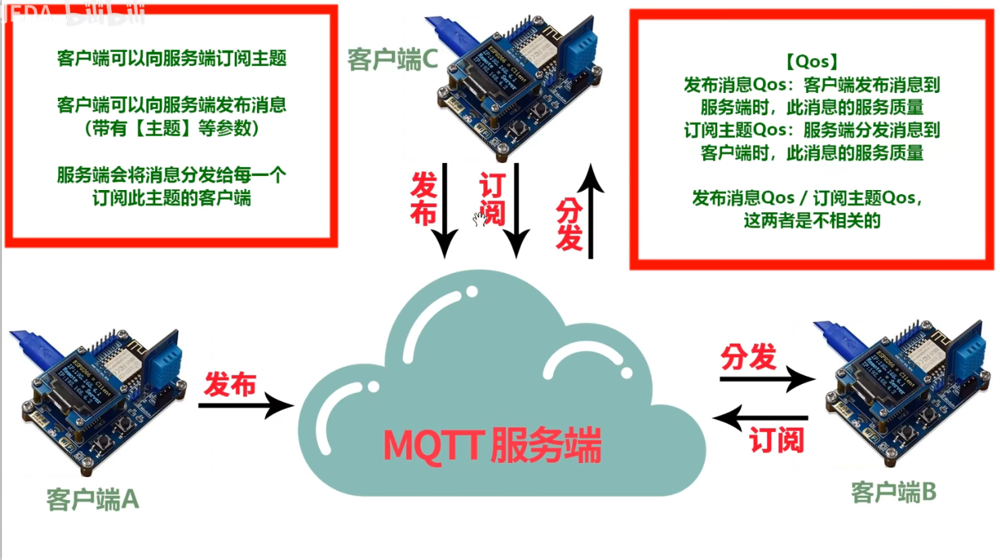

[toc]

# ESP8266程序下载
## flash布局
本设计采用无操作系统进行编程测试，使用不支持云端升级的non-FOTA固件。


## 下载地址
由于该开发板外部Flash容量为4096KB，也就是4MB，由于读写必须是扇区为单位进行操作，扇区上图说明中可以得到为4KB，因此最该开发板最后一个扇区地址为0X3FF000，因此采用对应下图的下载地址。


## ESP8266 Download Tool
烧录程序时，如果处于等待同步模式，则需要切换ESP8266从程序运行模式到程序下载模式中。


当板子引脚GPIO0为低电平时为串口下载模式，根据原理图可知，BOOT按键按下后，系统进入下载模式，因此等待程序下载，默认情况下，引脚接高电平则为程序运行模式。


# sdk编程—程序架构


# UART编程


代码中需要注意的一点是，os_printf用的是系统串口打印，波特率为74880，而uart0_sendStr波特率为串口初始化函数配置。

``` c?linenums
user_init(void)
{
	uart_init(BIT_RATE_9600, BIT_RATE_9600);
	os_printf("\r\n--------------------------------------------\r\n");
	os_printf("SDK	version:	%s	\r\n",	system_get_sdk_version()); //串口打印SDK版本信息
	uart0_sendStr("\r\nHello World!\r\n");
	os_printf("\r\n--------------------------------------------\r\n");
}
```


# Makefile
如果修改代码文件对应的路径，则需要进行makefile的编译修改，具体过程参考。
[【物联网教程】基于ESP8266(WIFI) - P14 物联网教程_14_MakeFile](https://www.bilibili.com/video/BV1dJ411S723?p=14&vd_source=85143ebef149f78ad6d9c01fb85eb64b)

# Watch Dog


如果不执行`system_soft_wdt_feed`函数，则系统会进行不断重启复位，因此需要进行经常喂狗保持系统稳定。

``` c?linenums
void ICACHE_FLASH_ATTR user_init(void)
{
	uart_init(115200,115200);	// 初始化串口波特率
	os_delay_us(10000);			// 等待串口稳定
	os_printf("\r\n=================================================\r\n");
	os_printf("\t Project:\t%s\r\n", ProjectName);
	os_printf("\t SDK version:\t%s", system_get_sdk_version());
	os_printf("\r\n=================================================\r\n");
	while(1)
	{
		system_soft_wdt_feed();		// 喂狗，防止复位
	}
}
```

# Delay

添加了了 ICACHE_FLASH_ATTR 的代码通常⽐比使⽤用 IRAM_ATTR 标记的代码执⾏行行得慢。然而，像⼤大多数嵌入式平台⼀样， ESP8266 的 iRAM 空间有限，因此建议⼀般代码添加ICACHE_FLASH_ATTR，仅对执⾏行行效率要求⾼高的代码添加 IRAM_ATTR宏。

``` c?linenums
#include "user_interface.h"
#include "osapi.h"

// 毫秒延时函数(不要延时太久)
//===========================================
void ICACHE_FLASH_ATTR delay_ms(u32 C_time)
{	for(;C_time>0;C_time--)
	{ (1000);}
}

```


# GPIO_Output
根据原理图控制LED灯亮，则需要配置GPIO4为低电平，根据乐鑫的技术文档2.2章GPIO寄存器说明，需要先将GPIO4配置为GPIO功能，代码为第11行。

``` c?linenums
void ICACHE_FLASH_ATTR user_init(void)
{
	u8 F_LED = 0 ;		// LED状态标志位
	uart_init(115200,115200);	// 初始化串口波特率
	os_delay_us(10000);			// 等待串口稳定
	os_printf("\r\n=================================================\r\n");
	os_printf("\t Project:\t%s\r\n", ProjectName);
	os_printf("\t SDK version:\t%s", system_get_sdk_version());
	os_printf("\r\n=================================================\r\n");

	// 管脚功能选择(注意：参数1【PIN_NAME】管脚名、参数2【FUNC】管脚功能)
	//--------------------------------------------------------------------------
	PIN_FUNC_SELECT(PERIPHS_IO_MUX_GPIO4_U,	FUNC_GPIO4);	// GPIO4设为IO口

	// 将相应管脚设为输出模式，并输出对应电平(参数1【gpio_no】、参数2：输出电平)
	//--------------------------------------------------------------------------
	GPIO_OUTPUT_SET(GPIO_ID_PIN(4),1);			// IO4 = 1(高电平)

	// 注意：【PIN_NAME】、【FUNC】、【gpio_no】不要混淆
	//…………………………………………………………………………………………………
	//·【PIN_NAME】		管脚名称		"PERIPHS_IO_MUX_" + "管脚名"
	//·【FUNC】			管脚功能		功能序号 - 1
	//·【gpio_no】			IO端口序号		GPIO_ID_PIN(IO端口序号)
	//…………………………………………………………………………………………………

	while(1)
	{
		system_soft_wdt_feed();					// 喂狗，防止复位
		F_LED = !F_LED;							// LED状态值翻转
		GPIO_OUTPUT_SET(GPIO_ID_PIN(4),F_LED);	// 设置LED(IO4)输出值
		delay_ms(500);							// 延时500Ms
	}
}
```

PIN_FUNC_SELECT函数是将引脚配置为对应功能，管脚引脚名前缀为`PERIPHS_IO_MUX_`，后面为具体引脚名称，对面引脚宏下面为功能。


配置好GPIO4引脚后，将GPIO4引脚输出高电平即可输出对应电平。

# GPIO_Input
根据原理图可知GPIO0引脚与按键连接，由于存在外部上拉，因此按键按下时为低电平，没按下则为高电平。因此可以通过读取引脚电平变换得到按键是否按下的信息。

``` c?linenums
void ICACHE_FLASH_ATTR user_init(void)
{
	uart_init(115200,115200);	// 初始化串口波特率
	os_delay_us(10000);			// 等待串口稳定
	os_printf("\r\n=================================================\r\n");
	os_printf("\t Project:\t%s\r\n", ProjectName);
	os_printf("\t SDK version:\t%s", system_get_sdk_version());
	os_printf("\r\n=================================================\r\n");

	// 初始化LED(注意【PIN_NAME】、【FUNC】、【gpio_no】不要混淆)
	//-------------------------------------------------------------------------
	PIN_FUNC_SELECT(PERIPHS_IO_MUX_GPIO4_U,	FUNC_GPIO4);	// GPIO_4设为IO口
	GPIO_OUTPUT_SET(GPIO_ID_PIN(4),1);						// GPIO_4 = 1

	// 初始化按键(BOOT == GPIO0)
	//----------------------------------------------------------------------------------
	PIN_FUNC_SELECT(PERIPHS_IO_MUX_GPIO0_U,	FUNC_GPIO0);	// GPIO_0设为IO口
	GPIO_DIS_OUTPUT(GPIO_ID_PIN(0));						// GPIO_0失能输出(默认)
	PIN_PULLUP_DIS(PERIPHS_IO_MUX_GPIO0_U);					// GPIO_0失能内部上拉(默认)
//	PIN_PULLUP_EN(PERIPHS_IO_MUX_GPIO0_U);					// GPIO_0使能内部上拉

	while(1)
	{
		system_soft_wdt_feed();								// 喂狗，防止复位
		if( GPIO_INPUT_GET(GPIO_ID_PIN(0)) == 0 )			// 读取GPIO_0电平
			GPIO_OUTPUT_SET(GPIO_ID_PIN(4),0);				// LED亮
		else
			GPIO_OUTPUT_SET(GPIO_ID_PIN(4),1);				// LED灭
	}
}
```

17行是将GPIO0引脚配置为GPIO功能，然后关闭引脚输出功能和内部上拉，通过判断电平判断按键是否按下。

# GPIO_EXTI


通过寄存器`GPIO_STATUS_ADDRESS`读取当前的引脚中断状态，由于是GPIO0按键连接按键，按键按下后触发中断，此时`S_GPIO_INT`数值为`0x01`，通过对`GPIO_STATUS_W1TC_ADDRESS`寄存器对应引脚位置写入1，清楚中断标志位。


# OS_Timer (软件定时器)


需要注意的是该系统定时器会被其他高优先级的任务延迟，因此不能保证其精确运行。如果第20行代码注释打开，则会导致定时器被延迟而不能及时调用，因此推测喂狗函数的优先级较高。


# HW_Timer (硬件定时器)


# DHT11 温湿度采集
该模块代码部分的没有过多的讲解，具体时序信息内容等，参考文档，进行编写。
## reference
1. [温湿度传感器模块-DHT11](https://oshwhub.com/jixin/HDT11-9607db45400d4539af360a11b48395bd)
  
# Task
需要注意的一点，non-OS SDK 不支持抢占任务或进程切换。


  
  

需要注意的一点是消息队列深度，也就是当前忙碌时，系统预存的任务个数，当现正在忙碌时，并依次发送了三个任务，这个时候最后一个任务会被丢弃。当系统不忙碌后，继续操作对应的任务。上述代码测试结果如下图所示。系统安排了四个任务，但是由于消息队列深度为2，因此任务3和4会被抛弃。


为了进一步测试任务与优先级的关系，消息队列深度都设置为2，将任务1、2、3的优先级分别设定为0、1、2。因此任务3的优先级最高。

``` c?linenums
/ 宏定义
//==================================================================================
#define		ProjectName			"Task"		// 工程名宏定义

#define		MESSAGE_QUEUE_LEN	2			// 消息队列深度(对于同一个任务，系统最多接受的叠加任务数)
//==================================================================================

// 全局变量
//=========================================================
os_event_t * Pointer_Task_1 ;	// 定义任务1(串口打印任务)		// 第①步：定义任务指针 等级0
os_event_t * Pointer_Task_2 ;	// 定义任务2(串口打印任务)		// 第①步：定义任务指针 等级1
os_event_t * Pointer_Task_3 ;	// 定义任务3(串口打印任务)		// 第①步：定义任务指针 等级2
//=========================================================

// 毫秒延时函数
//===========================================
void ICACHE_FLASH_ATTR delay_ms(u32 C_time)
{	for(;C_time>0;C_time--)
		os_delay_us(1000);
}
//===========================================


// 任务执行函数(形参：类型必须为【os_event_t *】)		// 第③步：创建任务函数
//======================================================================================
void Func_Task_1(os_event_t * Task_message)	// Task_message = Pointer_Task_1
{
	// Task_message->sig=消息类型、Task_message->par=消息参数	// 第⑥步：编写任务函数(根据消息类型/消息参数实现相应功能)
	//--------------------------------------------------------------------------------
	os_printf("Func_Task_1 : 消息类型=%d，消息参数=%c\r\n",Task_message->sig, Task_message->par);
}

void Func_Task_2(os_event_t * Task_message)	// Task_message = Pointer_Task_2
{
	// Task_message->sig=消息类型、Task_message->par=消息参数	// 第⑥步：编写任务函数(根据消息类型/消息参数实现相应功能)
	//--------------------------------------------------------------------------------
	os_printf("Func_Task_2 : 消息类型=%d，消息参数=%c\r\n",Task_message->sig, Task_message->par);
}

void Func_Task_3(os_event_t * Task_message)	// Task_message = Pointer_Task_3
{
	// Task_message->sig=消息类型、Task_message->par=消息参数	// 第⑥步：编写任务函数(根据消息类型/消息参数实现相应功能)
	//--------------------------------------------------------------------------------
	os_printf("Func_Task_3 : 消息类型=%d，消息参数=%c\r\n",Task_message->sig, Task_message->par);
}
//======================================================================================


// user_init：entry of user application, init user function here
//==============================================================================
void ICACHE_FLASH_ATTR user_init(void)
{
	u8 C_Task = 0 ;			// 调用任务计数
	u8 Message_Type = 1;	// 消息类型
	u8 Message_Para = 'A';	// 消息参数

	uart_init(115200,115200);	// 初始化串口波特率
	os_delay_us(10000);			// 等待串口稳定
	os_printf("\r\n=================================================\r\n");
	os_printf("\t Project:\t%s\r\n", ProjectName);
	os_printf("\t SDK version:\t%s", system_get_sdk_version());
	os_printf("\r\n=================================================\r\n");


	// 给任务1分配空间(任务1空间 = 1个队列空间 * 队列数)	// 第②步：为任务分配内存
	//-------------------------------------------------------------------------------
	Pointer_Task_1=(os_event_t*)os_malloc((sizeof(os_event_t))*MESSAGE_QUEUE_LEN);
	Pointer_Task_2=(os_event_t*)os_malloc((sizeof(os_event_t))*MESSAGE_QUEUE_LEN);
	Pointer_Task_3=(os_event_t*)os_malloc((sizeof(os_event_t))*MESSAGE_QUEUE_LEN);

	// 创建任务(参数1=任务执行函数 / 参数2=任务等级 / 参数3=任务空间指针 / 参数4=消息队列深度)	// 第④步：创建任务
	//-----------------------------------------------------------------------------------------
	system_os_task(Func_Task_1, USER_TASK_PRIO_0, Pointer_Task_1, MESSAGE_QUEUE_LEN);
	system_os_task(Func_Task_2, USER_TASK_PRIO_1, Pointer_Task_2, MESSAGE_QUEUE_LEN);
	system_os_task(Func_Task_3, USER_TASK_PRIO_2, Pointer_Task_3, MESSAGE_QUEUE_LEN);

	// 调用4次任务
	//--------------------------------
	for(C_Task=1; C_Task<=4; C_Task++)
	{
		system_soft_wdt_feed();	// 喂狗，防止复位
		delay_ms(1000);			// 延时1秒
		if(C_Task == 1){
			os_printf("\r\n安排任务1：Task1 == %d\r\n",C_Task);
			// 调用任务(参数1=任务等级 / 参数2=消息类型 / 参数3=消息参数)
			// 注意：参数3必须为无符号整数，否则需要强制类型转换
			system_os_post(USER_TASK_PRIO_0, Message_Type++, Message_Para++);	// 第⑤步：给系统安排任务
		}
		else if(C_Task == 2){
			os_printf("\r\n安排任务2：Task2 == %d\r\n",C_Task);
			system_os_post(USER_TASK_PRIO_1, Message_Type++, Message_Para++);	// 第⑤步：给系统安排任务
		}
		else if(C_Task == 3){
			os_printf("\r\n安排任务3：Task3 == %d\r\n",C_Task);
			system_os_post(USER_TASK_PRIO_2, Message_Type++, Message_Para++);	// 第⑤步：给系统安排任务
		}
		else if(C_Task == 4){
			os_printf("\r\n安排任务4：Task1 == %d\r\n",C_Task);
			system_os_post(USER_TASK_PRIO_0, Message_Type++, Message_Para++);	// 第⑤步：给系统安排任务
		}
	}
	os_printf("\r\n------------------ user_init OVER ----------------\r\n\r\n");
}
//==============================================================================

```
上述代码大致为发送四个任务，顺序为任务1、任务2、任务3、任务4，根据下图测试结果可以看出，任务3的优先级最高，虽然安排比较晚，但是第一个被打印，其次再是任务2，最后才是任务1的第一次和第二次，经过测试满足文档的说明。


# Flash


# 网络体系结构


## IP & 端口


 ## UDP & TCP
 
 
 
 
 
# AP_Mode

## 修改AP的IP地址

IP地址为10.0.0.1，并且开启DHCP模式分配IP地址。

``` c?linenums
	struct	ip_info	info;
	wifi_station_dhcpc_stop();
	wifi_softap_dhcps_stop();

//	IP4_ADDR(&info.ip,	192,	168,	3,	200);
//	IP4_ADDR(&info.gw,	192,	168,	3,	1);
//	IP4_ADDR(&info.netmask,	255,	255,	255,	0);
//	wifi_set_ip_info(STATION_IF,	&info);

	IP4_ADDR(&info.ip,	10,	10,	10,	1);
	IP4_ADDR(&info.gw,	10,	10,	10,	1);
	IP4_ADDR(&info.netmask,	255,	255,	255,	0);
	wifi_set_ip_info(SOFTAP_IF,	&info);

	wifi_softap_dhcps_start();
```


# AP_UDP

## Server

 
 
## Client

C和S端代码是实现上，本质没有太大的区别，只有在ST_NetCon.proto.udp结构体上实现上有一定的区别。

# AP_TCP
## Server
软件实现流程:
1. 配置ESP8266为AP模式，并且配置AP结构体信息。
2. 利用定时器定时1s重复定时器，获取当前ESP8266的IP地址，并且关闭定时器和开启网络连接，TCP通信。
3. 设置网络连接结构体espconn，由于此代码是实现S端，不填写对端网络信息，然后注册连接成功回调函数和异常断开回调函数，创建TCP_server建立监听，设置超时断开连接时间。
4. 连接成功回调函数，注册网络数据发送成功回调函数、网络数据接受成功回调函数，成功断开TCP连接回调函数。
5. 接受成功回调函数有三个参数，参数1：网络传输结构体espconn指针、参数2：网络传输数据指针、参数3：数据长度。在TCP协议传输中，espconn结构体保存了远端主机的IP地址。

## Client
软件实现流程:
1. 配置ESP8266为AP模式，并且配置AP结构体信息。
2. 利用定时器定时30s定时器，获取当前ESP8266的IP地址，并且关闭定时器和开启网络连接，TCP通信。
3. 设置网络连接结构体espconn，由于此代码是实现C端，因此需要填写对端的IP地址和端口号，然后注册连接成功回调函数和异常断开回调函数，最终连接TCP服务器。
4. 连接成功回调函数，注册网络数据发送成功回调函数、网络数据接受成功回调函数，成功断开TCP连接回调函数。
5. 接受成功回调函数有三个参数，参数1：网络传输结构体espconn指针、参数2：网络传输数据指针、参数3：数据长度。在TCP协议传输中，espconn结构体保存了远端主机的IP地址。

# STA_Mode
代码实现
1. 将ESP8266配置为STA模式，配置STA参数，station_config结构体中的bssid_set变量是用来判别相同ssid的情况，如果设置为0则不用MAC判别WIFI。
2. 若在user_init函数中进行wifi_station_set_config参数的设置，则会自动连接入WIFI，不需在调用wifi_station_connect函数，如果不是初始化函数则需要调用wifi_station_connect函数才可连接如WiFi。
3. 利用1s重复定时器，调用wifi_station_get_connect_status函数获得当前WIFI状态，当确定获得IP地址后，则关闭定时器，并显示获取的IP信息。

如果需要手动配置ESP8266的静态IP地址等信息，参考下述代码41-45行。

# STA-UDP
## Server
代码实现
1. 将ESP8266配置为STA模式，配置STA参数，station_config结构体中的bssid_set变量是用来判别相同ssid的情况，如果设置为0则不用MAC判别WIFI。
2. 若在user_init函数中进行wifi_station_set_config参数的设置，则会自动连接入WIFI，不需在调用wifi_station_connect函数，如果不是初始化函数则需要调用wifi_station_connect函数才可连接如WiFi。
3. 利用1s重复定时器，调用wifi_station_get_connect_status函数获得当前WIFI状态，当确定获得IP地址后，则关闭定时器，并显示获取的IP信息。
4. 初始化网络连接，UDP通信，设置本地端口，注册数据成功发送回调函数和数据成功接收回调函数，初始化UDP通信。

## Client

代码实现
1. 将ESP8266配置为STA模式，配置STA参数，station_config结构体中的bssid_set变量是用来判别相同ssid的情况，如果设置为0则不用MAC判别WIFI。
2. 若在user_init函数中进行wifi_station_set_config参数的设置，则会自动连接入WIFI，不需在调用wifi_station_connect函数，如果不是初始化函数则需要调用wifi_station_connect函数才可连接如WiFi。
3. 利用1s重复定时器，调用wifi_station_get_connect_status函数获得当前WIFI状态，当确定获得IP地址后，则关闭定时器，并显示获取的IP信息。
4. 初始化网络连接，UDP通信，设置本地端口和对端IP地址和端口，注册数据成功发送回调函数和数据成功接收回调函数，初始化UDP通信，并主动发送通信。

# STA_TCP
## Server
①：复位ESP8266，等待ESP8266接入WIFI、创建TCP_Server	
②：电脑接入相同的WIFI		
③：打开网络调试软件，创建TCP_Client
④：设置TCP_Server的IP地址/端口号，建立TCP连接
⑤：主动向远端TCP_Server发送消息
⑥：实现局域网内的TCP通信	
⑦：ESP8266根据接收到的消息控制LED的亮/灭

## Client

①：打开网络调试软件，创建TCP_Server
②：设置TCP_Server的端口号，开启TCP侦听
③：等待TCP_Client接入TCP_Server
④：复位ESP8266，等待接入WIFI、创建TCP_Client
⑤：ESP8266主动向TCP_Server建立连接，发起通信
⑥：网络调试助手(TCP_Server)在客户端列表中选择ESP8266
⑦：网络调试助手(TCP_Server)向ESP8266发送数据

# DNS 
①：8266设置为STA模式，接入路由器WIFI
②：设置TCP通信参数
③：解析域名"www.rationmcu.com"，获取服务器IP地址
④：串口/OLED显示"www.rationmcu.com"的IP地址
⑤：ESP8266作为TCP_Client，接入"www.rationmcu.com"
⑥：TCP连接成功后，串口显示"TCP_Connect_OK"字符串

由于是HTTP连接，因此目的端口是80，本地端口使用`espconn_port`函数获取可用端口。

注意：连接TCP服务器没有在定时器回调函数中完成，而是在DNS解析回调函数中完成TCP服务器的连接。

# HTTP


①：8266设置为STA模式，接入路由器WIFI
②：设置TCP通信参数
③：解析域名"www.rationmcu.com"，获取服务器IP地址
④：ESP8266作为TCP_Client，接入"www.rationmcu.com"
⑤：向Server发送HTTP协议报文，获取网页信息	
⑥：打印【www.rationmcu.com/elecjc/2397.html】网页信息
⑦：【注意：网页默认编码方：UTF-8】
⑧：串口调试助手一般是ASCII/GBK/GB2312编码
⑨：串口助手收到的中文字符为乱码是正常


# SNTP


SNTP可以连接三个服务器获取基准时间，优先级顺序为0>1>2，既可以通过域名获取也可以通过IP地址进行获取。

# JSON
## API


``` json?linenums
{
    "Shanghai": {
        "temp": "30℃",
        "humid": "30%RH"
    },
    "ShenZhen": {
        "temp": "35℃",
        "humid": 50
    },
    "result": "ShenZhen is too Hot!",
}
```

## JSON_C_FuncLib

## 物联网教程
## 物联网云平台介绍


## 创建云端设备_乐鑫云


# MQTT协议讲解




  
reference:
1. [物联网教程48_ MQTT协议讲解](https://www.bilibili.com/video/BV1dJ411S723?p=49&spm_id_from=pageDriver&vd_source=85143ebef149f78ad6d9c01fb85eb64b)
2. MQTT协议_CN_注释.pdf

## mqtt.fx客户端


## 天工物接入介绍_百度云


## 创建云端设备


| 实例名                                | esp8266                          |
| ------------------------------------- | -------------------------------- |
| MQTT服务端域名                        | f7utnjh.mqtt.iot.gz.baidubce.com |
| MQTT服务端端口号                      | 1883                             |
| MQTT密码（身份密钥）                  | msUNR4cjzcGNcY6x                 |
| 身份                                  | lzy                              |
| 策略                                  | SW_LED，Will                     |
| MQTT客户端 1： iot_light_esp8266_01   | f7utnjh/iot_light_esp8266_01     |
| MQTT客户端 2： iot_light_mqttfx_baidu | f7utnjh/iot_light_mqttfx_baidu   |


注意：只有这个持有人标识标量修改后，系统参数才会修改，因此每次修改代码切记标识修改。


代码中的MQTT_CLIENT_ID是使用的是系统函数`system_get_chip_id`，因此不会存在重复现象。

# 物联网组件
## 规则引擎


## 数据可视化


## 创建设备型项目


点击项目进入到物模型中，创建物模型。


创建物影子，在选择物模型中选择上述选择的物模型。


创建成功后，下载对应的配置信息。


点击对应物影子后，进入到交互中，复制接入SDK信息。


# EPS8266字符串API
## int  os_sprintf( char *buffer,  const char * format,  [ argument ] … )

描述：把格式化的数据写入某个字符串缓冲区

返回值：以format为格式argument为内容组成的结果被写入buffer 的字节数，结束字符‘\0’不计入内
## void *  os_memset( void *dest,  int val,  unsigned int nbyte )

描述：将参数1(dest)所指向位置的nbyte个字节全部填充为val指定的ASCII值/数据

返回值：指向dest的void*指针

## void * os_memcpy( void *dest, const void *src, unsigned int nbyte )

描述：从参数2(src)所指的位置起，拷贝nbyte个字节到参数1(dest)所指位置处

返回值：指向dest的void*指针
## void *  os_memmove( void *dest,  const void *src,  unsigned int nbyte )

描述：从参数2(src)所指的位置起，拷贝nbyte个字节到参数1(dest)所指位置处，如果目标区域和源区域有重叠的话，memmove能够保证源字符串在被覆盖之前将重叠区域的字节拷贝到目标区域中。但复制后src内容会被更改。当目标区域与源区域没有重叠则和memcpy函数功能相同。

返回值：指向dest的void*指针。
## int  os_memcmp( const void *str1,  const void *str2,  unsigned int nbyte )

描述：比较参数1(str1)指向位置和参数2(str1)指向位置的前nbyte个字节(按字节比较)

返回值<0：		buf1\<buf2
返回值=0：		buf1\==buf2
返回值>0：		buf1\>buf2

## char *  os_strstr( const char *str1,  const char *str2 )

描述：计算给定字符串s的长度，不包括'\0'在内

返回值：字符串长度
## char *  os_strstr( const char *str1,  const char *str2 )

描述：判断字符串str2是否是str1的子串

返回值=NULL：	字符串2不是字符串1的子串
返回值!=NULL：	字符串2是字符串1的子串，返回字符串2在字符串1中首次出现的地址

## char *  strcpy( char* dest,  const char *src )

描述：把从参数2(src)所指位置起的字符串(含有'\0'结束符)复制到以参数1(dest)开始的地址空间

返回值：指向dest的char*指针
## char *  os_strncpy( char *dest,  char *src,  unsigned int nbyte )

描述：把从参数2(src)所指位置起的字符串的前nbyte个字节复制到以参数1(dest)开始的地址空间

返回值：指向dest的char*指针

## int  os_strcmp( const char *s1,  const char *s2 )

描述：两个字符串自左向右逐个字符相比(按ASCII值大小相比较)，直到出现不同的字符或遇'\0'为止

返回值<0：	s1\<s2
返回值=0：	s1\==s2
返回值>0：	s1\>s2
## int  os_strncmp( const char *s1,  const char *s2,  unsigned int nbyte )

描述：比较字符串s1和s2的前nbyte个字符。

返回值<0：	s1\<s2(前nbyte个字节)
返回值=0：	s1=\=s2(前nbyte个字节)
返回值>0：	s1\>s2(前nbyte个字节)

# sprintf无法使用

 

由于使用sprintf函数，对数据进行字符转换导致的问题，解决办法为使用ESP8266 IDE提供的API接口函数os_sprintf即可解决，形参一致。
``` c?linenums
#include <stdio.h>
#include <stdlib.h>
#include <string.h>

#define printf(...) os_printf( __VA_ARGS__ )
#define sprintf(...) os_sprintf( __VA_ARGS__ )

void GPIO_INTERRUPT(void)
{
	u32	S_GPIO_INT;		// 所有IO口的中断状态
	u32 F_GPIO_0_INT;	// GPIO_0的中断状态
	char str[50] = {0};

	// 读取GPIO中断状态
	//---------------------------------------------------
	S_GPIO_INT = GPIO_REG_READ(GPIO_STATUS_ADDRESS);

	sprintf(str, "S_GPIO_INT = [%X]\r\n",S_GPIO_INT);
	uart0_sendStr(str);

	// 清除中断状态位(如果不清除状态位，则会持续进入中断)
	//----------------------------------------------------
	GPIO_REG_WRITE(GPIO_STATUS_W1TC_ADDRESS, S_GPIO_INT);

	F_GPIO_0_INT = S_GPIO_INT & (0x01<<0);	// 获取GPIO_0中断状态

	sprintf(str, "F_GPIO_0_INT = [%X]\r\n",F_GPIO_0_INT);
	uart0_sendStr(str);

	// 判断是否是KEY中断(未做消抖)
	//------------------------------------------------------------
	if(F_GPIO_0_INT)	// GPIO_0的下降沿中断
	{
		F_LED = !F_LED;
		GPIO_OUTPUT_SET(GPIO_ID_PIN(4),F_LED);	// LED状态翻转
	}
}

```

参考链接：
1. [USAGE OF <STDIO.H> (PRINTF, SPRINTF)](https://www.esp8266.com/viewtopic.php?f=28&t=2173)
2. [小白学ESP8266遇到问题，请大佬帮忙](https://bbs.csdn.net/topics/394689453)
 
# 原理图

