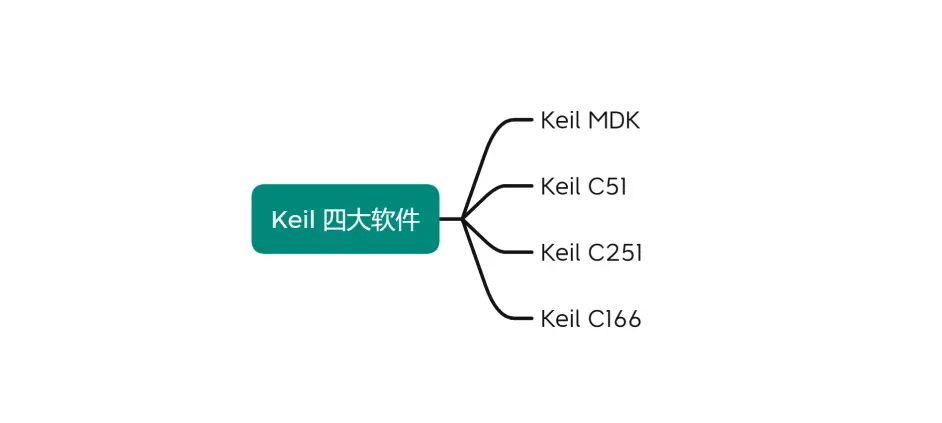
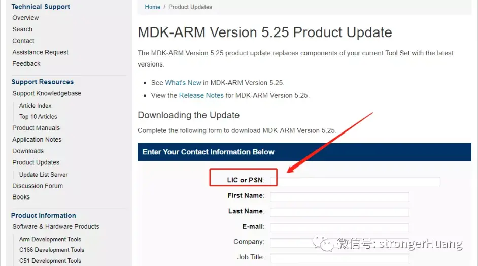

[toc]
# keil简单介绍
本文描述以下几种下载 Keil 历史版本的方法：

- 官网正规步骤下载
- 有规律的下载链接
- 第三方下载链接
 
适用于 Keil 四大软件（MDK、 C51、 C166、 C251）。

# 官网正规步骤下载
Keil 官网提供有 Keil 历史版本下载的地址
1. Keil MDK官网历史版本地址：https://www.keil.com/update/rvmdk.asp
2. Keil C51官网历史版本地址: https://www.keil.com/update/c51.asp
3. Keil C166官网历史版本地址: https://www.keil.com/update/c166.asp
4. Keil C251官网历史版本地址: https://www.keil.com/update/c251.asp
 
官网历史版本下载这种方法需要提供 LIC or PSN，因此，不适合绝大部分个人开发者，也不建议用这种方法。

