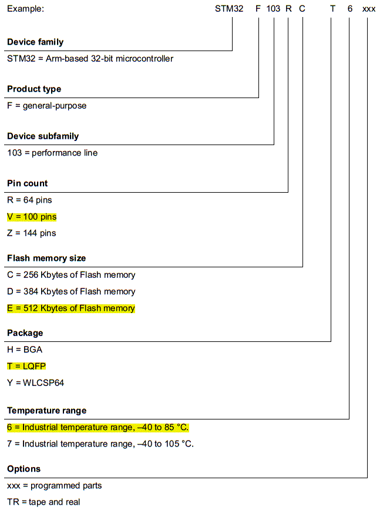

从图中可以看出：

STM32：是芯片的系列。

F代表：通用目的。

103代表：芯片的子系列。

R代表：芯片的引脚数量。R=60脚；V=100脚；Z=144脚。

C代表：芯片Flash内存的大小。C=256KB；D=384KB；E=512KB。

T代表：芯片的封装。H为BGA封装；T为LQFP封装；Y为WLCSP64封装。

6代表：芯片的温度范围。6为-40~85℃；7为-40~105℃。

xxx代表：可选择项。xxx为编程部分；TR为带料。

例如：芯片编号为STM32F103VET6，含义意法半导体公司的STM32系列中的，通用目的的，103子系列芯片，引脚数100，LQFP封装，512KB Flash，温度范围为-40~85℃。