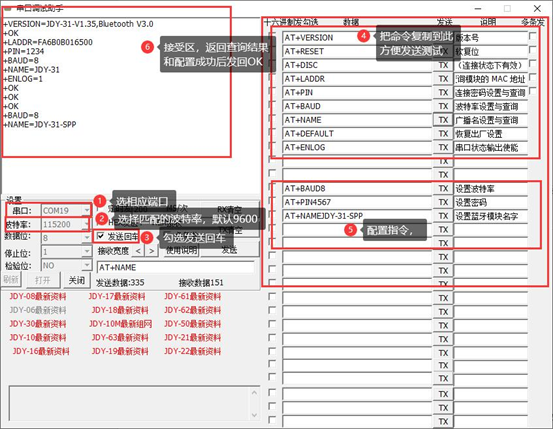

# SYS Mode and Configuration


# TIMx Mode and configuration
## TIMx PWM Generation CHx

``` c
HAL_TIM_PWM_Start(&htim1,TIM_CHANNEL_1);//开启PWM波形输出
__HAL_TIM_SET_COMPARE(&htim1, TIM_CHANNEL_1, 500); //改变占空比，500/1000=50%
```

# JDY-31



## Reference
1. [JDY-31蓝牙模块简单通信](https://blog.csdn.net/weixin_51690423/article/details/122690945?ops_request_misc=%257B%2522request%255Fid%2522%253A%2522164795114516780271517968%2522%252C%2522scm%2522%253A%252220140713.130102334.pc%255Fall.%2522%257D&request_id=164795114516780271517968&biz_id=0&utm_medium=distribute.pc_search_result.none-task-blog-2~all~first_rank_ecpm_v1~rank_v31_ecpm_bkp-4-122690945.142^v3^pc_search_quality_down,143^v4^control&utm_term=jdy-31+stm32&spm=1018.2226.3001.4187)

# USART
## Serial redirection
### Plan A
``` c
#if 1
#pragma import(__use_no_semihosting)             
                
struct __FILE 
{ 
	int handle; 

}; 

FILE __stdout;       
//定义_sys_exit()以避免使用半主机模式    
void _sys_exit(int x) 
{ 
	x = x; 
} 
//重定义fputc函数 
int fputc(int ch, FILE *f)
{      
	while((USART1->SR&0X40)==0);//循环发送,直到发送完毕   
    USART1->DR = (uint8_t) ch;      
	return ch;
}
#endif     


```

### Plan B

``` c
#ifdef __GNUC__
  #define PUTCHAR_PROTOTYPE int __io_putchar(int ch)
#else
 #define PUTCHAR_PROTOTYPE int fputc(int ch, FILE *f)
#endif

PUTCHAR_PROTOTYPE
{
 HAL_UART_Transmit(&huart1,(uint8_t *)&ch,1,0xFFFF);//阻塞方式打印
  return ch;
}
```

### Program Comparison
printf重定向到串口就必须关闭半主机模式，半主机模式简而言之就是将电脑的键盘和显示屏作为(scanf,printf)输入输出外设。
第一种方法使用微库将默认关闭半主机模式，但微库会使代码量优化减少，可能造成代码的稳定性降低，微库是面向深层嵌入式开发的（这句话可能是说微库是面向最终产品的。
第二种方法直接手动取消半主机模式，更加方便。