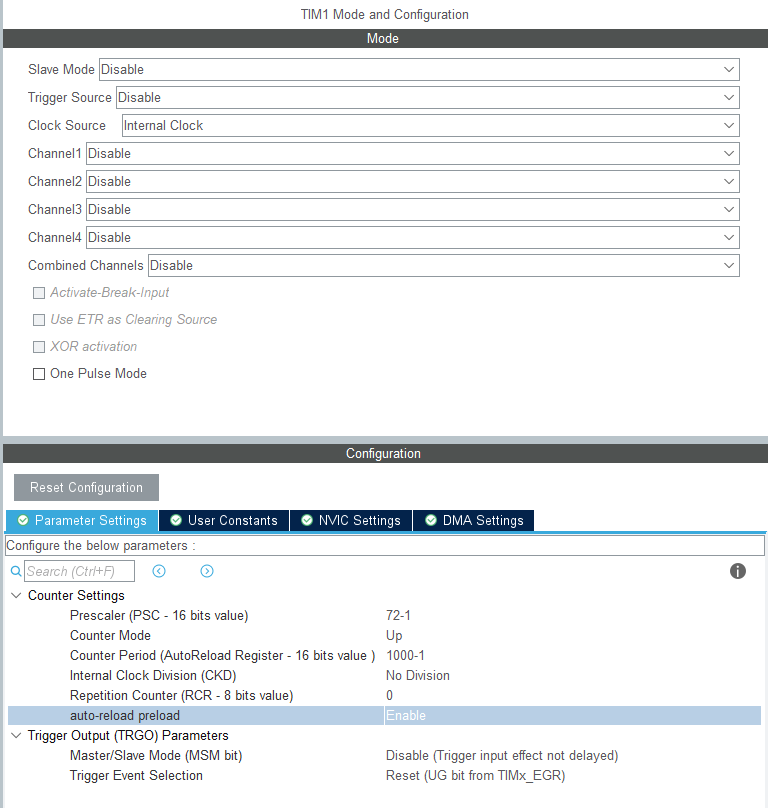
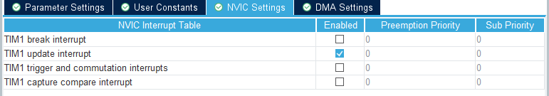

@[toc ]
# main.h

``` c?linenums

#include "stdio.h"
#include "stdlib.h"
#include "string.h"
#include "stdbool.h"

typedef signed char             int8_t; 
typedef short int               int16_t;
typedef int                     int32_t;
typedef long long int           int64_t;

typedef unsigned char           uint8_t;
typedef unsigned short int      uint16_t;
typedef unsigned int            uint32_t;
typedef unsigned long long int  uint64_t;

#include "usart.h"
#include "gpio.h"
#include "adc.h"

#include "dht11.h"
#include "oled.h"
#include "jdy_31.h"
#include "adc_muti.h"
#include "key.h"
#include "28BYJ-48.h"

void delay_us(__IO uint32_t delay);   

```

# HAL库微秒us的延时Delay实现

``` c?linenums
#define CPU_FREQUENCY_MHZ    72		// STM32时钟主频
void delay_us(__IO uint32_t delay)
{
    int last, curr, val;
    int temp;

    while (delay != 0)
    {
        temp = delay > 900 ? 900 : delay;
        last = SysTick->VAL;
        curr = last - CPU_FREQUENCY_MHZ * temp;
        if (curr >= 0)
        {
            do
            {
                val = SysTick->VAL;
            }
            while ((val < last) && (val >= curr));
        }
        else
        {
            curr += CPU_FREQUENCY_MHZ * 1000;
            do
            {
                val = SysTick->VAL;
            }
            while ((val <= last) || (val > curr));
        }
        delay -= temp;
    }
}


```

# SYS Mode and Configuration


# TIMx Mode and configuration

## TIM Base Update




``` c?linenums

// 开启定时器计数中断
HAL_TIM_Base_Start_IT(&htim1);

// 定时器中断回调函数 
void HAL_TIM_PeriodElapsedCallback(TIM_HandleTypeDef *htim)
{
	static unsigned char ledState = 0;
	static u32 count = 0;
	
	if (htim == (&htim1))
	{
		count++;
		if(count >= 1000){
			count = 0;

		}
	}
	
}
```

## TIMx PWM Generation CHx

``` c
HAL_TIM_PWM_Start(&htim1,TIM_CHANNEL_1);//开启PWM波形输出
__HAL_TIM_SET_COMPARE(&htim1, TIM_CHANNEL_1, 500); //改变占空比，500/1000=50%
```

# JDY-31


## Reference
1. [JDY-31蓝牙模块简单通信](https://blog.csdn.net/weixin_51690423/article/details/122690945?ops_request_misc=%257B%2522request%255Fid%2522%253A%2522164795114516780271517968%2522%252C%2522scm%2522%253A%252220140713.130102334.pc%255Fall.%2522%257D&request_id=164795114516780271517968&biz_id=0&utm_medium=distribute.pc_search_result.none-task-blog-2~all~first_rank_ecpm_v1~rank_v31_ecpm_bkp-4-122690945.142^v3^pc_search_quality_down,143^v4^control&utm_term=jdy-31+stm32&spm=1018.2226.3001.4187)

# HC-05
Step1：蓝牙与USB转TTL模块连接方式
RXD-TX
TXD-RX
VCC-VCC（5V-5V）
GND-GND
EN引脚不用接

Step2：进入AT模式
首先让AT引脚置高，然后接上蓝牙模块（有按键则按住蓝牙上的按键，再接通电源，进入AT指令模式），这时候将转串口模块接入电脑，当蓝牙模块state灯变为慢闪，则表明已经进入AT模式。打开串口调试助手便可以开始设置AT模式。（具体AT指令参考HC05 AT指令集）

Step3：配置蓝牙 （发送以下AT指令后返回OK表示设置成功）
恢复默认设置：
将蓝牙恢复默认设置：AT+ORGL\r\n（\r\n即回车、换行，在串口调试助手上输入一个回车即可）
设置蓝牙名称：
配置蓝牙的名称：AT+NAME=Bluetooth-Marster\r\n（主）或 AT+NAME=Bluetooth-Slave\r\n（从） 蓝牙名称为Bluetooth-Marster 或 Bluetooth-Slave
设置配对码：
配置蓝牙的配对码：AT+PSWD="1212"\r\n（蓝牙A与蓝牙B的配对码相同，这样才能成功配对）
设置工作角色：
将蓝牙A配置为主机模式：AT+ROLE=1\r\n，并将将蓝牙B配置为从机模式：AT+ROLE=0\r\n
配置串口参数：
配置波特率、停止位和校验位：AT+UART=115200,0,0\r\n，设置蓝牙通信串口波特率为9600，停止位1位，无校验位
查询地址：
查询蓝牙地址：AT+ADDR？\r\n（如2015:2:120758）
清空配对列表：
清空配对列表，方便配对新的蓝牙：AT+RMAAD\r\n
连接模式：
配置蓝牙连接模式，若为任意地址连接模式则配置为1，无需进行地址绑定，否则配置为0，需要进行地址绑定：AT+CMODE=1\r\n（蓝牙连接模式为任意地址连接模式）
蓝牙A绑定蓝牙B：
蓝牙A绑定蓝牙B地址：AT+BIND=2015,2,120758\r\n（注意把地址的冒号换成逗号）

Step4：返回常规工作模式
2个模块的PIO11引脚都接地，重新上电后进入常规工作模式，自动完成配对。之后，串口调试助手A和串口调试助手B就能互传数据了。

# USART
## Serial redirection
### Plan A
``` c
#if 1
#pragma import(__use_no_semihosting)             
                
struct __FILE 
{ 
	int handle; 

}; 

FILE __stdout;       
//定义_sys_exit()以避免使用半主机模式    
void _sys_exit(int x) 
{ 
	x = x; 
} 
//重定义fputc函数 
int fputc(int ch, FILE *f)
{      
	while((USART1->SR&0X40)==0);//循环发送,直到发送完毕   
    USART1->DR = (uint8_t) ch;      
	return ch;
}
#endif     


```

### Plan B

``` c
#ifdef __GNUC__
  #define PUTCHAR_PROTOTYPE int __io_putchar(int ch)
#else
 #define PUTCHAR_PROTOTYPE int fputc(int ch, FILE *f)
#endif

PUTCHAR_PROTOTYPE
{
 HAL_UART_Transmit(&huart1,(uint8_t *)&ch,1,0xFFFF);//阻塞方式打印
  return ch;
}
```

### Program Comparison
printf重定向到串口就必须关闭半主机模式，半主机模式简而言之就是将电脑的键盘和显示屏作为(scanf,printf)输入输出外设。
第一种方法使用微库将默认关闭半主机模式，但微库会使代码量优化减少，可能造成代码的稳定性降低，微库是面向深层嵌入式开发的（这句话可能是说微库是面向最终产品的。
第二种方法直接手动取消半主机模式，更加方便。