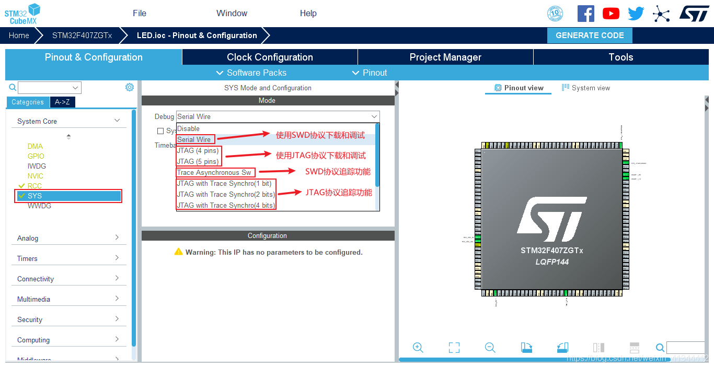

# SYS Mode and Configuration



# TIMx Mode and configuration
## TIMx PWM Generation CHx

``` c
HAL_TIM_PWM_Start(&htim1,TIM_CHANNEL_1);//开启PWM波形输出
__HAL_TIM_SET_COMPARE(&htim1, TIM_CHANNEL_1, 500); //改变占空比，500/1000=50%
```

# ADC Multi-channel acquisition
## Non-DMA Mode

## DMA Mode