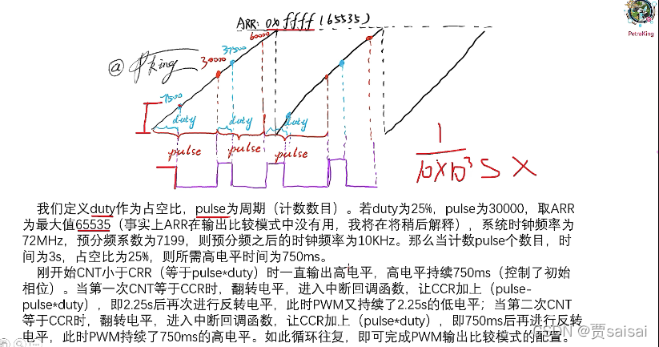

[toc]
# 输出比较模式

此模式可以说是PWM输出模式的增强型，PWM输出模式可以实现的此模式都可以实现。由于PWM输出模式是通过CNT寄存器与CRR寄存器的比较完成高低电平（占空比）的实现，而具体频率的实现是由ARR寄存器和定时器分频系数所决定的，每一个定时器中的由多个通道，每个通道的CNT和CRR是独立的，但是ARR是公用的，因此它们输出的频率都是相同的。
而输出比较模式，虽然也是CNT和CCR的比较进行输出电平，但是区别在于频率的实现是由于CCR的值不是固定死的，而是一直动态改变的。比如下图实现方式。

# 参考文献
1. [HAL库(STM32CubeMX)——基本定时器、PWM、输入捕获、输出比较、互补式PWM等综合学习（STM32G431RBT6）](https://blog.csdn.net/zerokingwang/article/details/123559200?ops_request_misc=%257B%2522request%255Fid%2522%253A%2522167921754116800197041139%2522%252C%2522scm%2522%253A%252220140713.130102334..%2522%257D&request_id=167921754116800197041139&biz_id=0&utm_medium=distribute.pc_search_result.none-task-blog-2~blog~baidu_landing_v2~default-1-123559200-null-null.blog_rank_default&utm_term=STM32%20HAL%20%E8%BE%93%E5%87%BA%E6%AF%94%E8%BE%83%E6%A8%A1%E5%BC%8F)
2. 