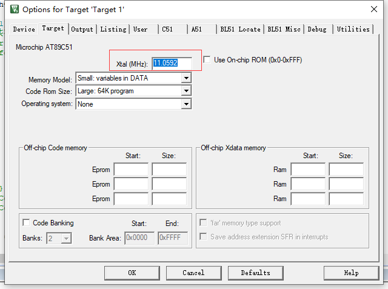
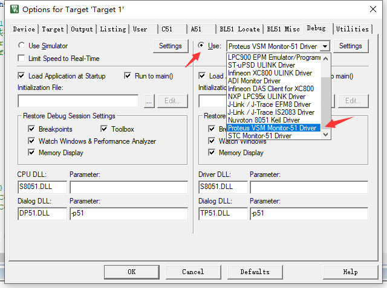
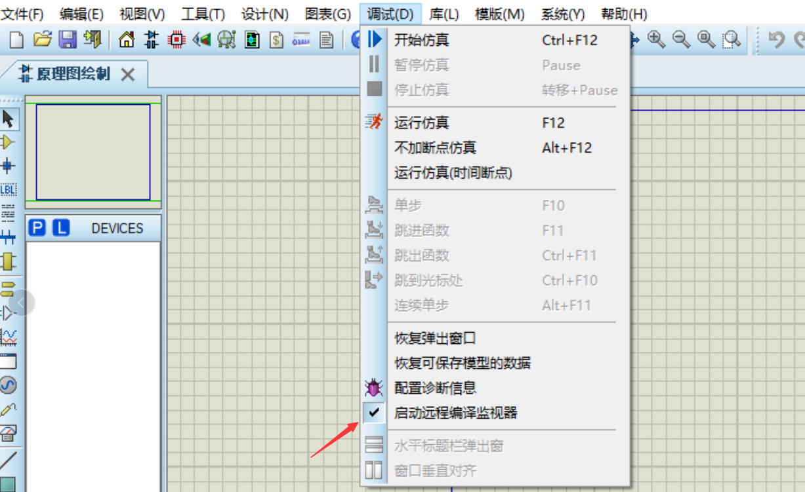
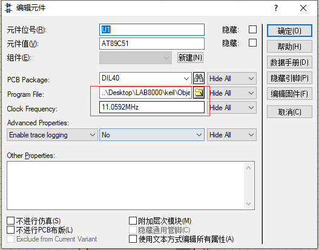

# Preparation

1. Keil for C51
2. proteus 8.9 SP2
3. VDM51.dll
 
# start woking

## keil for c51
1. Put VDM51.dll into T:\Keil_For_C51\C51\BIN folder
2. Modify the T:\Keil_For_C51\TOOLS.INI configuration file
3. Add the content `TDRV13=BIN\VDM51.DLL ("Proteus VSM Monitor-51 Driver")`.
4. 
5. 

## proteus
1. 
2.  
