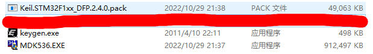
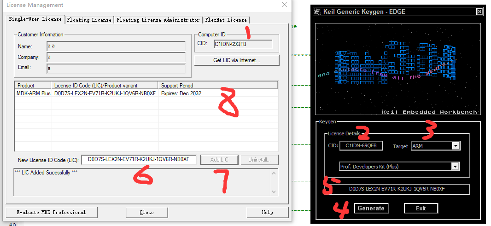

[toc]
# MDK for Arm
mdk软件下载地址为：[MDK-ARM Version 5.37](https://www.keil.com/demo/eval/arm.htm)，但是需要注意一点MDK在V537以后采用的编译器为V6版本，不支持向前兼容编译器V5的工程，因此不推荐使用MDK_V537，这里我使用的版本为MDK_V536，下载地址为：https://armkeil.blob.core.windows.net/eval/MDK536.EXE ,推荐使用迅雷下载。

器件包下载网址为[MDK5 Software Packs](https://www.keil.com/dd2/pack/)，下载STM32F1即可。

先安装MDK536，然后再安装前面两个器件包，keygan为注册机用于pojie MDK使用，==**由于keygan为破解软件在使用前关闭所有的杀毒软件** #F44336==！

注意安装MDK时，文件夹地址可以任意选择，但是注意一定不能有中文，最好使用`_`（下划线）替代空格。

用户信息内容随便填写即可。

安装MDK期间，可能会提示安装驱动，默认安装即可。软件安装后，就是要进行器件安装包，点击器件包后会自动寻找MDK的pack文件夹，一直点下一步即可，F1的器件包安装即可。

破解MDK，==**MDK和keygan都一定要管理员身份运行** #F44336==。

在序号1处复制CID信息到序号2处，在序号3处选择Target为ARM，然后点击序号4处获取信息，把序号5处的信息复制到6处，点击序号7，最终可以看到序号8处提示注册时间到2032年，代表注册成功。

若描述不够详细，可以参考注册视频：https://github.com/Relax-LiuZiyan/Story-writer/tree/master/Embedded/videos/MDK注册过程.mp4

# 所有资料下载网址
