# 步进电机基本介绍
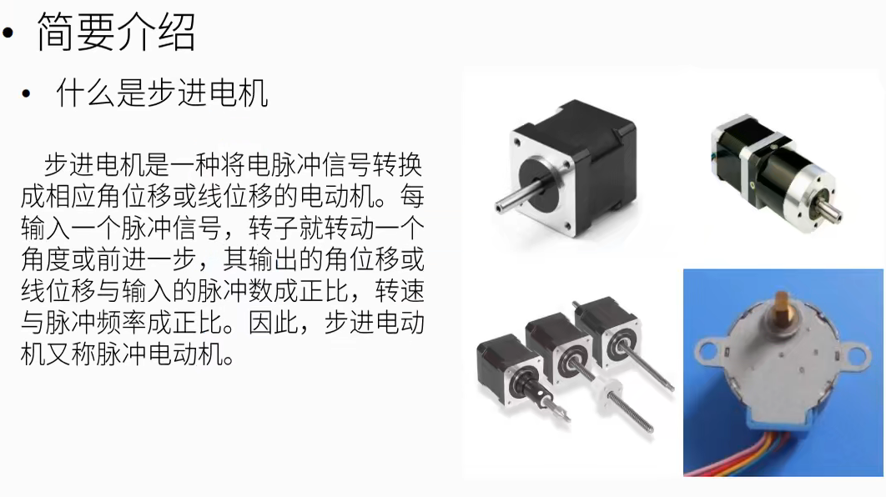

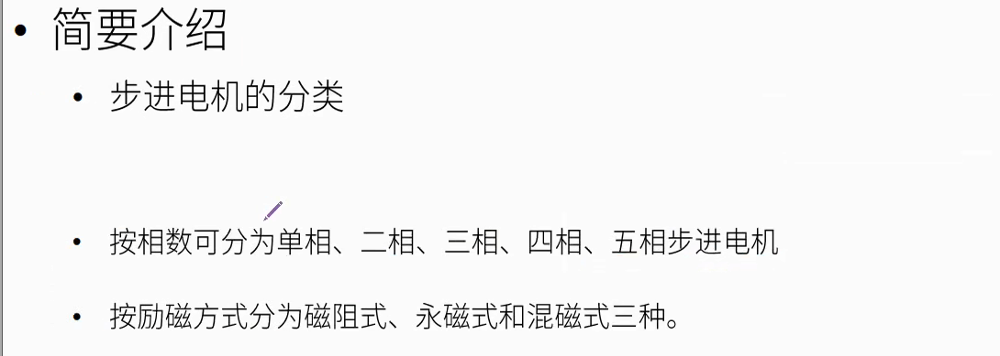

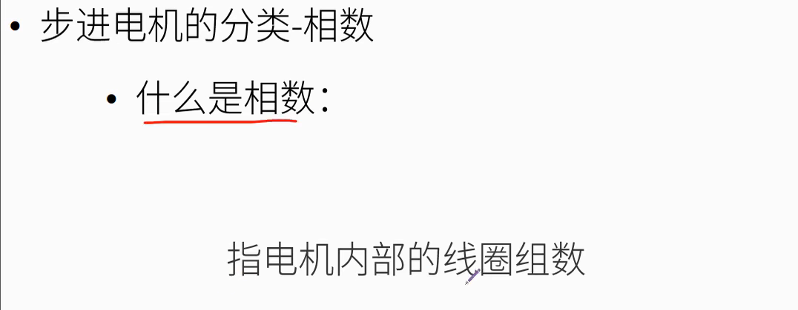
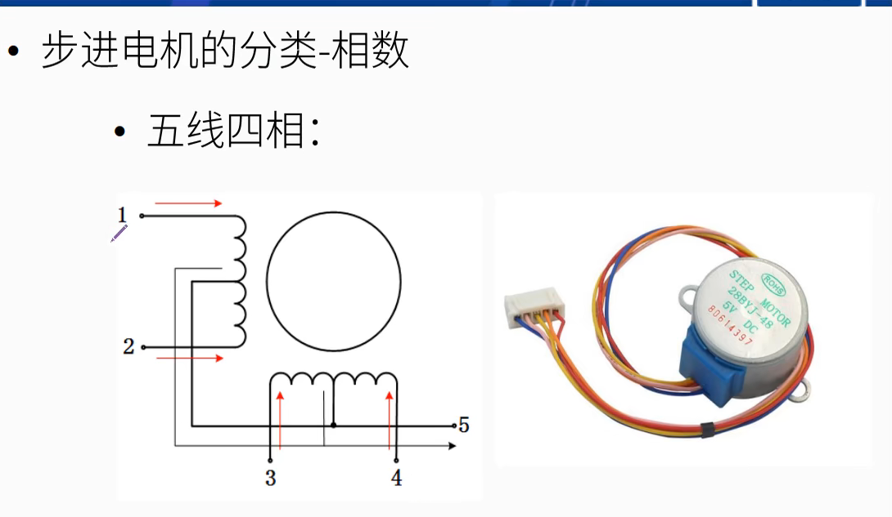

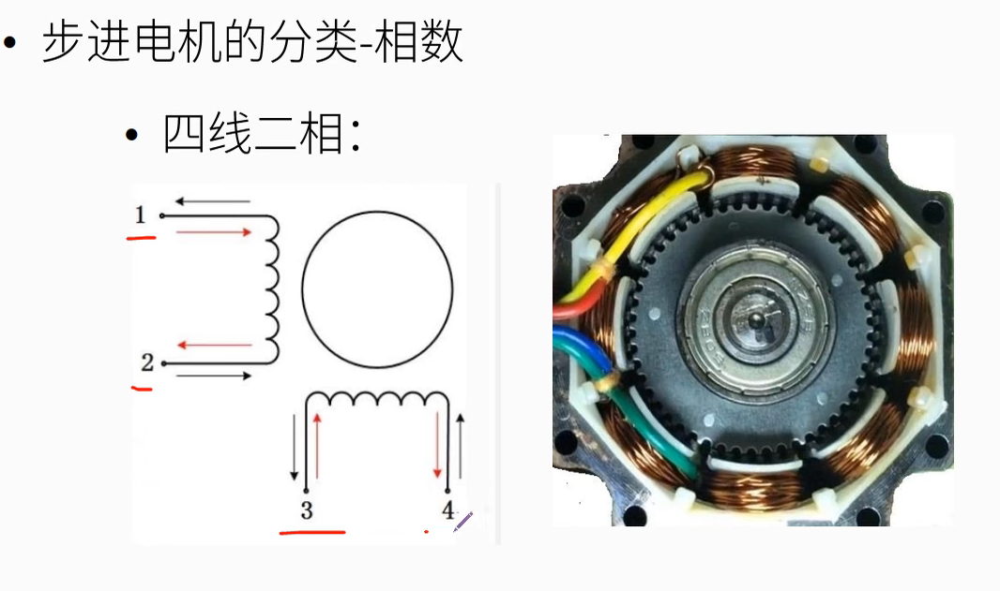
# 步进电机工作原理

## 单相整步驱动

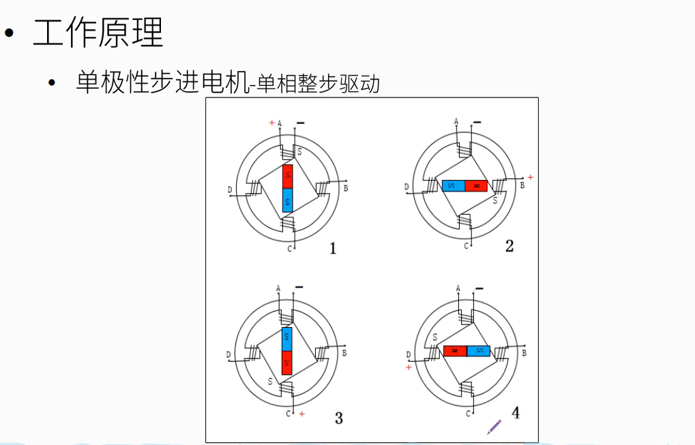
## 两相整步驱动
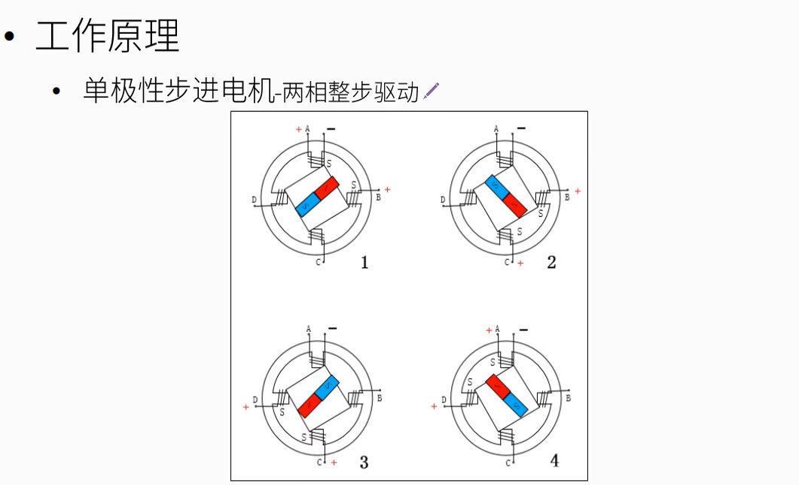
## 四相八拍驱动
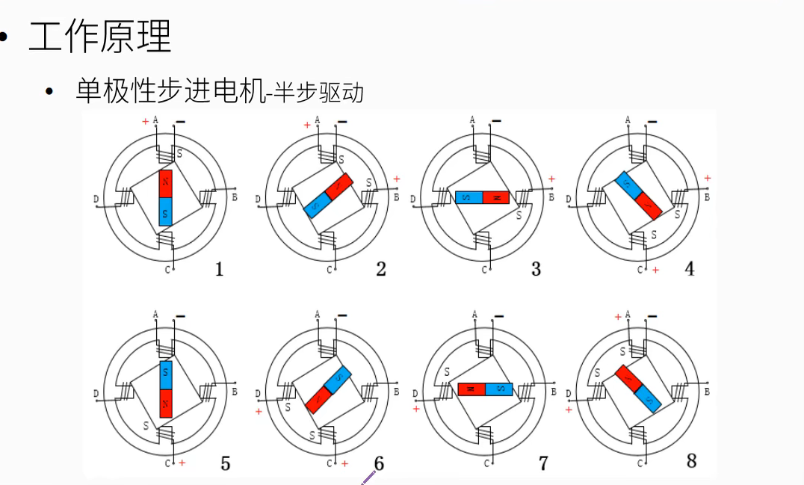
## 双相四拍整步驱动
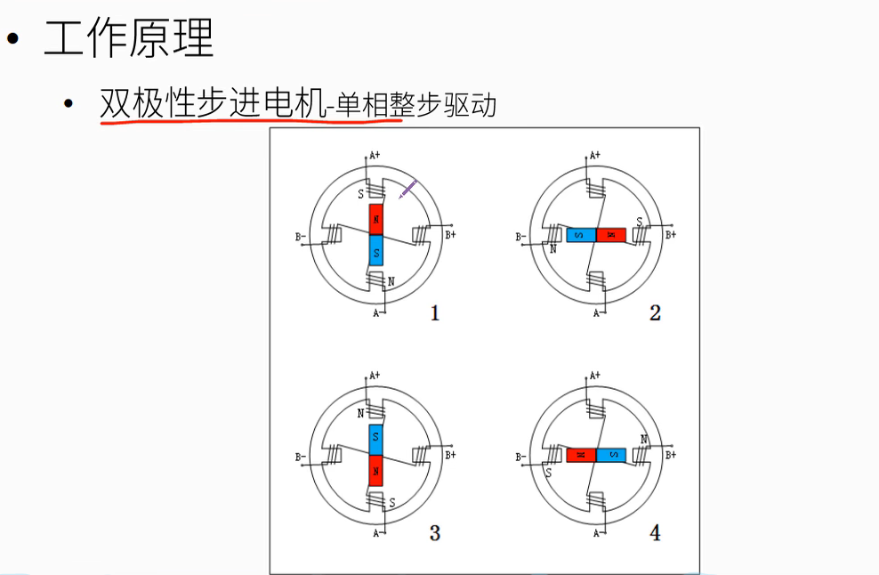

## 双相四拍半步驱动
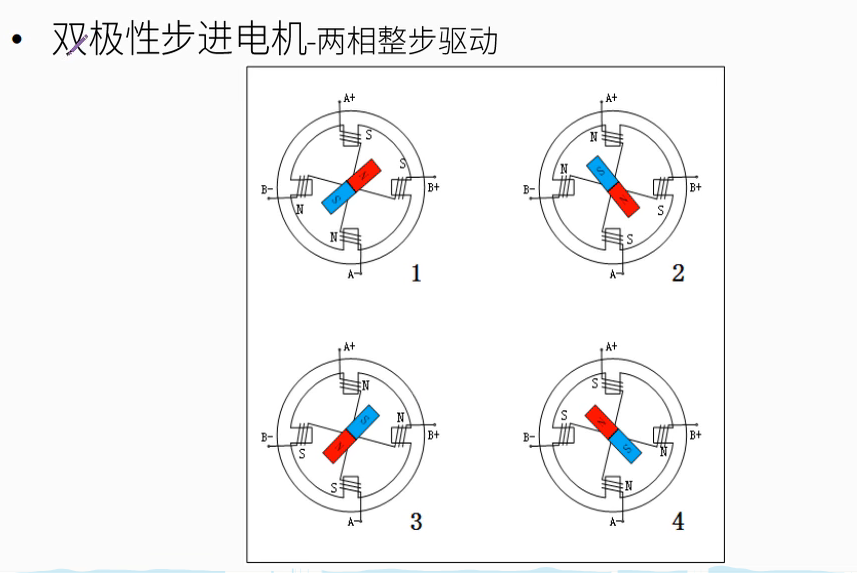
## 双相八拍半步驱动
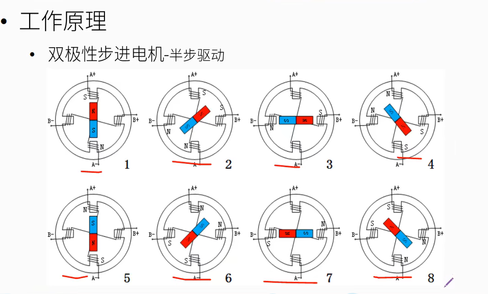

# 步进电机参数指标
## 静态参数

## 动态参数
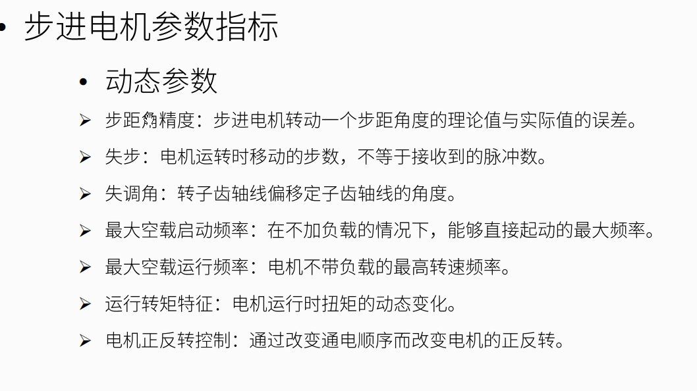

# code test
## C51
### schematic

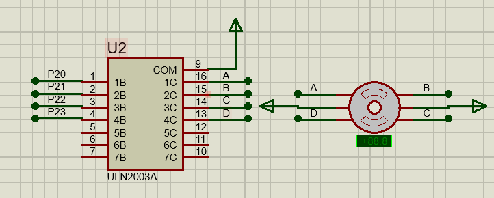
### stepper_motors.c

``` c
#include "stepper_motors.h"

uchar code step440[] = {0x03, 0x06, 0x0C, 0x09};	//四相四拍正转
uchar code step441[] = {0x09, 0x0C, 0x06, 0x03};	//四相四拍反转
uchar code step480[] = {0x03, 0x02, 0x06, 0x04, 0x0C, 0x08, 0x09, 0x01};	//四相八拍正转

//ms延时函数
void Delay_xms(uint x)
{
	uint i,j;
	for(i=0;i<x;i++)
		for(j=0;j<112;j++);
}

void Motor480(void)
{
	uchar i;
	for(i=0;i<8;i++){
		MotorData=step480[i];
		Delay_xms(1000);			//转速调节
	}
}

void Motor440(void)
{
	uchar i;
	for(i=0;i<4;i++){
		MotorData=step440[i];
		Delay_xms(1000);			//转速调节
	}
}

//停止转动
void MotorStop(void)
{
	MotorData=0x00;
}


```

### stepper_motors.h

``` c
#ifndef __STEP_MOTOR_H__
#define __STEP_MOTOR_H__

#include "reg52.h"

#define MotorData P2

sbit motor_a = P2^0;
sbit motor_b = P2^1;
sbit motor_c = P2^2;
sbit motor_d = P2^3;

#define uchar unsigned char
#define uint  unsigned int
	
extern uchar code step440[];
extern uchar code step441[];
extern uchar code step480[];

void Delay_xms(uint x);
void Motor440(void);
void Motor480(void);
void MotorStop(void);

#endif

```
### main.c

``` c
#include <reg52.h>
#include "stepper_motors.h"

//主函数
void main(void)
{
	uint i;
	Motor440();	
	Motor480();	
	while(1){
		;
	}
}

```