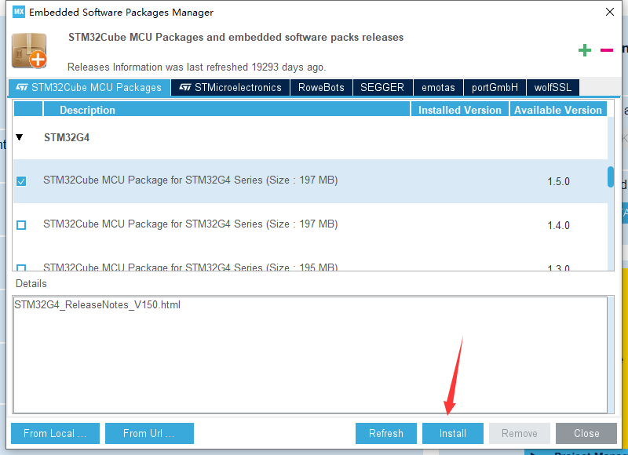
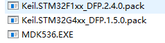

# 环境搭建
## stm32cubemx按照

## MDK for Arm
mdk软件下载地址为：[MDK-ARM Version 5.37](https://www.keil.com/demo/eval/arm.htm)，但是需要注意一点MDK在V537以后采用的编译器为V6版本，不支持向前兼容编译器V5的工程，因此不推荐使用MDK_V537，这里我使用的版本为MDK_V536，下载地址为：https://armkeil.blob.core.windows.net/eval/MDK536.EXE ,推荐使用迅雷下载。

器件包下载网址为[MDK5 Software Packs](https://www.keil.com/dd2/pack/)，下载STM32F1和STM32G4即可。

先安装MDK536，然后再安装前面两个器件包，器件包看。

注意安装MDK时，文件夹一定不能有中文，最好使用_替代空格。

用户信息内容随便填写即可。

安装MDK期间，可能会提示安装驱动，默认安装即可。器件安装包会自动寻找MDK的pack文件夹，一直点下一步即可，F1和G4的器件包安装顺序无所谓。

### 若非使用MDK_537
参考下方网址，安装compiler version 5。
https://blog.csdn.net/weixin_45028335/article/details/126291787

[STM32Cube initialization code generator](https://www.st.com/en/development-tools/stm32cubemx.html)
[STM32Cube MCU & MPU Packages](https://www.st.com/en/embedded-software/stm32cube-mcu-mpu-packages.html#products)

[MDK5 Software Packs](https://www.keil.com/dd2/pack/)