[toc]

# 环境搭建
## stm32cubemx安装步骤
前面两个为器件包，不要解压，最后一个为stm32cubemx安装包。

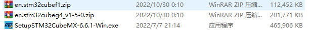
stm32cubemx安装包**==右键管理员身份 #F44336==**运行，点击已经阅读并且同意协议。

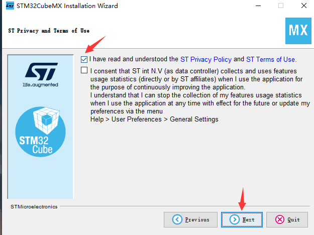
文件夹==**==一定不能有中文 #F44336==**==，最好使用_替代空格，如果不了解直接默认路径即可。

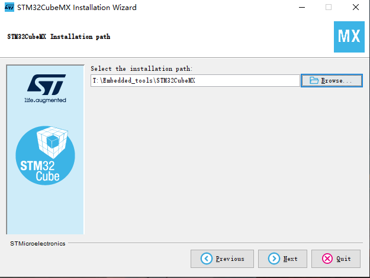
安装后打开软件，点击管理器件包。

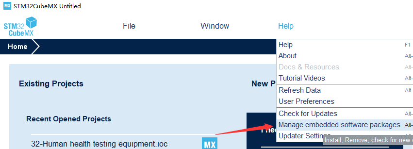
找到对应器件包的文件夹下，然后选中点击打开即可，两个都需要加入。

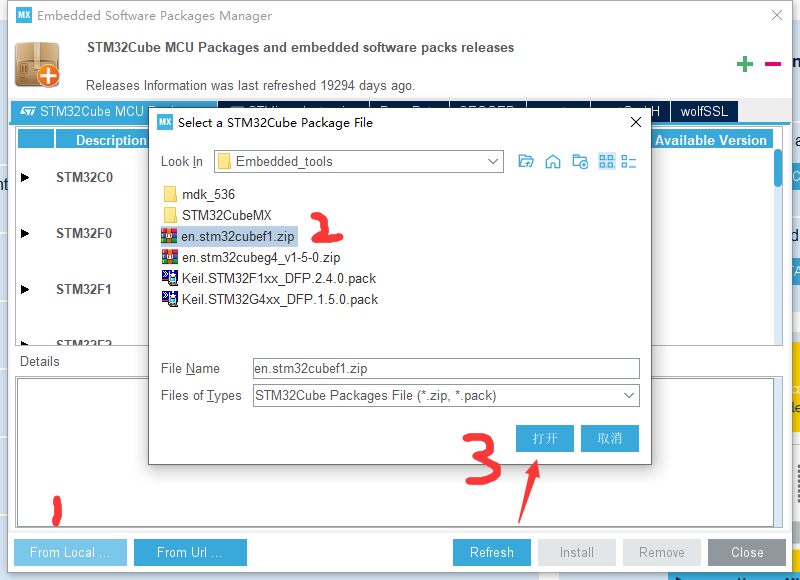
## MDK for Arm
mdk软件下载地址为：[MDK-ARM Version 5.37](https://www.keil.com/demo/eval/arm.htm)，但是需要注意一点MDK在V537以后采用的编译器为V6版本，不支持向前兼容编译器V5的工程，因此不推荐使用MDK_V537，这里我使用的版本为MDK_V536，下载地址为：https://armkeil.blob.core.windows.net/eval/MDK536.EXE ,推荐使用迅雷下载。

器件包下载网址为[MDK5 Software Packs](https://www.keil.com/dd2/pack/)，下载STM32F1和STM32G4即可。

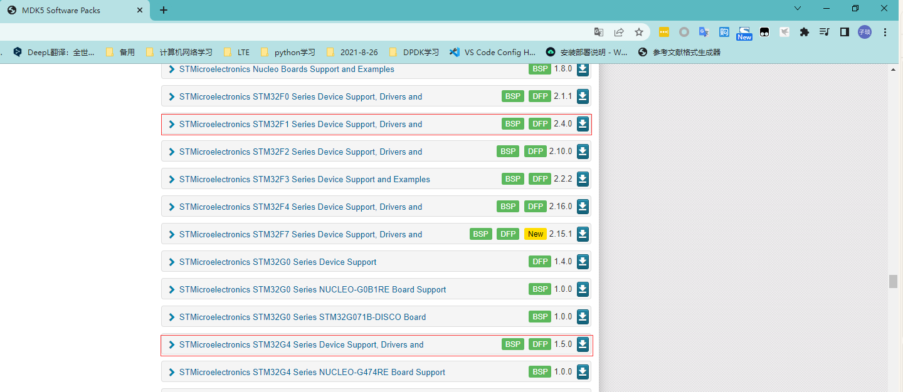
先安装MDK536，然后再安装前面两个器件包，keygan为注册机用于pojie MDK使用，==**由于keygan为破解软件在使用前关闭所有的杀毒软件** #F44336==！

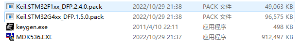
注意安装MDK时，文件夹一定不能有中文，最好使用_替代空格。

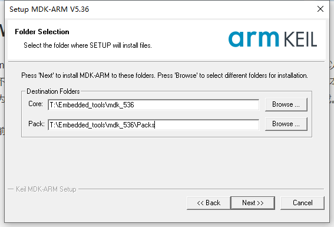
用户信息内容随便填写即可。

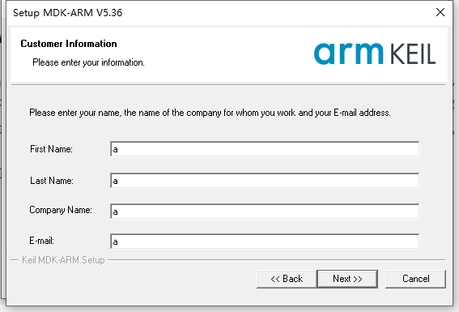
安装MDK期间，可能会提示安装驱动，默认安装即可。器件安装包会自动寻找MDK的pack文件夹，一直点下一步即可，F1和G4的器件包安装顺序无所谓。

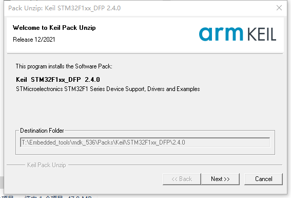
破解MDK，==**MDK和keygan都一定要管理员身份运行** #F44336==。

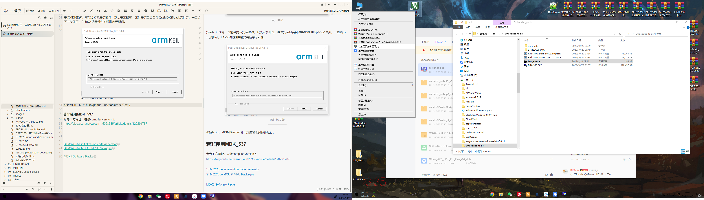

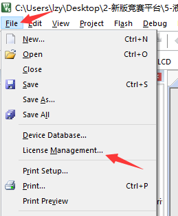
在序号1处复制CID信息到序号2处，在序号3处选择Target为ARM，然后点击序号4处获取信息，把序号5处的信息复制到6处，点击序号7，最终可以看到序号8处提示注册时间到2032年，代表注册成功。

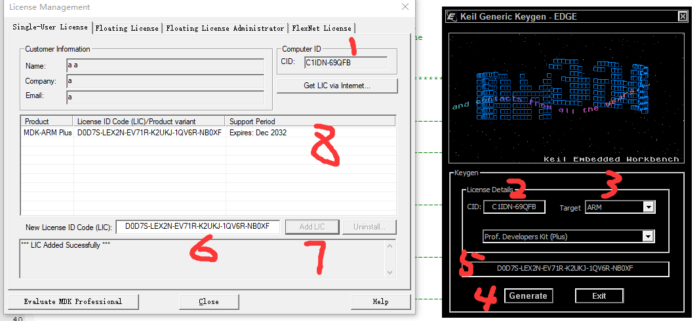

若描述不够详细，可以参考注册视频：https://github.com/Relax-LiuZiyan/Story-writer/tree/master/Embedded/videos/MDK注册过程.mp4
### 若非使用MDK_537
参考下方网址，安装compiler version 5。
https://blog.csdn.net/weixin_45028335/article/details/126291787
## 软件网址
### 官方网址
[STM32Cube initialization code generator](https://www.st.com/en/development-tools/stm32cubemx.html)
[STM32Cube MCU & MPU Packages](https://www.st.com/en/embedded-software/stm32cube-mcu-mpu-packages.html#products)
[MDK-ARM Version 5.37](https://www.keil.com/demo/eval/arm.htm)
[MDK5 Software Packs](https://www.keil.com/dd2/pack/)
### 百度网盘
由于其内部具有注册机，因此链接可能失效，请及时联系作者，VX992926601（说明来意和姓名学校）。

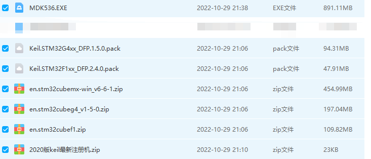
链接：https://pan.baidu.com/s/1gQfu2cCNepK7cTklNA3wtg 
提取码：rt13 
# 学习计划
1. 熟悉赛点资源包内容，讲解一下遇到错误时应该怎么解决，并初步学习LCD外设、GPIO模块和EXTI模块，根据进度适当讲解LED外设、按键外设，并布置相应的作业。
2. 对上周作业进行快速讲解，学习USART模块和RTC模块，并结合外设布置相应的作业。
3. 对上周作业进行快速讲解，学习ADC模块和DAC模块，并结合外设布置相应的作业。
4. 对上周作业进行快速讲解，学习TIM_Base模块和I2C模块，并结合外设布置相应的作业。
5. 对上周作业进行快速讲解，学习定时器输出模块，一个定时器完成占空比和频率多通道都可调功能，并结合外设布置相应的作业。
6. 对上周作业进行快速讲解，学习定时器捕获模块，一个定时器完成占空比和频率多通道都捕获功能，并结合外设布置相应的作业。
7. 对上周作业进行快速讲解，结合省赛题目开始编程与讲解。
# 提问问题方式
## 压缩并发送代码
如果有代码语法或逻辑错误，并已经进行==长时间 #F44336==进行检查、搜索和测试后，将代码进行压缩后，发送给我，如果时逻辑错误在发送信息中写好出现的什么逻辑错误(比如按键B1按下应该是LED1亮，但却是LED2亮)，越详细越好。

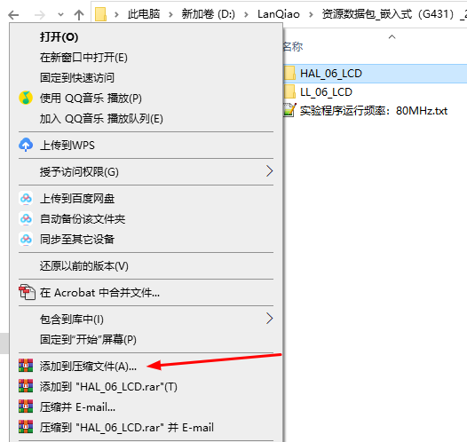

## 远程调试
如果需要进行远程进行调试，请下载todesk：https://newdl.todesk.com/windows/ToDesk_Lite.exe ,截图方式如下所示，需要使我看到==设备代码与临时密码 #F44336==。

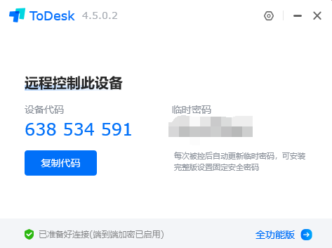
# G4赛点资源包分析

``` c?linenums
新版竞赛平台:.
│  CT117E-M4产品手册.pdf
│  CT117E_M4_SCH.pdf
│  
├─1-USB驱动程序
│  └─CMSIS DAP USB转串口驱动
│          CMSIS-DAP_Update.INF
│          Readme.txt
│          
├─2-底层驱动代码参考
│      ds18b20_hal.c
│      ds18b20_hal.h
│      ds18b20_ll.c
│      ds18b20_ll.h
│      i2c_hal.c
│      i2c_hal.h
│      i2c_ll.c
│      i2c_ll.h
│      说明.txt
│      
├─3-芯片资料
│  │  74HC_HCT573.pdf
│  │  AT24C02.pdf
│  │  DHT11.pdf
│  │  DS18B20.pdf
│  │  LIS302DL.pdf
│  │  LM324.pdf
│  │  MCP4017.PDF
│  │  STM32G431RB数据手册.pdf
│  │  STM32G4系列微控制器参考手册.pdf
│  │  STM32G4系列微控制器编程手册.pdf
│  │  
│  └─液晶控制器芯片资料
│          液晶控制器ILI9325.pdf
│          液晶控制器ILI9328.pdf
│          液晶控制器说明.txt
│          液晶控制芯片uc8230s.pdf
│          
├─4-库文件
       stm32cube_fw_g4_v120.zip
```
代码部分为后续讲解部分，此处暂时不做讲解，按照重要程度进行依次分析。
## CT117E_M4_SCH.pdf
开发板的硬件原理图，非常重要，用于软件开发。要非常熟悉各种外设对应单片机的IO口，可以大大的节省项目开发的时间，下表为会用到的外设对应单片机引脚图(还在慢慢完善，不是最终版)。
| 外设引脚            | 外设引脚           |
| :------------------ | :----------------- |
| 74HC573锁存器LE引脚 | PD2                |
| LED1-8              | PC8-PC15           |
| Button 1-4          | PB0、PB1、PB2、PA0 |
## CT117E-M4产品手册.pdf
单纯的开发板介绍手册，自己稍微看一下就好，没有价值作用。
# GPIO模块学习
## LED外设学习
可以看出LD1-8都连在VDD一端，因此为共阳管，当Q1-8输出电平即可完成LED的点亮。

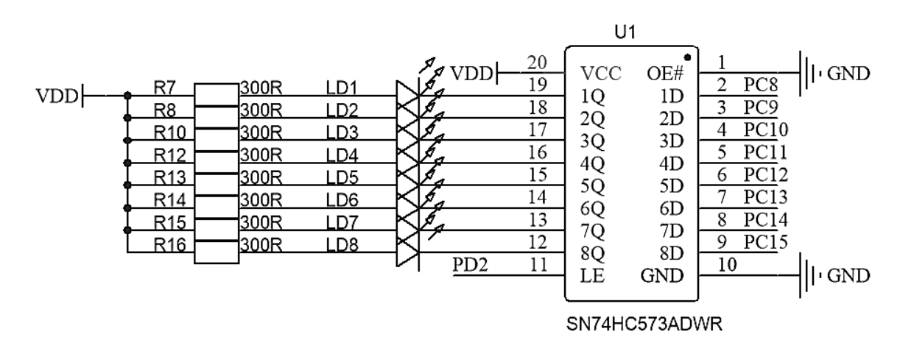
74HC573为锁存器芯片，通过下表可以看出OE引脚必须接地才有效，这与上图硬件原理图是相符的。只有当LE引脚为高电平时，输出才等于输入，否则输出不会改变（即保持上次电平状态，这样实现了所锁存的概念）。

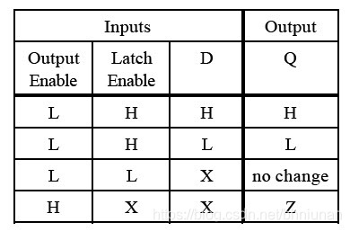
通过上述分析，如果想让LED1亮我们大致操作为：

``` c?linenums
// PD2 高电平 (开锁存器)
// PC8 低电平 (使锁存器1Q处输出低电平)
// PD2 低电平 (关锁存器)
```
> 思考一下：为什么必须要有关锁存，第三行代码的存在？

如果不关锁存的话，假如下一时刻你不小心操作了PC8引脚，是不是因为着LED1灯的状态发生了改变。如果关了锁存的话，PC8的电平经过锁存操作已经在1Q处完成了电平保持，只要锁存器LE引脚不高电平，PC8引脚电平不会影响到LED1的状态改变！这就是锁存器的作用。

### STM32CubeMX配置
LED控制需要用到PD2和PC8-PC15作为输出引脚，User Label设置是为了方便项目使用，可根据个人习惯而定。

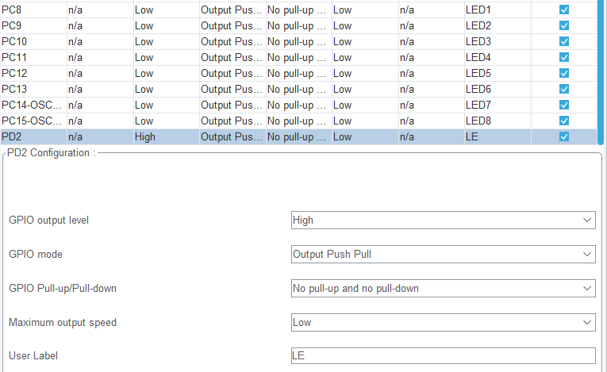
### keil编程
下述代码可以完成引进的控制功能，但缺点在于后续无法确定某一时刻LED的状态。
``` c?linenums
void Led_Control(uint16_t LEDx, uint8_t Status)
{
	HAL_GPIO_WritePin(GPIOD, GPIO_PIN_2, GPIO_PIN_SET);
	if(!Status){
		HAL_GPIO_WritePin(GPIOC, LEDx, GPIO_PIN_SET);
	}
	else{
		HAL_GPIO_WritePin(GPIOC, LEDx, GPIO_PIN_RESET);
	}
	HAL_GPIO_WritePin(GPIOD, GPIO_PIN_2, GPIO_PIN_RESET);		
}
```

将代码变形一下，在main.c中定义一个全局变量`uint8_t Led_status`的每一位作为Led1-8状态，当函数对LED进行改变时，此变量也会进行修改。

``` c?linenums

---------------------------------------------------------
// led.c文件

extern uint8_t Led_status;

void Led_Control(uint16_t LEDx, uint8_t Status)
{
	HAL_GPIO_WritePin(GPIOD, GPIO_PIN_2, GPIO_PIN_SET);
	if(!Status){
		Led_status &= ~(LEDx >> 8);
		HAL_GPIO_WritePin(GPIOC, LEDx, GPIO_PIN_SET);
	}
	else{
		Led_status |= (LEDx >> 8);
		HAL_GPIO_WritePin(GPIOC, LEDx, GPIO_PIN_RESET);
	}
	HAL_GPIO_WritePin(GPIOD, GPIO_PIN_2, GPIO_PIN_RESET);		
}
------------------------------------------------------------

---------------------------------------------------------
// main.c文件

// 此变量每一位代表LED的状态
uint8_t Led_status = 0X00;

// 调用一下代码
Led_Control(LED1_Pin | LED3_Pin, 1);
sprintf((char*)str, "Led_status = 0X%02X", Led_status);
LCD_DisplayStringLine(Line0, str);

Led_Control(LED3_Pin, 0);
sprintf((char*)str, "Led_status = 0X%02X", Led_status);
LCD_DisplayStringLine(Line2, str);
	
---------------------------------------------------------

---------------------------------------------------------
// 打印结果
// led_status = 0X05

// led_status = 0x01
```
## 按键外设学习
按键外设为独立按键，并采用外部上拉的方式，当按键按下时引脚可以读取低电平，否则为高电平，因此可以通过电平判断按键是否按下。

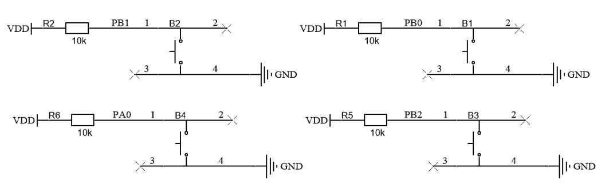
在机械按键的触点闭合和断开时，都会产生抖动，为了保证系统能正确识别按键的开关，就必须对按键的抖动进行处理。抖动时间的长短由按键的机械特性决定，一般为5ms～10ms。按键抖动会引起一次按键被误读多次。为确保CPU对键的一次闭合仅作一次处理，必须去除键抖动。去除按键机械抖动的方式很多，比如硬件中的施密特触发器，软件延时等操作。

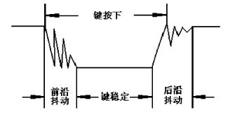
### STM32CubeMX配置
由于按键外部采用的是外部上拉，此

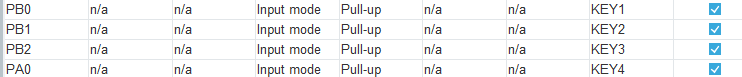
# LCD外设学习
LCD外设初始化函数还是很复杂的，但真正需要掌握的东西却很简单，绝大部分东西官方已经提供。

