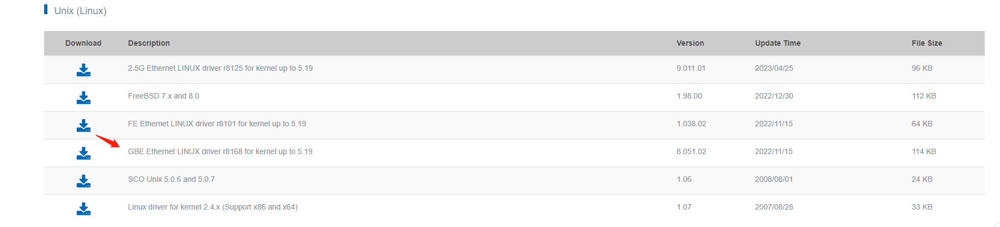
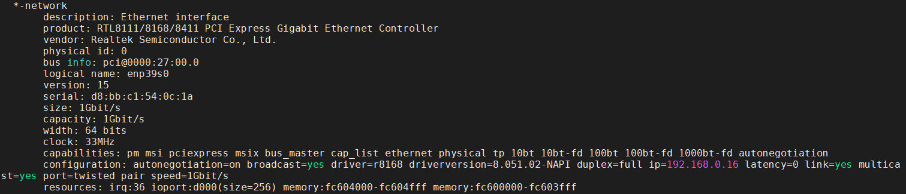
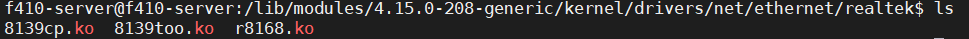
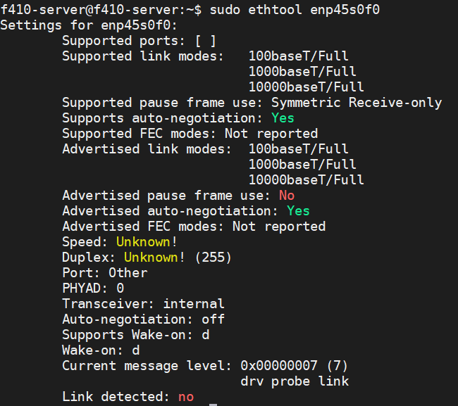
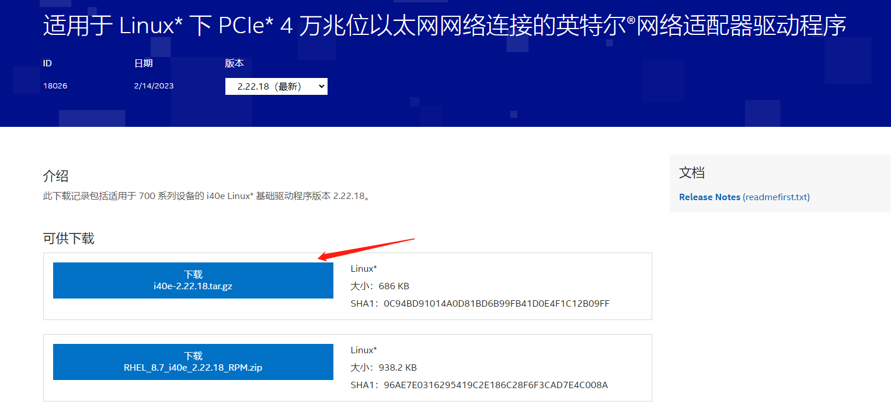
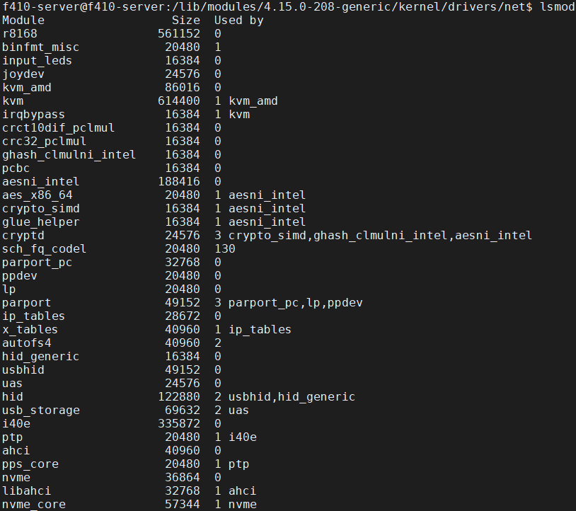
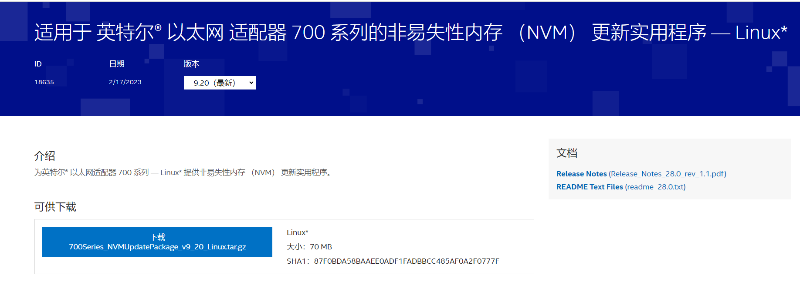

[toc]

# 系统环境
## 安装新内核版本后无法识别主板网卡的问题
主板上的网卡信息无法被识别，通过`sudo lshw -class network`命令后，打印信息为`*-network UNCLAIMED`，通过`ifconfig`命令，没有识别到对应的网卡信息。这意味着该设备没有被操作系统识别或找不到合适的驱动程序。

由于此主板之前一直使用，重新安装**新的系统**后，才导致网卡口应该没问题的，因此可以认为是驱动的问题。

 Ubuntu 18.04.6 LTS (GNU/Linux 4.15.0-208-generic x86_64)
 主板：X570-A PRO
 网卡：RTL8111/8168/8411
  ## 解决办法
 首先下载网卡驱动信息
 https://www.realtek.com/en/component/zoo/category/network-interface-controllers-10-100-1000m-gigabit-ethernet-pci-express-software
 
 
 
 卸载之前的驱动信息，避免相同驱动冲突问题，通过lsmod查看后，进行卸载`sudo rmmod r8169`。

解压下载的文件`tar -jxf r8168-8.051.02.tar.bz2`，解压后，进入到`src`文件夹后，运行`sudo make all`命令。由于本系统是新系统，因此提前需要安装`sudo apt-get install make`和`sudo apt-get install gcc`。

安装驱动：可能没有执行脚本权限，先赋权限`chmod +x autorun.sh`，执行`sudo ./autorun.sh`完毕后重启。

此时再通过`sudo lshw -class network`命令后，显示安装成功。


由于已经通过make编译生成了驱动文件，因此可以在驱动文件下生产了网卡驱动，可以删除解压的文件夹即可。




## 其中遇到的问题

在编译驱动时，通过命令`sudo make all`后，提示没有`/lib/modules/4.15.0-208-generic/build`路径，经过查询学弟在安装系统内核后，忘记安装系统头文件导致此问题，运行命令`sudo apt-get install linux-headers-$(uname -r)`，即可完成内核头文件的安装。

## 参考文献
1. [ubuntu RTL8111/8168/8411网卡驱动怎么正确安装？](https://www.zhihu.com/question/287274115)


# X710-T4网卡驱动和固件更新
## 驱动信息无法识别




[网卡驱动软件](https://www.intel.cn/content/www/cn/zh/download/18026/intel-network-adapter-driver-for-pcie-40-gigabit-ethernet-network-connections-under-linux.html)，此处选择`i40e-2.22.18.tar.gz`即可。



以下是驱动的编译，安装和测试。

``` bash?linenums
To manually build the driver
----------------------------
1. Move the base driver tar file to the directory of your choice.
   For example, use '/home/username/i40e' or '/usr/local/src/i40e'.

2. Untar/unzip the archive, where <x.x.x> is the version number for the
   driver tar file:
   # tar zxf i40e-<x.x.x>.tar.gz
3. Change to the driver src directory, where <x.x.x> is the version number
   for the driver tar:
   # cd i40e-<x.x.x>/src/
4. Compile the driver module:
   # make install
   The binary will be installed as:
   /lib/modules/<KERNEL VER>/updates/drivers/net/ethernet/intel/i40e/i40e.ko
   
   The install location listed above is the default location. This may differ
   for various Linux distributions.

   NOTE: To gather and display additional statistics, use the
   I40E_ADD_PROBES pre-processor macro: 	
   # make CFLAGS_EXTRA=-DI40E_ADD_PROBES
   Please note that this additional statistics gathering can impact
   performance.

   NOTE: You may see warnings from depmod related to unknown RDMA symbols
   during the make of the OOT base driver. These warnings are normal and
   appear because the in-tree RDMA driver will not work with the OOT base
   driver. To address the issue, you need to install the latest OOT versions
   of the base and RDMA drivers.

5. Load the module using the modprobe command.

   To check the version of the driver and then load it:

   # modinfo i40e
   # modprobe i40e [parameter=port1_value,port2_value]

   Alternately, make sure that any older i40e drivers are removed from the
   kernel before loading the new module:

   # rmmod i40e; modprobe i40e

6. Assign an IP address to the interface by entering the following,
   where <ethX> is the interface name that was shown in dmesg after modprobe:

   # ip address add <IP_address>/<netmask bits> dev <ethX>

7. Verify that the interface works. Enter the following, where IP_address
   is the IP address for another machine on the same subnet as the interface
   that is being tested:

   # ping <IP_address>

Note: For certain distributions like (but not limited to) Red Hat Enterprise
Linux 7 and Ubuntu, once the driver is installed, you may need to update the
initrd/initramfs file to prevent the OS loading old versions of the i40e driver.
   For Red Hat distributions:
	# dracut --force

   For Ubuntu:
	# update-initramfs -u
```


安装之前驱动显示字节为335872。


驱动安装后信息如下所示，可以看到现在的i40e驱动版本为2.22.18，跟最新的驱动版本相同。

``` bash?linenums
f410-server@f410-server:~/i40e-2.22.18/src$ ethtool enp45s0f0
Settings for enp45s0f0:
        Supported ports: [ TP ]
        Supported link modes:   100baseT/Full
                                1000baseT/Full
                                10000baseT/Full
        Supported pause frame use: Symmetric Receive-only
        Supports auto-negotiation: Yes
        Supported FEC modes: Not reported
        Advertised link modes:  100baseT/Full
                                1000baseT/Full
                                10000baseT/Full
        Advertised pause frame use: No
        Advertised auto-negotiation: Yes
        Advertised FEC modes: Not reported
        Speed: 10000Mb/s
        Duplex: Full
        Port: Twisted Pair
        PHYAD: 0
        Transceiver: internal
        Auto-negotiation: on
        MDI-X: Unknown
Cannot get wake-on-lan settings: Operation not permitted
        Current message level: 0x0000000f (15)
                               drv probe link timer
        Link detected: yes
f410-server@f410-server:~/i40e-2.22.18/src$ modinfo i40e
filename:       /lib/modules/4.15.0-208-generic/updates/drivers/net/ethernet/intel/i40e/i40e.ko
version:        2.22.18
license:        GPL
description:    Intel(R) 40-10 Gigabit Ethernet Connection Network Driver
author:         Intel Corporation, <e1000-devel@lists.sourceforge.net>
srcversion:     51A6A1821A4BE66CE429DBC
alias:          pci:v00008086d0000158Bsv*sd*bc*sc*i*
alias:          pci:v00008086d0000158Asv*sd*bc*sc*i*
alias:          pci:v00008086d00000DDAsv*sd*bc*sc*i*
alias:          pci:v00008086d000037D3sv*sd*bc*sc*i*
alias:          pci:v00008086d000037D2sv*sd*bc*sc*i*
alias:          pci:v00008086d000037D1sv*sd*bc*sc*i*
alias:          pci:v00008086d000037D0sv*sd*bc*sc*i*
alias:          pci:v00008086d000037CFsv*sd*bc*sc*i*
alias:          pci:v00008086d000037CEsv*sd*bc*sc*i*
alias:          pci:v00008086d00000D58sv*sd*bc*sc*i*
alias:          pci:v00008086d00000CF8sv*sd*bc*sc*i*
alias:          pci:v00008086d00001588sv*sd*bc*sc*i*
alias:          pci:v00008086d00001587sv*sd*bc*sc*i*
alias:          pci:v00008086d0000104Fsv*sd*bc*sc*i*
alias:          pci:v00008086d0000104Esv*sd*bc*sc*i*
alias:          pci:v00008086d000015FFsv*sd*bc*sc*i*
alias:          pci:v00008086d00001589sv*sd*bc*sc*i*
alias:          pci:v00008086d00001586sv*sd*bc*sc*i*
alias:          pci:v00008086d0000101Fsv*sd*bc*sc*i*
alias:          pci:v00008086d00000DD2sv*sd*bc*sc*i*
alias:          pci:v00008086d00001585sv*sd*bc*sc*i*
alias:          pci:v00008086d00001584sv*sd*bc*sc*i*
alias:          pci:v00008086d00001583sv*sd*bc*sc*i*
alias:          pci:v00008086d00001581sv*sd*bc*sc*i*
alias:          pci:v00008086d00001580sv*sd*bc*sc*i*
alias:          pci:v00008086d00001574sv*sd*bc*sc*i*
alias:          pci:v00008086d00001572sv*sd*bc*sc*i*
depends:        ptp,intel_auxiliary
retpoline:      Y
name:           i40e
vermagic:       4.15.0-208-generic SMP mod_unload modversions
parm:           debug:Debug level (0=none,...,16=all) (int)
parm:           l4mode:L4 cloud filter mode: 0=UDP,1=TCP,2=Both,-1=Disabled(default) (int)
```


## 固件更新
从Intel官网下载最新版本的网卡固件，此固件的版本信息为9.20。
[适用于 英特尔® 以太网 适配器 700 系列的非易失性内存 （NVM） 更新实用程序 — Linux*](https://www.intel.cn/content/www/cn/zh/download/18635/non-volatile-memory-nvm-update-utility-for-intel-ethernet-adapters-700-series-linux.html?wapkw=x710)



下载完成后复制到服务器端，解压完成后，进入到`Linux`文件夹下，运行`sudo ./nvmupdate64e`即可。**注意在运行大概5-10分钟，更新的过程中千万不要关机，固件更新过程中如果断电，会变砖！**

``` bash?linenums
f410-server@f410-server:~/700Series/Linux_x64$ sudo ./nvmupdate64e
[sudo] f410-server 的密码：

Intel(R) Ethernet NVM Update Tool
NVMUpdate version 1.39.32.6
Copyright(C) 2013 - 2023 Intel Corporation.


WARNING: To avoid damage to your device, do not stop the update or reboot or power off the system during this update.
Inventory in progress. Please wait [*****|....]


Num Description                          Ver.(hex)  DevId S:B    Status
=== ================================== ============ ===== ====== ==============
01) Intel(R) Ethernet Converged         8.00(8.00)   1589 00:045 Update
    Network Adapter X710-T4                                      available

Options: Adapter Index List (comma-separated), [A]ll, e[X]it
Enter selection: A
Would you like to back up the NVM images? [Y]es/[N]o: y
Update in progress. This operation may take several minutes.
[****|.....]


Num Description                          Ver.(hex)  DevId S:B    Status
=== ================================== ============ ===== ====== ==============
01) Intel(R) Ethernet Converged         9.32(9.20)   1589 00:045 Update
    Network Adapter X710-T4                                      successful

Reboot is required to complete the update process.

Tool execution completed with the following status: All operations completed successfully.
Press any key to exit.

```

运行`sudo ethtool -i enp45s0f0`，可以查看到`firmware-version: 9.20 `，更新成功。

``` bash?linenums
f410-server@f410-server:~/700Series/Linux_x64$ sudo ethtool -i enp45s0f0
driver: i40e
version: 2.22.18
firmware-version: 9.20 0x8000d8cc 1.2766.0
expansion-rom-version:
bus-info: 0000:2d:00.0
supports-statistics: yes
supports-test: yes
supports-eeprom-access: yes
supports-register-dump: yes
supports-priv-flags: yes
```