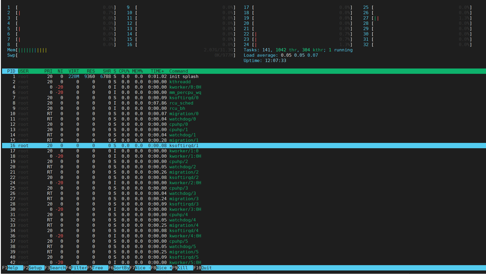
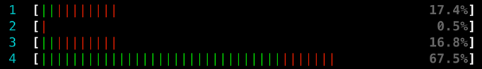
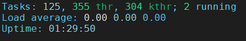
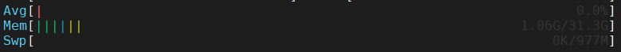
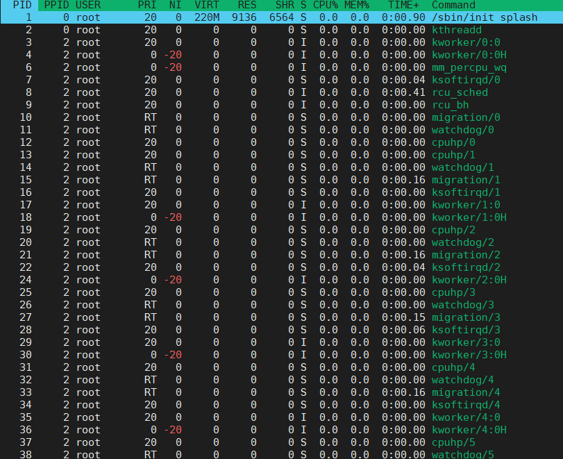
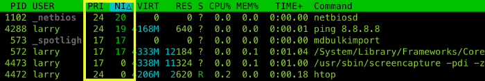
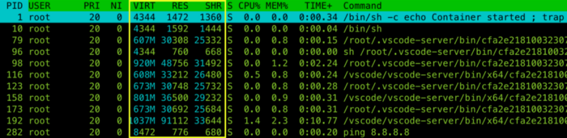

# 主界面介绍
上面界面是可以通过设置进行修改，1-32对应CPU核心0-31，条状为CPU占用率，下侧界面为任务线程(进程、用户态线程与内核线程等)。

## 主界面上册介绍
使用率的 bar 包含了红色跟绿色，有时甚至还会有蓝色，那其实是有意义：

- 红色 代表 kernel thread 佔用的 CPU，像是系统需要自动做 process scheduling、memory management 等等，是整个系统中最重要、优先权也最高的任务
  
- 绿色 代表 normal priority thread，进程的优先权比 kernel thread 低一些，一般来说使用者执行的程序如果没有特别调优先权的话，都会归在这一类
  
- 蓝色 代表 low priority thread，因为优先权比较低，分配到的 CPU 自然也比较少，适合“我 ok，你先跑”那类比较无关紧要的 process，如果 CPU 已经被压榨到快不行了，或是 memory 真的不够用了，第一个杀掉的也是这类 process

## 主界面右上侧介绍

### Tasks 
首先 Tasks 栏位的 125, 355 thr, 304 kthr, 2 running 代表的是目前总共有 125个process、355个thread，304个kernel thread(内核线程需要打开才可看到，在主界面按下K即可), 其中 2个 thread 正在执行（这里指正在物理CPU上操作的进程 or 正在等待轮到它在CPU上运行的进程）。
### Load Average
Load Average(LA) 是用来判断断目前系统有多繁忙，三个数字代表的是系统在最近 1分钟、5分钟、15 分钟内，平均有多少个 thread 需要 CPU。

以上图来说，近一分钟内平均有 0个 thread 需要使用 CPU 进行运算。一般来说电脑完全没在用时 LA 会低于 1，而平常在上网、听音乐、做简报则是会介于 1 到 2 之间。

所以如果觉得自己写的程序跑很慢，不妨先看看 LA 确认瓶颈是不是在 CPU，如果 LA 很低但程序却慢得夸张，那很可能程序并没有善用多核心，或是瓶颈卡在硬盘跟网路 IO；如果 LA 已经很高了但还是觉得太慢，那就只能改善演算法、或是换更快的 CPU 了。
### Uptime
Uptime表示系统的运行时长。
## 主界面左上侧介绍

### Avg
此处的平均值，可以简单理解为所有CPU的平均指，没有太大的参考意义。
### Memory 
- 绿色 指的是被 process 占用的内存，譬如说你开的浏览器、VSCode、终端机等等程式，还有正在执行的 htop 都算是这一类。
  
- 蓝色 则是 buffer pages，用来储存一些 metadata。譬如说当你第一次执行 ls -l 时系统会去硬盘看这个资料夹有哪些文件、每个文件的权限等等，然后帮你存在 buffer pages，当你短时间内再执行 ls -l 时就不用再进入硬盘（因为硬盘很慢），直接从 buffer取出。
  
- 橘色 的 cache pages 跟 buffer 很像，只不过 buffer 存的是 metadata，而 cache 存的是文件内容。像你第一次下 cat index.js 时就会把内容读取到 cache pages，如果你 cat 之后发现代码太长，决定先看前十行就好了，那再下 head -n 10 index.js 就会从 cache pages 直接读取。

这也代表说内存使用量并非越低越好，毕竟开在那边也没啥用，不如让系统把闲置的部分拿去当 buffer 跟 cache，读取时能不碰硬盘就不碰硬盘，才可以让代码执行得更快。

所以千万不要相信什么“内存清理大师”可以帮你提升效能，说真的没变慢就不错了，随便把 buffer 跟 cache 都清掉了只会加重系统负担。内存管理就交给系统来，十之八九都可以管理得还不错。
### swap 
swap 的部分虽然上图完全没用到，但还是解释一下：swap 的机制跟刚刚提到的 cache & buffer 正好相反，万一你实在开了太多程序，而且每个程序都跟 chrome 一样狂吃猛吃，导致 memory 快要不够了。

那系统就会把内存里面一些东西 swap 到硬盘上，等真的需要那些东西时再从硬盘拿回来。虽然这样做看似有更多内存可以用，但代价就是程序运行速度会慢上许多，因为硬盘实在是太慢了。
## 主界面下册
以上各项分别为：
- PID：进程的标识号
- -PPID：进程的父标识号
- USER：运行此进程的用户
- PRI：进程的优先级
- NI：进程的优先级别值，默认的为0，可以进行调整
- VIRT：进程占用的虚拟内存值
- RES：进程占用的物理内存值
- SHR：进程占用的共享内存值
- S：进程的运行状况，R表示正在运行、S表示休眠，等待唤醒、Z表示僵死状态
- %CPU：该进程占用的CPU使用率
- %MEM：该进程占用的物理内存和总内存的百分比
- TIME+：该进程启动后占用的总的CPU时间
- COMMAND：进程启动的启动命令名称

### PID & PPID & USER
PID : 是每个 process 的 ID。PID的用途挺多的，譬如说可以用 `kill -KILL <pid>` 来杀掉某个 process；或是使用 `kill -STOP` 来暂停 process 再用 `kill -CONT`让继续执行。

PPID: 是每个 process 的 parent ID，就是其父进程的 PID

USER: 是把这个 process 跑起来的用户。不管程序是谁写的，只要是我把他跑起来，USER 那栏就会显示我的名字。
### PRI & NI
接下来的 Priority 跟 Nice 两个都是跟优先权有关的指标，注意数字越小表示优先权越高，也就可以分配到越多 CPU 时间。

其中 PRI 是由系统帮你决定的，无法自行修改，像上图 mdbulkimport 的 PRI 值是 17，而 ping 8.8.8.8 则是 24，代表系统认为 mdbulkimport 比 ping 来得重要。

而 nice 值的部分预设是 0，可以用 `renice -n 19 -p <pid>` 调整到最低优先权 19，想要调高的话最高也可以调到 -20。

虽然 nice 值可以随自己高兴调高调低，但系统不见得都会听你的。有的系统比较友善会愿意参考你设的 nice 值，但也有一些只看 PRI 系统根本不在乎 nice，你设你的我排我的，所以不要太期待提高优先权可以为效能带来多大的变化，想要提升效能还是乖乖把代码写好比较重要～

### VIRT & RES & SHR
这三个数字都是跟内存有关的，分别代表 Virtual memory、Resident 跟 Shared memory。

Virtual memory 的概念比较复杂一点，基本上你可以把他想成 process 可以存取到的 memory 总和。譬如说 head -n index.js 内部运作的方式是先把 index.js 打开，然后读取前十行。虽然他只读取前十行，但 head process 已经把文件打开了，他其实有权限 access 到整个文件的内容（只是它没有这么做），所以 virtual memory 会把整个文件的大小算进去。

 Resident 正好相反，他指的是物理上你到底占用了多少内存。以同样的例子来说，若你只读取前十行，那系统就只把前十行从硬盘读进内存，RES 也就只算那十行。

因此在 htop 里面 RES 一定会小于 VIRT（如下图），而且通常是远小于，因为 VIRT 会把一堆乱七八糟的东西都算进去，所以就算看到 VIRT 很肥也完全不用担心。

Shared memory 的话顾名思义就是可以跟别人分享的 memory，像程序执行时很常会用的 glibc，或是在读取 read-only 文件时，这些东西都只需要读进内存一次就可以了，所以就会被算进 SHR 里面。

虽说能跟其他 process 共用内存是好事，但这种事也强求不来，所以一般我都只看 RES，很少在管 SHR 是多少。

### State