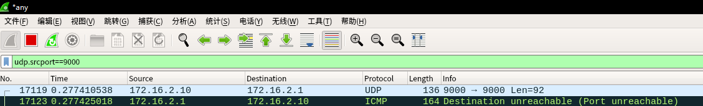
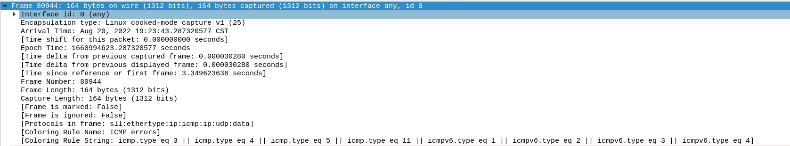
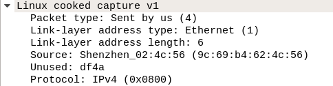
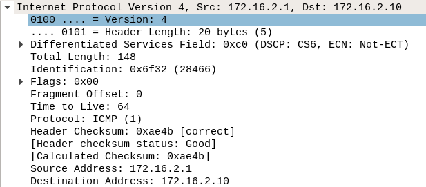
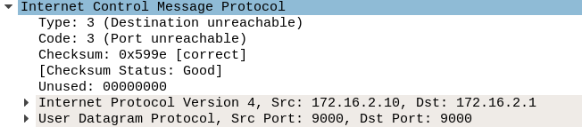
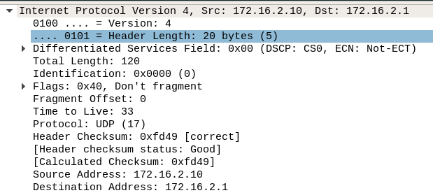
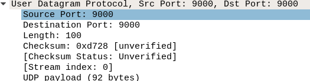
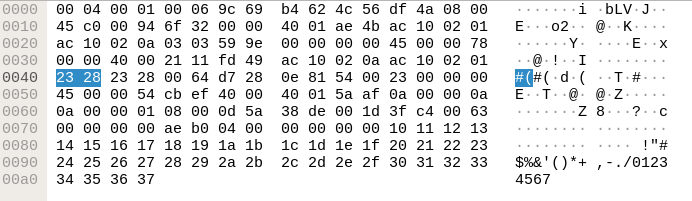

[toc]

错误
1. 定时器中断函数中不要放长时间运行的任务，要用`work_struct`执行要运行的函数。
2. 结构体的大小会进行字节对齐，因此注意大小，如果可以使用`sizeof`函数进行。
3. 封装的报文进行发送时使用output_pkg函数，最后发送强制使用nb->output(nb, skb)慢缓冲发送报文，

S端接收到C端报文，此时由于S端对9000端口还没有开放进行处理UDP报文，因此S端会回发C段一个ICMP报文，内容为 Port unreachable。

# iperf3打流遇到的校验错误问题
## 未加载驱动udp报文wireshark提示校验错误
1.在未加载驱动下，iperf3进行UDP报文打流，wireshakr提示(UDP CHECKSUM INCORRECT)。

之所以出现此错误，是由于网卡具有了tso和tx功能，网卡已经支持IP片以及IP/TCP/UDP等协议的校验和计算，用来减少内核层面的运算(减少CPU负载)，当协议层发现网卡支持相应的特性时，会将相应的处理交给网卡操作。

reference : [解决wireshark抓包校验和和分片显示异常](http://wjhsh.net/charlieroro-p-11363336.html)
