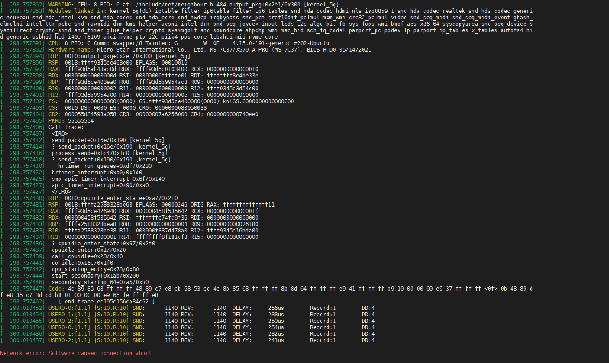

错误
1. 定时器中断函数中不要放长时间运行的任务，要用`work_struct`执行要运行的函数。
2. 结构体的大小会进行字节对齐，因此注意大小，如果可以使用`sizeof`函数进行。
3. 封装的报文进行发送时使用output_pkg函数，最后发送强制使用nb->output(nb, skb)慢缓冲发送报文，

# output_pkg+0x2e1/0x300 报错

测试使用的是ICMP报文进行UDP报文封装后，使用项目之前使用的output_pkg报文发送函数进行发送时，提示内核出错。


``` bash?linenums
[  298.757362] WARNING: CPU: 8 PID: 0 at ./include/net/neighbour.h:484 output_pkg+0x2e1/0x300 [kernel_5g]
[  298.757363] Modules linked in: kernel_5g(OE) iptable_filter ip6table_filter ip6_tables snd_hda_codec_hdmi nls_iso8859_1 snd_hda_codec_realtek snd_hda_codec_generi                                                                      c nouveau snd_hda_intel kvm snd_hda_codec snd_hda_core snd_hwdep irqbypass snd_pcm crct10dif_pclmul mxm_wmi crc32_pclmul video snd_seq_midi snd_seq_midi_event ghash_                                                                      clmulni_intel ttm pcbc snd_rawmidi drm_kms_helper aesni_intel drm snd_seq joydev input_leds i2c_algo_bit fb_sys_fops wmi_bmof aes_x86_64 syscopyarea snd_seq_device s                                                                      ysfillrect crypto_simd snd_timer glue_helper cryptd sysimgblt snd soundcore shpchp wmi mac_hid sch_fq_codel parport_pc ppdev lp parport ip_tables x_tables autofs4 hi                                                                      d_generic usbhid hid i40e r8169 ahci nvme ptp i2c_piix4 pps_core libahci mii nvme_core
[  298.757391] CPU: 8 PID: 0 Comm: swapper/8 Tainted: G        W  OE    4.15.0-191-generic #202-Ubuntu
[  298.757392] Hardware name: Micro-Star International Co., Ltd. MS-7C37/X570-A PRO (MS-7C37), BIOS H.D0 05/14/2021
[  298.757394] RIP: 0010:output_pkg+0x2e1/0x300 [kernel_5g]
[  298.757396] RSP: 0018:ffff93d5ce403e00 EFLAGS: 00010016
[  298.757397] RAX: ffff93d5ab43ac0d RBX: ffff93d5c0103400 RCX: 0000000000000010
[  298.757398] RDX: 000000000000000d RSI: 00000000fffffe01 RDI: ffffffff8e4be33e
[  298.757399] RBP: ffff93d5ce403ea0 R08: ffff93d5b9954ac8 R09: 0000000000000000
[  298.757400] R10: 0000000000000002 R11: 0000000000000000 R12: ffff93d5c3d54c00
[  298.757401] R13: ffff93d5b9954a00 R14: 000000000000000e R15: 0000000000000000
[  298.757402] FS:  0000000000000000(0000) GS:ffff93d5ce400000(0000) knlGS:0000000000000000
[  298.757403] CS:  0010 DS: 0000 ES: 0000 CR0: 0000000080050033
[  298.757404] CR2: 000055d34598a058 CR3: 00000007a6256000 CR4: 0000000000740ee0
[  298.757405] PKRU: 55555554
[  298.757406] Call Trace:
[  298.757407]  <IRQ>
[  298.757412]  send_packet+0x16e/0x190 [kernel_5g]
[  298.757414]  ? send_packet+0x16e/0x190 [kernel_5g]
[  298.757416]  process_send+0x1c4/0x1d0 [kernel_5g]
[  298.757418]  ? send_packet+0x190/0x190 [kernel_5g]
[  298.757420]  __hrtimer_run_queues+0xdf/0x230
[  298.757422]  hrtimer_interrupt+0xa0/0x1d0
[  298.757425]  smp_apic_timer_interrupt+0x6f/0x140
[  298.757427]  apic_timer_interrupt+0x90/0xa0
[  298.757427]  </IRQ>
[  298.757430] RIP: 0010:cpuidle_enter_state+0xa7/0x2f0
[  298.757431] RSP: 0018:ffffa2588328be68 EFLAGS: 00000246 ORIG_RAX: ffffffffffffff11
[  298.757432] RAX: ffff93d5ce426940 RBX: 000000458f535642 RCX: 000000000000001f
[  298.757432] RDX: 000000458f535642 RSI: fffffffc74fc9f36 RDI: 0000000000000000
[  298.757433] RBP: ffffa2588328bea8 R08: 0000000000000004 R09: 0000000000026180
[  298.757433] R10: ffffa2588328be38 R11: 000000f887dd78a0 R12: ffff93d5c16bda00
[  298.757434] R13: 0000000000000001 R14: ffffffff8f181cf8 R15: 0000000000000000
[  298.757436]  ? cpuidle_enter_state+0x97/0x2f0
[  298.757437]  cpuidle_enter+0x17/0x20
[  298.757439]  call_cpuidle+0x23/0x40
[  298.757441]  do_idle+0x18c/0x1f0
[  298.757442]  cpu_startup_entry+0x73/0x80
[  298.757444]  start_secondary+0x1ab/0x200
[  298.757446]  secondary_startup_64+0xa5/0xb0
[  298.757447] Code: 4c 89 85 68 ff ff ff 48 89 c7 e8 cb 68 53 cd 4c 8b 85 68 ff ff ff 8b 8d 64 ff ff ff e9 41 ff ff ff b9 10 00 00 00 e9 37 ff ff ff <0f> 0b 48 89 d                                                                      f e8 35 c7 3d cd b8 01 00 00 00 e9 65 fe ff ff e8
[  298.757462] ---[ end trace ec195c156ca34c62 ]---

```

[ 1047.548092] WARNING: CPU: 23 PID: 2321 at ./include/net/neighbour.h:484 output_pkg+0x3fd/0x420 [kernel_5g]
[ 1047.548093] Modules linked in: kernel_5g(OE) iptable_filter ip6table_filter ip6_tables snd_hda_codec_hdmi snd_hda_codec_realtek snd_hda_codec_generic nls_iso8859_1 snd_hda_intel snd_hda_codec kvm snd_hda_core irqbypass snd_hwdep crct10dif_pclmul nouveau crc32_pclmul ghash_clmulni_intel snd_pcm pcbc snd_seq_midi aesni_intel snd_seq_midi_event aes_x86_64 wmi_bmof input_leds crypto_simd joydev glue_helper mxm_wmi snd_rawmidi cryptd video ttm drm_kms_helper snd_seq snd_seq_device drm snd_timer i2c_algo_bit snd fb_sys_fops soundcore syscopyarea sysfillrect sysimgblt mac_hid shpchp wmi sch_fq_codel parport_pc ppdev lp parport ip_tables x_tables autofs4 hid_generic usbhid hid i40e ptp i2c_piix4 pps_core r8169 ahci nvme libahci mii nvme_core [last unloaded: kernel_5g]
[ 1047.548129] CPU: 23 PID: 2321 Comm: kworker/23:3 Tainted: G           OE    4.15.0-191-generic #202-Ubuntu
[ 1047.548130] Hardware name: Micro-Star International Co., Ltd. MS-7C37/X570-A PRO (MS-7C37), BIOS H.D0 05/14/2021
[ 1047.548132] Workqueue: events Package_Send [kernel_5g]
[ 1047.548134] RIP: 0010:output_pkg+0x3fd/0x420 [kernel_5g]
[ 1047.548135] RSP: 0018:ffffaca14535fd90 EFLAGS: 00010212
[ 1047.548136] RAX: ffff8e21aab06a0e RBX: ffff8e21d1c5f700 RCX: 0000000000000010
[ 1047.548137] RDX: 000000000000000e RSI: 00000000fffffe01 RDI: ffffffffb9cbe33e
[ 1047.548137] RBP: ffffaca14535fe30 R08: ffff8e22036022c8 R09: 0000000000000000
[ 1047.548138] R10: 0000000000000002 R11: 0000000000000000 R12: ffff8e2203602200
[ 1047.548138] R13: ffff8e21d2f6b200 R14: 000000000000000e R15: 0000000000000000
[ 1047.548139] FS:  0000000000000000(0000) GS:ffff8e220e7c0000(0000) knlGS:0000000000000000
[ 1047.548140] CS:  0010 DS: 0000 ES: 0000 CR0: 0000000080050033
[ 1047.548141] CR2: 0000000002d47d60 CR3: 00000007b0436000 CR4: 0000000000740ee0
[ 1047.548141] PKRU: 55555554
[ 1047.548142] Call Trace:
[ 1047.548146]  ? __switch_to_asm+0x35/0x70
[ 1047.548147]  ? __switch_to_asm+0x41/0x70
[ 1047.548150]  Package_Send+0x3a1/0x3c0 [kernel_5g]
[ 1047.548151]  ? Package_Send+0x3a1/0x3c0 [kernel_5g]
[ 1047.548154]  process_one_work+0x1de/0x420
[ 1047.548155]  worker_thread+0x32/0x410
[ 1047.548157]  kthread+0x121/0x140
[ 1047.548158]  ? process_one_work+0x420/0x420
[ 1047.548160]  ? kthread_create_worker_on_cpu+0x70/0x70
[ 1047.548161]  ret_from_fork+0x35/0x40
[ 1047.548162] Code: 48 29 d7 4c 89 85 68 ff ff ff e8 af a6 08 f9 4c 8b 85 68 ff ff ff 8b 8d 64 ff ff ff e9 c0 fe ff ff b9 10 00 00 00 e9 b6 fe ff ff <0f> 0b 48 89 df e8 19 05 f3 f8 b8 01 00 00 00 e9 73 fd ff ff e8
[ 1047.548176] ---[ end trace eff148d24b6e20bf ]---
