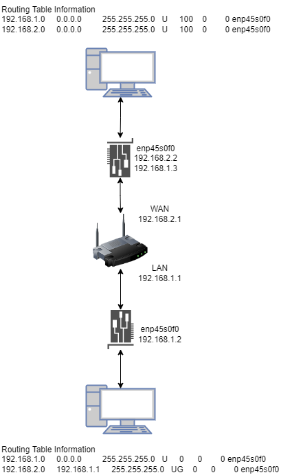

# 路由表信息
C端路由表和IP地址信息如下所示：
``` c?linenums
f410-client@f410client-MS-7C37:~/lzy/408_client_lte$ route
Kernel IP routing table
Destination     Gateway         Genmask         Flags Metric Ref    Use Iface
default         _gateway        0.0.0.0         UG    20100  0        0 enp45s0f0
default         _gateway        0.0.0.0         UG    20104  0        0 enp39s0
link-local      0.0.0.0         255.255.0.0     U     1000   0        0 enp45s0f0
172.16.1.0      0.0.0.0         255.255.255.0   U     101    0        0 enp45s0f1
172.16.2.0      0.0.0.0         255.255.255.0   U     102    0        0 enp45s0f2
172.16.3.0      0.0.0.0         255.255.255.0   U     103    0        0 enp45s0f3
192.168.0.0     0.0.0.0         255.255.255.0   U     104    0        0 enp39s0
192.168.1.0     0.0.0.0         255.255.255.0   U     100    0        0 enp45s0f0
f410-client@f410client-MS-7C37:~/lzy/408_client_lte$ sudo route del -net default netmask 0.0.0.0 dev enp45s0f0
f410-client@f410client-MS-7C37:~/lzy/408_client_lte$ sudo route add -net 192.168.2.0 netmask 255.255.255.0 dev enp45s0f0 gw 192.168.1.1
f410-client@f410client-MS-7C37:~/lzy/408_client_lte$ ping 192.168.2.2
PING 192.168.2.2 (192.168.2.2) 56(84) bytes of data.
64 bytes from 192.168.2.2: icmp_seq=1 ttl=63 time=2.14 ms
^C
--- 192.168.2.2 ping statistics ---
1 packets transmitted, 1 received, 0% packet loss, time 0ms
rtt min/avg/max/mdev = 2.143/2.143/2.143/0.000 ms
f410-client@f410client-MS-7C37:~/lzy/408_client_lte$ route
Kernel IP routing table
Destination     Gateway         Genmask         Flags Metric Ref    Use Iface
default         _gateway        0.0.0.0         UG    20104  0        0 enp39s0
link-local      0.0.0.0         255.255.0.0     U     1000   0        0 enp45s0f0
172.16.1.0      0.0.0.0         255.255.255.0   U     101    0        0 enp45s0f1
172.16.2.0      0.0.0.0         255.255.255.0   U     102    0        0 enp45s0f2
172.16.3.0      0.0.0.0         255.255.255.0   U     103    0        0 enp45s0f3
192.168.0.0     0.0.0.0         255.255.255.0   U     104    0        0 enp39s0
192.168.1.0     0.0.0.0         255.255.255.0   U     100    0        0 enp45s0f0
192.168.2.0     192.168.1.1     255.255.255.0   UG    0      0        0 enp45s0f0
f410-client@f410client-MS-7C37:~/lzy/408_client_lte$ ifconfig enp45s0f0
enp45s0f0: flags=4163<UP,BROADCAST,RUNNING,MULTICAST>  mtu 1500
        inet 192.168.1.2  netmask 255.255.255.0  broadcast 192.168.1.255
        inet6 fe80::b083:44b4:4513:9631  prefixlen 64  scopeid 0x20<link>
        ether 9c:69:b4:61:69:08  txqueuelen 1000  (Ethernet)
        RX packets 27  bytes 1798 (1.7 KB)
        RX errors 0  dropped 0  overruns 0  frame 0
        TX packets 409  bytes 39072 (39.0 KB)
        TX errors 0  dropped 0 overruns 0  carrier 0  collisions 0
```

S端路由表和IP地址信息如下所示：

``` c?linenums
f410-server@:408_server_lte$ route
内核 IP 路由表
目标            网关            子网掩码        标志  跃点   引用  使用 接口
default         _gateway        0.0.0.0         UG    100    0        0 enp45s0f0
default         _gateway        0.0.0.0         UG    104    0        0 enp39s0
link-local      0.0.0.0         255.255.0.0     U     1000   0        0 enp45s0f0
172.16.1.0      0.0.0.0         255.255.255.0   U     105    0        0 enp45s0f1
172.16.2.0      0.0.0.0         255.255.255.0   U     106    0        0 enp45s0f2
172.16.3.0      0.0.0.0         255.255.255.0   U     107    0        0 enp45s0f3
192.168.0.0     0.0.0.0         255.255.255.0   U     104    0        0 enp39s0
192.168.1.0     0.0.0.0         255.255.255.0   U     100    0        0 enp45s0f0
192.168.2.0     0.0.0.0         255.255.255.0   U     100    0        0 enp45s0f0
f410-server@:408_server_lte$ ifconfig enp45s0f0
enp45s0f0: flags=4163<UP,BROADCAST,RUNNING,MULTICAST>  mtu 1500
        inet 192.168.2.2  netmask 255.255.255.0  broadcast 192.168.2.255
        inet6 fe80::8e2f:f9c4:eaf8:244b  prefixlen 64  scopeid 0x20<link>
        ether 9c:69:b4:62:4c:54  txqueuelen 1000  (以太网)
        RX packets 954  bytes 62143 (62.1 KB)
        RX errors 0  dropped 0  overruns 0  frame 0
        TX packets 1538  bytes 130549 (130.5 KB)
        TX errors 0  dropped 0 overruns 0  carrier 0  collisions 0
```

路由表修改命令常用：

``` c?linenums
sudo route del -net default netmask 0.0.0.0 dev enp45s0f0
sudo route add -net 192.168.2.0 netmask 255.255.255.0 dev enp45s0f0 gw 192.168.1.1
```

iperf3打流测试命令：

``` c?linenums

iperf3 -u -c 10.0.0.1 -p10000 -l1400 -t100 -b100M -A0

iperf3 -s -p10000 -A0

```

# 网络环境
网络拓扑图如下所示，注意S端的IP地址需要填写一个192.168.1.X的地址，否则LINUX协议栈收到C端发送的报文头为192.168.1.X的报文，不会对其进行上层提交。

‘
# 代码修改
需要在C端和S端check.c中的`do_lte`函数中，加入以下代码。链路0为LTE链路，链路1-3为正常链路。

``` c?linenums
	link[1].isvalid = 0;
	link[2].isvalid = 0;
	link[3].isvalid = 0;
	lte_on = lte_is_valid(link,link_count);
```


## client1_conf.c

``` c?linenums

static struct nic_info nic_list[] = {
    [0] = {
		.name = "enp45s0f0", 
		.ip_str = "192.168.1.2",
		.isvalid = 0,
    },
	[1] = {
		.name = "enp45s0f1",
		.ip_str = "172.16.1.10",
		.isvalid = 0,
	},
	[2] = {
		.name = "enp45s0f2",
		.ip_str = "172.16.2.10",
		.isvalid = 0,
	},
	[3] = {
		.name = "enp45s0f3",
		.ip_str = "172.16.3.10",
		.isvalid = 0,
	},
};

static struct link_info user0_link_list[] = {
    [0] = {
        .isvalid = 0,
        .scale = 1,
	    .istosnd = 1,
        .ip_str = "192.168.2.2",
    },
	[1] = {
		.isvalid = 0,
		.scale = 1,
		.istosnd = 1,
		.ip_str = "172.16.1.1",
	},
	[2] = {
		.isvalid = 0,
		.scale = 1,
		.istosnd = 1,
		.ip_str = "172.16.2.1",
	},
	[3] = {
		.isvalid = 0,
		.scale = 1,
		.istosnd = 1,
		.ip_str = "172.16.3.1",
	},
};
```

## server_conf.c
S端的用户链路信息中的IP地址，为与其网卡对接的Wan口IP地址。

``` c?linenums

struct nic_info nic_list[] = {
	[0] = {
		.name = "enp45s0f0",
		.ip_str = "192.168.2.2",
		.isvalid = 0,
	},
	[1] = {
		.name = "enp45s0f1",
		.ip_str = "172.16.1.1",
		.isvalid = 0,
	},
	[2] = {
		.name = "enp45s0f2",
		.ip_str = "172.16.2.1",
		.isvalid = 0,
	},
	[3] = {
		.name = "enp45s0f3",
		.ip_str = "172.16.3.1",
		.isvalid = 0,
	},
};

struct link_info user0_link_list[] = {
	[0] = {
		.isvalid = 0,
		.scale = 1,
		.istosnd = 1,
		.ip_str = "192.168.2.1",
	},
	[1] = {
		.isvalid = 0,
		.scale = 1,
		.istosnd = 1,
		.ip_str = "172.16.1.10",
	},
	[2] = {
		.isvalid = 0,
		.scale = 1,
		.istosnd = 1,
		.ip_str = "172.16.2.10",
	},
	[3] = {
		.isvalid = 0,
		.scale = 1,
		.istosnd = 1,
		.ip_str = "172.16.3.10",
	},
};
```

# 测试
## ping测试
``` c?linenums
root@f410client-MS-7C37:/home/f410-client/lzy/408_client_lte# ping 192.168.2.2
PING 192.168.2.2 (192.168.2.2) 56(84) bytes of data.
64 bytes from 192.168.2.2: icmp_seq=1 ttl=63 time=1.96 ms
64 bytes from 192.168.2.2: icmp_seq=2 ttl=63 time=2.71 ms
^C
--- 192.168.2.2 ping statistics ---
2 packets transmitted, 2 received, 0% packet loss, time 1000ms
rtt min/avg/max/mdev = 1.963/2.338/2.714/0.378 ms
root@f410client-MS-7C37:/home/f410-client/lzy/408_client_lte# ping 10.0.0.1
PING 10.0.0.1 (10.0.0.1) 56(84) bytes of data.
64 bytes from 10.0.0.1: icmp_seq=1 ttl=64 time=0.671 ms
64 bytes from 10.0.0.1: icmp_seq=2 ttl=64 time=0.776 ms
^[[A64 bytes from 10.0.0.1: icmp_seq=3 ttl=64 time=0.899 ms
64 bytes from 10.0.0.1: icmp_seq=4 ttl=64 time=0.730 ms
64 bytes from 10.0.0.1: icmp_seq=5 ttl=64 time=0.841 ms
64 bytes from 10.0.0.1: icmp_seq=6 ttl=64 time=0.702 ms
64 bytes from 10.0.0.1: icmp_seq=7 ttl=64 time=0.825 ms
64 bytes from 10.0.0.1: icmp_seq=8 ttl=64 time=0.671 ms
64 bytes from 10.0.0.1: icmp_seq=9 ttl=64 time=0.810 ms
64 bytes from 10.0.0.1: icmp_seq=10 ttl=64 time=0.927 ms
64 bytes from 10.0.0.1: icmp_seq=11 ttl=64 time=0.774 ms
64 bytes from 10.0.0.1: icmp_seq=12 ttl=64 time=0.902 ms
64 bytes from 10.0.0.1: icmp_seq=13 ttl=64 time=0.801 ms
64 bytes from 10.0.0.1: icmp_seq=14 ttl=64 time=0.883 ms
64 bytes from 10.0.0.1: icmp_seq=15 ttl=64 time=0.771 ms
64 bytes from 10.0.0.1: icmp_seq=16 ttl=64 time=0.778 ms
64 bytes from 10.0.0.1: icmp_seq=17 ttl=64 time=0.695 ms
64 bytes from 10.0.0.1: icmp_seq=18 ttl=64 time=0.809 ms
64 bytes from 10.0.0.1: icmp_seq=19 ttl=64 time=0.671 ms
64 bytes from 10.0.0.1: icmp_seq=20 ttl=64 time=0.791 ms
64 bytes from 10.0.0.1: icmp_seq=21 ttl=64 time=0.918 ms
64 bytes from 10.0.0.1: icmp_seq=22 ttl=64 time=0.781 ms
64 bytes from 10.0.0.1: icmp_seq=23 ttl=64 time=0.911 ms
^C
--- 10.0.0.1 ping statistics ---
23 packets transmitted, 23 received, 0% packet loss, time 22498ms
rtt min/avg/max/mdev = 0.671/0.797/0.927/0.083 ms
```
## iperf3 打流测试（只保留LTE链路）
C端测试结果如下：
``` c?linenums
root@f410client-MS-7C37:/home/f410-client/lzy/408_client_lte# iperf3 -u -c 10.0.0.1 -p10000 -l1400 -t100 -b100M -A0
Connecting to host 10.0.0.1, port 10000
[  4] local 10.0.0.10 port 47899 connected to 10.0.0.1 port 10000
[ ID] Interval           Transfer     Bandwidth       Total Datagrams
[  4]   0.00-1.00   sec  10.8 MBytes  90.3 Mbits/sec  8066
[  4]   1.00-2.00   sec  11.9 MBytes   100 Mbits/sec  8929
[  4]   2.00-3.00   sec  11.9 MBytes   100 Mbits/sec  8929
[  4]   3.00-4.00   sec  11.9 MBytes   100 Mbits/sec  8928
[  4]   4.00-5.00   sec  11.9 MBytes   100 Mbits/sec  8929
[  4]   5.00-6.00   sec  11.9 MBytes   100 Mbits/sec  8928
[  4]   6.00-7.00   sec  11.9 MBytes   100 Mbits/sec  8929
[  4]   7.00-8.00   sec  11.9 MBytes   100 Mbits/sec  8928
[  4]   8.00-9.00   sec  11.9 MBytes   100 Mbits/sec  8929
[  4]   9.00-10.00  sec  11.9 MBytes   100 Mbits/sec  8928
[  4]   9.00-10.00  sec  11.9 MBytes   100 Mbits/sec  8928
- - - - - - - - - - - - - - - - - - - - - - - - -
[ ID] Interval           Transfer     Bandwidth       Jitter    Lost/Total Datagrams
[  4]   0.00-10.00  sec   120 MBytes   101 Mbits/sec  0.000 ms  0/90208 (0%)
[  4] Sent 90208 datagrams
iperf3: error - the server has terminated
```
S端测试结果如下：
``` c?linenums
root@:408_server_lte# iperf3 -s -p10000 -A0
-----------------------------------------------------------
Server listening on 10000
-----------------------------------------------------------
Accepted connection from 10.0.0.10, port 36586
[  5] local 10.0.0.1 port 10000 connected to 10.0.0.10 port 47899
[ ID] Interval           Transfer     Bandwidth       Jitter    Lost/Total Datagrams
[  5]   0.00-1.00   sec  10.8 MBytes  90.3 Mbits/sec  0.011 ms  0/8065 (0%)
[  5]   1.00-2.00   sec  11.9 MBytes   100 Mbits/sec  0.012 ms  0/8929 (0%)
[  5]   2.00-3.00   sec  11.9 MBytes   100 Mbits/sec  0.013 ms  0/8929 (0%)
[  5]   3.00-4.00   sec  11.9 MBytes   100 Mbits/sec  0.012 ms  0/8928 (0%)
[  5]   4.00-5.00   sec  11.9 MBytes   100 Mbits/sec  0.012 ms  0/8929 (0%)
[  5]   5.00-6.00   sec  11.9 MBytes   100 Mbits/sec  0.012 ms  0/8928 (0%)
[  5]   6.00-7.00   sec  11.9 MBytes   100 Mbits/sec  0.014 ms  0/8929 (0%)
[  5]   7.00-8.00   sec  11.9 MBytes   100 Mbits/sec  0.014 ms  0/8928 (0%)
[  5]   8.00-9.00   sec  11.9 MBytes   100 Mbits/sec  0.012 ms  0/8929 (0%)
[  5]   9.00-10.00  sec  11.9 MBytes   100 Mbits/sec  0.012 ms  0/8928 (0%)
^C[  5]  10.00-10.23  sec  2.38 MBytes  87.1 Mbits/sec  0.012 ms  0/1786 (0%)
- - - - - - - - - - - - - - - - - - - - - - - - -
[ ID] Interval           Transfer     Bandwidth       Jitter    Lost/Total Datagrams
[  5]   0.00-10.23  sec  0.00 Bytes  0.00 bits/sec  0.012 ms  0/90208 (0%)
iperf3: interrupt - the server has terminated

```
## 内核打印信息
``` bash?linenums
[  412.508711] USER0-0:[1.1]SND:   6651582      RCV:       282  DELAY:         0us      Record:1        DD:0
[  412.508713] USER0-1:[0.1]SND:       246      RCV:         0  DELAY:         0us      Record:1        DD:0
[  412.508714] USER0-2:[0.1]SND:       246      RCV:         0  DELAY:         0us      Record:1        DD:0
[  412.508714] USER0-3:[0.1]SND:       246      RCV:         0  DELAY:         0us      Record:1        DD:0
[  413.020694] USER0-0:[1.1]SND:   6651582      RCV:       282  DELAY:         0us      Record:1        DD:0
[  413.020695] USER0-1:[0.1]SND:       246      RCV:         0  DELAY:         0us      Record:1        DD:0
[  413.020696] USER0-2:[0.1]SND:       246      RCV:         0  DELAY:         0us      Record:1        DD:0
[  413.020697] USER0-3:[0.1]SND:       246      RCV:         0  DELAY:         0us      Record:1        DD:0
[  413.532680] USER0-0:[1.1]SND:   2661590      RCV:       439  DELAY:         0us      Record:1        DD:0
[  413.532682] USER0-1:[0.1]SND:       246      RCV:         0  DELAY:         0us      Record:1        DD:0
[  413.532683] USER0-2:[0.1]SND:       246      RCV:         0  DELAY:         0us      Record:1        DD:0
[  413.532684] USER0-3:[0.1]SND:       246      RCV:         0  DELAY:         0us      Record:1        DD:0
[  414.044666] USER0-0:[1.1]SND:       222      RCV:       282  DELAY:         0us      Record:1        DD:0
[  414.044668] USER0-1:[0.1]SND:       246      RCV:         0  DELAY:         0us      Record:1        DD:0
[  414.044669] USER0-2:[0.1]SND:       246      RCV:         0  DELAY:         0us      Record:1        DD:0
[  414.044669] USER0-3:[0.1]SND:       246      RCV:         0  DELAY:         0us      Record:1        DD:0
[  414.556652] USER0-0:[1.1]SND:       222      RCV:       282  DELAY:         0us      Record:1        DD:0
[  414.556654] USER0-1:[0.1]SND:       246      RCV:         0  DELAY:         0us      Record:1        DD:0
[  414.556655] USER0-2:[0.1]SND:       246      RCV:         0  DELAY:         0us      Record:1        DD:0
[  414.556656] USER0-3:[0.1]SND:       246      RCV:         0  DELAY:         0us      Record:1        DD:0
```

