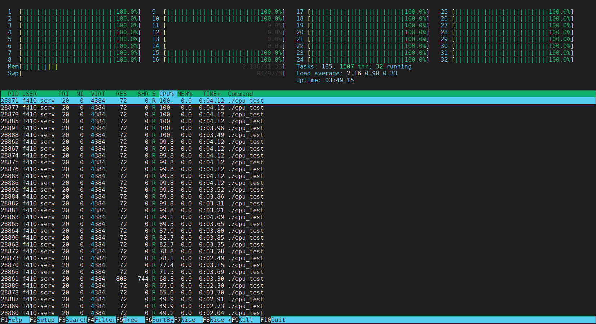

# 一、CPU性能设置
左上角GAME BOOST调整为OFF，A-XMP调整为1，其他配置可以不用修改。操作目的是将CPU设置为非自动模式，将内存设置为高频模式。CPU主频通过命令进行设置。


## 1.1 工具安装
``` bash?linenums
sudo apt-get install cpufrequtils
```
## 1.2 查看CPU信息
执行cpufreq-info命令，显示所有CPU的各种信息，较为重要的有：
>hardware limits： CPU硬件支持的频率最小值-最大值；
available frequency steps： CPU频率可以被设置的值；
available cpufreq governors： CPU频率调节策略。包括powersave, userspace,ondemand,conservative, performance。


### 1.2.1 CPU支持主频
如图1所示，CPU硬件支持的频率最小值为2.20GHz，最大值为3.4GHz。
### 1.2.2 CPU主频可设置的值
如图一，CPU频率可以被设置的值有：3.4GHz，2.8GHz，2.20GHz。
需要注意的是：CPU的频率不能被设置为任意值，必须是available frequency steps中的值，若设置的值不在其中，系统会选择设置为大于且在available frequency steps中的最小值。此外，CPU频率设置不会超过其上下限，即 hardware limits。
### 1.2.3 调节策略
命令：`sudo cpufreq-set -g {模式}`
powersave，是无论如何都只会保持最低频率的所谓”省电”模式；
userspace，是自定义频率时的模式，这个是当你设定特定频率时自动转变的；
ondemand，默认模式。一有cpu计算量的任务，就会立即达到最大频率运行，等执行完 毕就立即回到最低频率；
conservative，翻译成保守（中庸）模 式，会自动在频率上下限调整，
ondemand的区别在于它会按需分配频率，而不是一味追求最高频率；
performance，顾名思义只注重效率，无论如何一直保持以最大频率运行。
### 1.2.4 模式使用
powersave，ondemand，conservative，ondemand，performance这些模式设置后，就如1.2.3中字面意思一样，不用再进一步设置频率。
而userspace模式，假如你选择的是自定义模式可以通过的话，sudo cpufreq-set -f 1700000（你所需要的频率）
注意，此处的频率必须是以KHz为单 位，并且是可以达到的频率（也就是用cpufreq-info查看到的各个频率），cpu频率＝倍频x外频。以下凡是涉及频率的一律如此。
而在自动调节下，也可以设置其上限和下限
``` bash?linenums
sudo cpufreq-set -d {频率下限}
sudo cpufreq-set -u {频率上限}
```
## 1.3 命令总结
``` bash?linenums
Usage: cpufreq-set [options] Options:
-c CPU, –cpu CPU #指定CPU核心号，请注意上图的analyzing CPU数字。
-d FREQ, –min FREQ #手工指定最小主频速度。（在userspace策略）
-u FREQ, –max FREQ #手工指定最大主频速度。（在userspace策略）
-g GOV, –governor GOV #设置工作策略
-f FREQ, –freq FREQ #设定特定的工作频率（CPU默认档次）
-h, –help #输出这个帮助信息
```
## 1.4 编写cpu_set.sh脚本
``` bash?linenums
#!/bin/bash
 
###
 # Copyright 2022 liuziyan, All Rights Reserved. 
 # @Author       : liuziyan
 # @version      : 1.0
 # @Date         : 2022-09-13 19:44:36
 # @Instructions : 
 # @LastEditTime : 2022-09-20 11:28:00
 # @FilePath     : /s_v1.0.8/script/cpu_set.sh
### 

INPUT=$1

if [ "${INPUT}" == "1" ] ; then
    echo "CPU核心10-13修改为性能模式"
    sudo cpufreq-set -g performance -c 10
    sudo cpufreq-set -g performance -c 11
    sudo cpufreq-set -g performance -c 12
    sudo cpufreq-set -g performance -c 13
elif [ "${INPUT}" == "2" ] ; then
    echo "CPU核心10-13修改为默认模式"
    sudo cpufreq-set -g conservative -c 10
    sudo cpufreq-set -g conservative -c 11
    sudo cpufreq-set -g conservative -c 12
    sudo cpufreq-set -g conservative -c 13
elif [ "${INPUT}" == "3" ] ; then
    echo "CPU核心10-13修改为节能模式"
    sudo cpufreq-set -g powersave -c 10
    sudo cpufreq-set -g powersave -c 11
    sudo cpufreq-set -g powersave -c 12
    sudo cpufreq-set -g powersave -c 13
else
	echo "使用方法将CPU设置为对应的模式: 参数1为性能,参数2为默认,参数3为节能!"
    exit
fi

```
脚本调用显示如下所示：
``` bash?linenums
root@:s_v1.0.8# ./script/cpu_set.sh 1
CPU核心10-13修改为性能模式
root@:s_v1.0.8# ./script/cpu_set.sh 2
CPU核心10-13修改为默认模式
root@:s_v1.0.8# ./script/cpu_set.sh 3
CPU核心10-13修改为节能模式
root@:s_v1.0.8# ./script/cpu_set.sh 0
使用方法将CPU设置为对应的模式: 参数1为性能,参数2为默认,参数3为节能!
```
## 1.5 CPU隔离
CPU隔离的需求：在一个SMP或者NUMA系统中，CPU的数量大于1。在工程中，我们有时候有一种需求，就是让某个能够独占CPU，这个CPU什么都不做，就只做指定的任务，从而获得低延迟、高实时的好处。

比如在DPDK中，通过在系统文件`/etc/default/grub`添加设置`GRUB_CMDLINE_LINUX_DEFAULT=“isolcpus=0-3,5,7”`隔离CPU0-3,5,7，让DPDK的任务在运行的时候，其他任务不会和DPDK的任务进行上下文切换，从而保证网络性能最佳。文件信息添加成功后，需要重新更新一下启动项，并且重启电脑才可有效。

``` bash
# 原文件/etc/default/grub的配置信息
GRUB_CMDLINE_LINUX_DEFAULT="quiet splash iommu=pt intel_iommu=on"
# 添加配置信息
GRUB_CMDLINE_LINUX_DEFAULT="quiet splash iommu=pt intel_iommu=on isolcpus=10-13"

# 在终端中更新启动项信息
sudo grub-mkconfig -o /boot/grub/grub.cfg 
#重启电脑
sudo reboot 
```

### 1.5.1 用户态隔离
编写了如下程序，通过利用fork函数启动32的进程，由于PC采用的使AMD5950X，16核32线程，因此程序中的32哥进程会均分到32个核心上运行，但是通过`htop`命令查看程序运行前后所示。



测试程序如下
``` c?linenums
#include <sys/types.h>
#include <unistd.h>
#include <stdio.h>

int main(int argc, char *argv[]){
    fork();
    fork();
    fork();
    fork();
    fork();
    while (1);
}
```

**通过上面实验，可以看出isolcpus=10-13使得CPU10-13上无法再运行用户空间的进程了(除非手动设置affinity，有关手动绑定用户空间进程，可查看参考3)。**

### 1.5.2 内核态隔离

### 1.5.3 内核态线程
内核态的线程其实和用户态差不多，当它们没有绑定到隔离的CPU的时候，是不会跑到隔离CPU运行的。具体操作就是在启动项中隔离要使用的CPU，然后在内核线程中绑定到对应的CPU编号即可，相关函数有`kthread_bind`。相关内容可以参考：第三章、LINUX内核线程的使用。
### 1.5.4 参考
1. [Linux高性能任务独占CPU举例分析](https://blog.csdn.net/21cnbao/article/details/113733439)（很重要）
## 1.6 常用关于CPU的命令
``` bash?linenums
cat /proc/cpuinfo
sudo cpufreq_info
watch -n 0 "cat /proc/cpuinfo | grep -i mhz"
```
## 1.7 参考
1. [设置ubuntu中cpu频率](https://blog.csdn.net/xuershuai/article/details/122023817)
2. [linux调频指令-cpufreq介绍](https://blog.csdn.net/qq_40315501/article/details/124466387)

# 二、常用打流命令
## 2.1 iperf3
``` bash?linenums
iperf3 -u -c 10.0.0.1 -p10000 -l8756 -t100 -b12G -A10 -Z -O3
iperf3 -s -p10000 -A10

iperf3 -u -c 172.16.0.1 -p10000 -l1400 -t1000 -b10M -A10
iperf3 -s -p10000 -A10

```
## 2.2 iperf
``` bash?linenums
iperf -u -c172.16.1.1 -p10000 -l1400 -t100 -b1000M -i1 
iperf -u -s -p10000 -i1
```
## 2.3 打流软件对比
1. 进行UDP打流前，iperf3需要发送端与接收端先建立一个TCP的链接，在进行UDP报文的传输，而iperf则不需要进行TCP的建立。
2. iperf使用场景为低流量，高可靠场景，iperf3场景为高流量，快速发包。iperf3会在每个1S周期内的0.1S内前半段时间进行大流量的灌包，后半段时间进行空闲。这样则会导致缓冲区满而导致丢包。
3. iperf3具有-A(affinity)参数，可以将打流程序绑定在一个特定的CPU上，对于大流量灌包有很大的帮助。
## 2.4 额外知识
1. 命令中的-l参数指的是载荷的长度，假如你设置为1400B，发送为UDP报文，其最终发送的报文长度为14(MAC)+20(IP)+8(UDP)+1400(payload) = 1442Byte，在传输过程中是没有MAC头字节的，即MTU1500不包括MAC头。

# 三、LINUX内核线程的使用
有时需要程序来监听和处理某些指定事件，此时经常会做个服务，让其在后台执行，这在应用程序这样的用户态很经常用到，而在Linux Kernel里也会有类似的经历，此时同样可以使用线程来实现，不过它叫内核线程。
LINUX内核线程只能在内核中由其他的线程来创建，而所有的内核线程由kthreadd创建，故而使用ps -ef命令看到所有被[]括起来的内核线程（守护进程）对应的PPID均为2。
内核线程与普通用户态线程除了内核线程没有独立地址空间（其mm成员指向NULL）外，其他的可被调度和被抢占均支持。
``` c?linenums
#include <linux/sched.h>   //wake_up_process()  
#include <linux/kthread.h> //kthread_create()、kthread_run()  
#include <err.h> //IS_ERR()、PTR_ERR()  
```
## 3.1 kthread_create() 创建内核线程
``` c?linenums
#define kthread_create(threadfn, data, namefmt, arg...) \
        kthread_create_on_node(threadfn, data, -1, namefmt, ##arg)
```
## 3.2 kthread_run() 创建并运行内核线程
``` c?linenums
#define kthread_run(threadfn, data, namefmt, ...) \
({ \
        struct task_struct *__k \
                = kthread_create(threadfn, data, namefmt, ## __VA_ARGS__); \
        if (!IS_ERR(__k)) \
                wake_up_process(__k); \
        __k; \
})
```
## 3.3 kthread_stop()，停止指定内核线程
一般是在其他线程中调用停止函数，去停止指定的内核线程。
``` c?linenums
int kthread_stop(struct task_struct *k);
```
## 3.4 kthread_should_stop()，判断线程是否该停止
在指定线程中利用while循环函数调用此函数，判断此线程是否停止。
``` c?linenums
bool kthread_should_stop(void)
{
	return test_bit(KTHREAD_SHOULD_STOP, &to_kthread(current)->flags);
}
```
## 3.5 kthread_bind()，绑定创建好的线程在执行CPU核心上运行
``` c?linenums
void kthread_bind(struct task_struct *k, unsigned int cpu);
```
也可在创建线程的时候调用如下函数在创建的同时一起绑定CPU：
``` c?linenums
struct task_struct *kthread_create_on_cpu(int (*threadfn)(void *data),
                   void *data,
                   unsigned int cpu,
                   const char *namefmt);
```
上述两个代码需要在使用后需要调用kthread_run()里用到的wake_up_process()才能进入运行队列。
### 3.5.1 编译驱动时提示warning : "kthread_create_on_cpu" undefined!
代码中使用了函数`kthread_create_on_cpu`，但是在编译驱动过程中提示，经过查阅结果为：`kthread_create_on_cpu`不是由内核导出的，它是 CPU 热插拔线程使用的内部函数（请参阅参考资料linux/smpboot.h）。如果必须设置线程到特定CPU上，则使用函数kthread_bind进行绑定运行。
### 3.5.2 参考
[linux内核模块：内核方法未定义（kthread_create_on_cpu）](https://qa.1r1g.com/sf/ask/2039076791/#)
## 3.6 实际测试
线程一旦启动起来后，会一直运行，除非该线程主动调用do_exit函数，或者其他的进程调用kthread_stop函数，结束线程的运行。 但如果线程函数正在处理一个非常重要的任务，它不会被中断的。当然如果线程函数永远不返回并且不检查信号，它将永远都不会停止，因此，**==线程函数必须能让出CPU #F44336==**，以便能运行其他线程。同时线程函数也必须能重新被调度运行。在例子程序中，这是**==通过schedule_timeout()函数完成的 #F44336==**。

测试代码参考：[内核线程](https://www.jianshu.com/p/b3fed01aa01a)
## 3.7 注意
1. 值得一提的是kthread_should_stop函数，我们需要在开启的线程中嵌入该函数并检查此函数的返回值，否则kthread_stop是不起作用的
2. 休眠有两种相关的状态:TASK_INTERRUPTIBLE and TASK_UNINTERRUPTIBLE。它们的惟一却不是处于TASK_UNINTERRUPTIBLE状态的进程会忽略信号，而处于TASK_INTERRUPTIBLE状态的进程如果收到信号会被唤醒并处理信号(然后再次进入等待睡眠状态)。两种状态的进程位于同一个等待队列上，等待某些事件，不能够运行。
3. schedule_time(s*HZ)的参数为节拍数，HZ宏每个系统定义不一样，表示每一秒时钟中断数，如在2.6中为1000，2.4中为100, s为秒单位，例如如果要休眠20ms，则schedule_time(0.02*HZ)就可以了。
4. 在调用kthread_stop函数时，线程函数不能已经运行结束。否则，kthread_stop函数会一直进行等待。在执行kthread_stop的时候，目标线程必须没有退出，否则会Oops。原因很容易理解，当目标线程退出的时候，其对应的task结构也变得无效，kthread_stop引用该无效task结构就会出错。
5。. 线程函数必须能让出CPU，以便能运行其他线程。同时线程函数也必须能重新被调度运行。在例子程序中，这是通过schedule_timeout()函数完成的
## 3.8 查看线程的CPU利用率
可以使用top命令来查看线程（包括内核线程）的CPU利用率。命令如下：` top -p {线程号}`或`ps aux | grep {线程名}`。下面的命令显示所有内核线程：`ps afx`。
## 3.9 参考
1. [内核线程](https://www.jianshu.com/p/b3fed01aa01a)
2. [Linux内核多线程实现方法 —— kthread_create函数【转】](https://www.cnblogs.com/sky-heaven/p/8204631.html)
2. [kthread_create 简单使用](https://blog.csdn.net/iamliuyanlei/article/details/9326119)
# 四、LINUX内核任务延迟队列

# 五、LINUX内核定时器

# 六、LINUX内核延时函数
内核中涉及的延时主要有两种实现方式：**忙等待**或者**睡眠等待**。前者阻塞程序，在延时时间到达前一直占用CPU，而后者是将进程挂起（置进程于睡眠状态并释放CPU资源）。前者一般用在延时时间在毫秒以内的精确延时，后者用于延时时间在毫秒以上的长延时。为了充分利用 CPU 资源，使系统有更好的吞吐性能，在对延迟时间的要求并不是很精确的情况下，睡眠等待通常是值得推荐的。
## 6.1 忙等待短延时 
内核中提供了如下3个函数用于纳秒、微秒和毫秒级的延时：
``` c?linenums
void ndelay(unsigned long nsecs); 
void udelay(unsigned long usecs); 
void mdelay(unsigned long msecs); //一般不建议直接使用mdelay()函数，这将无谓地耗费 CPU 资源
```
上述延迟的实现原理本质上是忙等待，它根据 CPU 频率进行一定次数的循环。其本质同如下代码：
``` c?linenums
void delay(unsigned int time) 
{ 
 while (time--); 
}
```
## 6.2 忙等待长延时函数
内核中进行延迟的一个很直观的方法是比较当前的 jiffies 和目标 jiffies（设置为当前 jiffies 加上时间间隔的 jiffies），直到未来的 jiffies 达到目标 jiffies。

利用jiffies和time_befor实现延时100个jiffies和2秒的代码：
``` c?linenums
 /*延迟 100 个 jiffies*/ 
 unsigned long delay = jiffies + 100; 
 while (time_before(jiffies, delay)); 
  
 /*再延迟 2s*/ 
 unsigned long delay = jiffies + 2*HZ; 
 while (time_before(jiffies, delay)); 
```
其中，time_befor()只是一个函数宏，与其对应的还有一个time_after():
``` c?linenums
#define time_after(a,b) \ 
 (typecheck(unsigned long, a) && \ 
 typecheck(unsigned long, b) && \ 
 ((long)(b) - (long)(a) < 0)) 

#define time_before(a,b) time_after(b,a)
```
## 6.3 睡眠短延时
### 6.3.1 sleep类延时函数
下述函数将使得调用它的进程睡眠参数指定的时间，受系统 HZ 和进程调度的影响，msleep()类似函数的精度是有限的。msleep()、ssleep()不能被打断，而msleep_interruptible()则可以被打断。
``` cpp?linenums
void msleep(unsigned int millisecs); 
unsigned long msleep_interruptible(unsigned int millisecs); 
void ssleep(unsigned int seconds); 
```
### 6.3.2 schedule类睡眠延时函数
``` c?linenums
signed long  schedule_timeout_interruptible(signed long timeout);
signed long  schedule_timeout_uninterruptible(signed long timeout) 
```
`schedule_timeout_uninterruptible()`和`schedule_timeout_interruptible`是将当前任务睡眠指定的jiffies之后重新被调度执行，它的实现原理是向系统添加一个定时器，在定时器处理函数中唤醒参数对应的进程。上一小节的sleep类函数的底层实现也是调用`schedule_timeout_uninterruptible`这个函数进行实现的。
``` c?linenums
void msleep(unsigned int msecs) 
{ 
	unsigned long timeout = msecs_to_jiffies(msecs) + 1; 
	while (timeout) 
		timeout = schedule_timeout_uninterruptible(timeout); 
} 
unsigned long msleep_interruptible(unsigned int msecs) 
{ 
	unsigned long timeout = msecs_to_jiffies(msecs) + 1; 
	while (timeout && !signal_pending(current)) 
		timeout = schedule_timeout_interruptible(timeout); 
	return jiffies_to_msecs(timeout); //返回剩余的延时时间
}
signed long _ _sched schedule_timeout_interruptible(signed long timeout) 
{ 
	_ _set_current_state(TASK_INTERRUPTIBLE); //置进程状态为 TASK_INTERRUPTIBLE
	return schedule_timeout(timeout); 
} 
signed long _ _sched schedule_timeout_uninterruptible(signed long timeout) 
{ 
	_ _set_current_state(TASK_UNINTERRUPTIBLE); //置进程状态为 TASK_UNINTERRUPTIBLE
	return schedule_timeout(timeout); 
} 
```
**注意**：`chedule_timeout` 要求调用者首先设置当前的进程状态。为获得一个不可中断的延迟, 可使用 `TASK_UNINTERRUPTIBLE`代替。如果你忘记改变当前进程的状态,，调用 `schedule_time`如同调用 `shcedule`，建立一个不用的定时器（本章参考2），具体原理大致为`chedule_timeout`函数不会把当前的进程的状态由`TASK_RUNNING`变为`TASK_INTERRUPTIBLE`和`TASK_UNINTERRUPTIBLE`或者`TASK_KILLABLE`所以在`__schedule()`中，不会把这个task从runqueue中移出去。那么当系统进行调度的时候这个进程仍然会被调度进来。`schedule_timeout_interruptible`, 在调用`schedule`之前，会先调用`set_current_state`设置进程状态，所以会将进程移出运行队列。从而达到降低CPU使用率的作用。

`shcedule`函数的功能是：让调度器选择一个合适的进程并切换到对应的线程运行（本章参考1）。
### 6.3.3 sleep_on类，在等待队列上睡眠的延时函数
函数可以将当前进程添加到等待队列中，从而在等待队列上睡眠。当超时发生时，进程将被唤醒（后者可以在超时前被打断）：
``` c?linenums
sleep_on_timeout(wait_queue_head_t *q, unsigned long timeout); 
interruptible_sleep_on_timeout(wait_queue_head_t*q, unsigned long timeout); 
```
## 6.4 参考
1. [【linux kernel】linux内核的进程调度函数__schedule](https://blog.csdn.net/iriczhao/article/details/122644580)
2. [Linux驱动学习–时间、延迟及延缓操作](http://niehan.blog.techweb.com.cn/archives/118.html)
3. [Linux内核中的延时函数详解](https://blog.csdn.net/liangzc1124/article/details/121756964)
4. [schedule_timeout与mdelay的区别](https://www.cnblogs.com/muryo/p/4106208.html)
5. [进程调度-【转载】schedule_timeout和schedule_timeout_interruptible让出CPU](https://www.cnblogs.com/zhangzhiwei122/p/16156917.html)
6. [一文讲解linux内核中时间管理基本概念](https://zhuanlan.zhihu.com/p/489077937)
# 七、网卡多队列原理及学习

## 参考
1. [网卡多队列原理及学习](https://blog.csdn.net/linggang_123/article/details/113186750)
2. [Linux网卡多队列学习笔记](https://blog.csdn.net/liqiaochu970326/article/details/123989715)

# 八、Linux netfilter
## 8.1 hook相关问题
### 8.1.1 发送钩子函数与报文
当上层生成报文经过Hook函数时，此时处理该报文的CPU和进程号与产生此业务流的相同。因此可以简单理解为，当有两个网络应用通信时，hook点会出现相同的两个函数被同时调用，但线程号不同。


同一个应用的网络流，无论报文产生的速度多快，都是只能产生一个线程，只有第一个报文处理结束后，退出钩子函数后，才会有新的报文进入，因此不用进行选择链路加锁等操作。现有处理为将8756字节的报文切割成6个1500的UDP报文，并封装新的UDP报文头进行传输，处理时间为2~3us，主频5.4GHz。

### 8.1.2 接收钩子函数与报文
#### 测试1：对外网卡和虚拟网卡同时打印信息
在接收钩子处添加打印测试代码，设备现在有一个对外网通信网卡，还有进行实验测试的四个网卡。在加载驱动时，进行客户端向服务器端虚拟网卡进行打球测试，查看会有几个ENTER信息出现。如果永远都是一条ENTER和EXIT，可以初步认为所有的网卡的报文信息都由一个控制器控制，排队进入网络协议栈函数。


可以看到下图中出现了连续两个ENTER的打印信息，可以认为当前报文还未出hook函数时，又有新的报文进入才会触发新的打印信息，这也就是一个对外网通信网卡和一个打流虚拟网卡测试的。


#### 开启两个打流软件同时对虚拟网卡进行打流


# 九、交互式进程查看器-htop使用
# 常用的网站
1. [Linux内核API](https://deepinout.com/linux-kernel-api/linux-kernel-api-process-management/linux-kernel-api-pro)(网站包含有内核API接口的中文注释，可以用于查看源码)
2. [linux内核源码网站](https://elixir.bootlin.com/linux/v4.15.18/source)
# 提出的问题与解决办法
1. 是否可以将一个任意函数（自己创建函数或LINUX内核函数）进行线程化绑定可控制CPU上，这样既可以降低业务流使用的CPU。