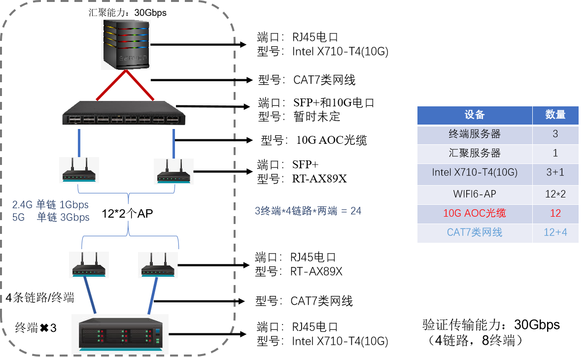

# 项目需求
预计项目搭建的环境如下图所示，每个客户端四个网口，初步规划分别使用WIFI的频段2.4GHz、5.2GHz、5.8GHz、6GHz(最新WIFI6E协议支持)，进行数据传输。预计要达到汇聚服务器网卡的满吞吐状态，即40Gbps（基本上不可能达到，传统业务传输会导致丢包的情况太多，先讨论最大值）。

 

## 模块化结构
根据图二可知，与交换机想连接的为12个10G SFP+光口和4个10G 电口，如果后期每添加一个终端服务器数量，则需要交换机多提供4个10G SFP+光口。**==因此需要最低12个SFP+光口，4个电口，均为10G #F44336==**。需要注意的一点是，如果为了前期测试方便可以多一些电口进行直连进行多用户先进行测试系统代码的稳定性，**==最好为8电口万兆 #F44336==**。

包转发率需求：由于系统绝大多数采用WIFI传输，一个报文也就是1500Byte，每秒的转发报文数是`40*1024*1024*1024/1500*8=3.5Mpps`。

## 三层特性

核心交换机、汇聚交换机、接入交换机