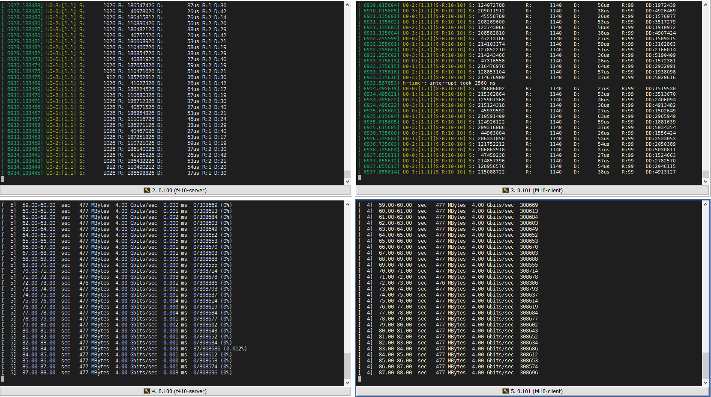
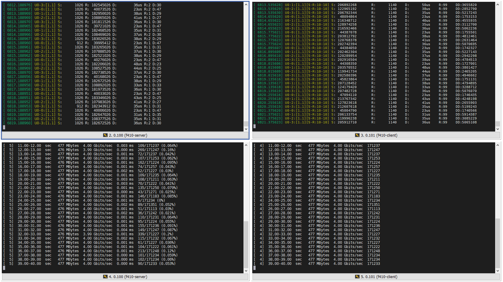

# 报文在发送端切包之前出现丢包
## 原因分析

在进行iperf3打流，分两次分别为报文的有效载荷长度分别为1460和2920，速率都为4Gbps，测试结果分别如图1和图2所示。

根据图1和图2进行分析，两个Iperf3打流的速率是一致的，唯一的区别在于载荷为2920的报文，在发送前需要进行切包符合MTU要求，然后选择链路发送。因此问题应该是出现在报文切割线程，报文处理不及时出现报文被动丢包。

为了确定不是接收端组装报文而丢包或者由于接收端排序丢包文导致，在接收端打开了报文组装的所有DBG信息提示，但是经过打流并未出现任何打印信息。因此可以基本判定，是由于报文发送造成的丢包。

## 现存在的问题
1. 在`NF_INET_POST_ROUTING`处，采用`sk_buff_head`有锁队列存入报文，在`pkg_proc_func`线程处对有锁队列进行取出报文，进行切割。 两个独立的线程，针对有锁队列会存在互相等待，可能会导致报文的丢失。

## 解决过程 

## 测试结果

## 总结

