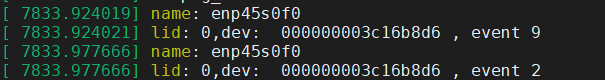
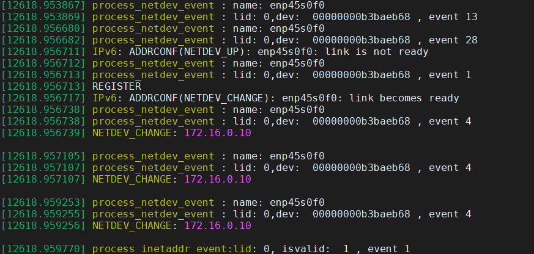
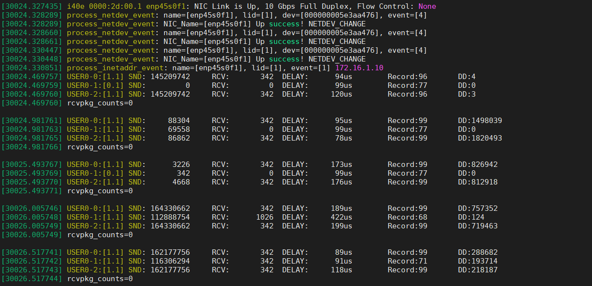

# 前提背景
两个PC之间通过三条链路进行通信，使用的是蔡学长的Linux4.15版本，并且后期加了均匀收发包的算法。

# 问题
在业务流的时候，将其中一条链路Down掉，会导致对应链路的Client端Kernel Down，因此需要找到为何导致此问题。

# 解决



当网卡关掉的时候，网卡任务通知链打印信息依次是任务9（NETDEV_GOING_DOWN）和2（NETDEV_DOWN）。 之前经过测试，如果在任务通知链2达到后卸掉任务包会导致空指针问题，因此在任务通知链2到来时就立刻关闭该网卡的链路任务，并且切掉对应链路的报文，应该可以解决空指针问题。



## notifier.c文件进行修改
``` c?linenums
static int process_inetaddr_event(struct notifier_block *this, unsigned long event, void *ptr) {
    short               i = 0;
    char                *dev_name = NULL, *flag = NULL;
    struct nic_info     *cur = NULL;
    struct in_ifaddr    *ifa = NULL;
    struct in_device    *idev = NULL;
    struct net_device   *dev = NULL;

    if (!ptr)
        return NOTIFY_DONE;

    ifa = (struct in_ifaddr *)ptr;
    idev = ifa->ifa_dev;
    dev = idev->dev;
    dev_name = dev->name;
	
    if (!(flag = strstr(dev_name, host->tun.name))) {
        for (i = 0; i < host->nic_count; ++i) {
            if (strstr(dev_name, host->nic_list[i].name)) {
                cur = host->nic_list + i;
                break;
            }
        }
    }
    else if (flag)
        cur = &(host->tun);

    if (!cur)
        return NOTIFY_DONE;

    switch (event) {
    case NETDEV_UP:
        cur->isvalid = 1;
        cur->ifa = ifa;
        break;
    case NETDEV_DOWN:
        cur->isvalid = 0;
        cur->ifa = NULL;
		break;
    default:
		break;
    }
	prt_info("%s: name=[%s], lid=[%d], event=[%d] " NIPQUAD_FMT,__func__, cur->name, i, (int)cur->isvalid, NIPQUID(cur->ip));
    return NOTIFY_DONE;
}

static struct notifier_block inetaddr_notifier = {
    .notifier_call = process_inetaddr_event,
};

/******************************************************************************************************
*
*	NIC Down: NETDEV_GOING_DOWN -> NETDEV_DOWN
*	NIC Up	: NETDEV_PRE_UP	-> NETDEV_UDP_TUNNEL_PUSH_INFO -> NETDEV_UP -> NETDEV_CHANGE
*	NIC OFF : NETDEV_CHANGE
*	NIC ON	: NETDEV_CHANGE -> NETDEV_CHANGE -> NETDEV_CHANGE -> NETDEV_UP(process_inetaddr_event)
*
*******************************************************************************************************/
static int process_netdev_event(struct notifier_block *this, unsigned long event, void *ptr) {

    short               i = 0, lid = 0;
    char                *dev_name = NULL, *flag = NULL;
    struct net_device   *dev = NULL;
    struct in_device    *idev = NULL;
    struct in_ifaddr    *ifa = NULL;
    struct nic_info     *cur = NULL;
	struct link_info    *link_list = NULL;
	

    if (!ptr){
        return NOTIFY_DONE;
    }

	dev = netdev_notifier_info_to_dev(ptr);
    dev_name = dev->name;
    
	if (!(flag = strstr(dev_name, host->tun.name))) {
		// 寻找发生任务通知链的物理网卡
        for (i = 0; i < host->nic_count; ++i) {
            if (strstr(dev_name, host->nic_list[i].name)) {
                cur = host->nic_list + i;
				link_list = host->user_list->link_list + i;
                lid = i;
                break;
            }
        }
    }
    else if (flag){
        cur = &(host->tun); //虚拟网卡
    }

    if (!cur) {
        return NOTIFY_DONE;
	}

	prt_info("%s: name=[%s], lid=[%d], dev=[%p], event=[%ld]",__func__ , dev_name, i, dev, event);	
	
    switch (event) {
    case NETDEV_CHANGE:
//		prt_info("%s: name=[%s], lid=[%d], NETDEV_CHANGE: " NIPQUAD_FMT,__func__ , dev_name, i, NIPQUID(cur->ip));
         for (i = 0; i < host->user_count; ++i) {
             if (lid < host->user_list[i].link_count){
				if(cur->isvalid){
					cur->isvalid = 0;
					host->user_list[i].link_list[lid].isvalid = 0;
			        cur->ndev = NULL;
			        cur->net = NULL;
			        cur->ifa = NULL;
					prt_info("%s: NIC_Name=[%s] Down success! NETDEV_CHANGE", __func__, dev_name);					
				}
				else{
					prt_info("%s: NIC_Name=[%s] Up success! NETDEV_CHANGE", __func__, dev_name);
					if(!cur->isvalid)	//如果网卡活性1，则是ifconfig Up，已经NETDEV_REGISTER；如果没有，则是网卡直插，因此需要经过NETDEV_REGISTER。
						goto NIC_ON;
				}
			 }
         }
        break;
    case NETDEV_UP:
    case NETDEV_REGISTER:
NIC_ON:
        cur->ndev = dev;
        cur->net = dev_net(dev);
        idev = in_dev_get(dev);
        if (!idev)
           break;
        in_dev_put(idev);
        for (ifa = idev->ifa_list; ifa && (ifa->ifa_flags & IFA_F_SECONDARY); ifa = ifa->ifa_next)
            ;
        if (!ifa)
            break;
        cur->ifa = ifa;
		cur->isvalid = 1;
		prt_info("%s: NIC_Name=[%s] Up success! NETDEV_REGISTER", __func__, dev_name);
        break;
    case NETDEV_GOING_DOWN:
        cur->isvalid = 0;
        break;
    case NETDEV_DOWN:
        cur->isvalid = 0;
    case NETDEV_UNREGISTER:
        cur->ndev = NULL;
        cur->net = NULL;
        cur->ifa = NULL;
		prt_info("%s: NIC_Name=[%s] Down success!", __func__, dev_name);
        break;
    default:
        return NOTIFY_DONE;
    }
    return NOTIFY_DONE;
}
```

## post_routing.c文件修改

``` c?linenums
        link = user->link_list + lid;
        nic = host->nic_list + lid;

        if (unlikely(select_route(nic, link, skb) < 0))
        {
            if (likely(skb))
                kfree_skb(skb);
            return NF_STOLEN;
        }

        if (unlikely(!link->isvalid && skb))
        {
            kfree_skb(skb);
            return NF_STOLEN;
        }

        link->snd_size += skb->len + SIZE_MAC_HDR;
        (*(state->okfn))(state->net, state->sk, skb);
```

# 网卡ON后无法直接链路正常

当网卡UP后，链路1的活性会由0变为1，然后再变成0，再次变为1。



链路活性的赋值只有在