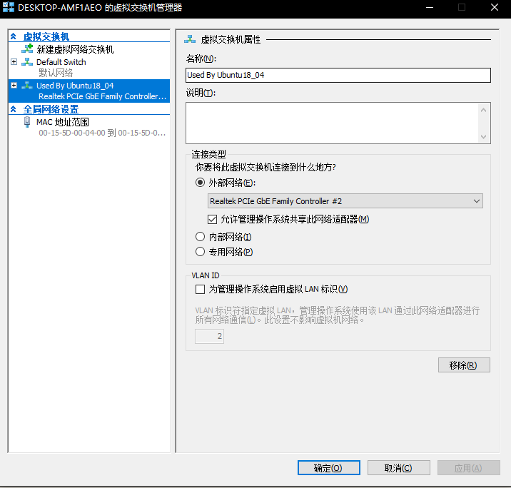

[toc]

# 前言
Win10家庭版中没有，需要单独安装。
Win10专业版：控制面板->程序->启用或关闭Windows功能->Hyper-V，选中后打勾重启即可。

# Hyper-V安装Ubuntu18.04
1. 下载镜像[http://releases.ubuntu.com/](http://releases.ubuntu.com/)
2. 在Hyper-V中新建虚拟机，虚拟机的代数选择第1代；连接虚拟硬盘中选择使用现有虚拟硬盘，位置选择为下载的镜像；其余选项默认选择即可。
## 处理器资源控制

1. 虚拟处理器的数量：使用的物理核个数。
2. 虚拟机保留：是指物理机应该为这台虚拟机保留多少的CPU资源，如果你为这台CPU分配了2个CPU核心，每核心都全部保留即100%，那就相当于物理机把2核心的CPU资源全部保留给这台虚拟机，总共占自己50%的CPU资源。虚拟机保留适用于比较重要的虚拟机，不管总资源怎么分配，先给他保留一定的资源。例如：虚拟处理器的数量为16个，并且虚拟机保留（百分比）为100%，则相当于效率使用1600%，占总系统资源的百分比为1600% / 3200 % = 50%。
3. 虚拟机限制：如果一台虚拟机上运行的程序随着任务的运行，不断地要增加CPU资源，如果不加入限制，就会把物理机上所有的CPU资源都要过来，其他虚拟机无法正常运行，数值百分比上虚拟机保留一样的原理。虚拟机保留的值一样不能大于虚拟机限制的值。例如：虚拟机限制为50%，则该虚拟机可以使用的硬件CPU最高资源是50%，虽然虚拟机提示CPU利用率接近100%。
4. 详细内容：[Hyper-V 3 限定虚拟机可用的CPU利用率](https://blog.51cto.com/wangshujiang/936269)
5. 实现所有CPU利用率达100%：for i in \`seq 1 $(cat /proc/cpuinfo |grep "physical id" |wc -l)\`; do dd if=/dev/zero of=/dev/null & done；批量删除任务：for i in \`seq 29814 29829\`;dokill -9 $i;done。
   - cat /proc/cpuinfo |grep "physical id" | wc -l 可以获得CPU的个数,　我们将其表示为N。
   - seq 1 N 用来生成１到Ｎ之间的数字
   - for i in \`seq 1 N\`; 就是循环执行命令,从１到Ｎ
   - dd if=/dev/zero of=/dev/null 执行dd命令,　输出到/dev/null, 实际上只占用CPU,　没有IO操作.
   - 由于连续执行Ｎ个(Ｎ是CPU个数)的dd 命令, 且使用率为100%,这时调度器会调度每个dd命令在不同的CPU上处理。
## 虚拟机管理器
### 外部
创建一个绑定到物理网络适配器的虚拟交换机，以便虚拟机可以访问物理网络。

### 内部
创建一个虚拟交换机。该交换机只能由此物理计算机上运行的虚拟机使用:或者只能用于虚拟机与物理计算机之间的连接。丙部虚拟茭换机不提供与物理网络之间的连接。
==默认网络交换机将自动使用NAT(网络地址转换)向虚拟机提供计算机网络的访问故限。 #F44336==

### 专用
创建一个只能由此物理计算机上运行的虚拟机使用的虚拟交换机。