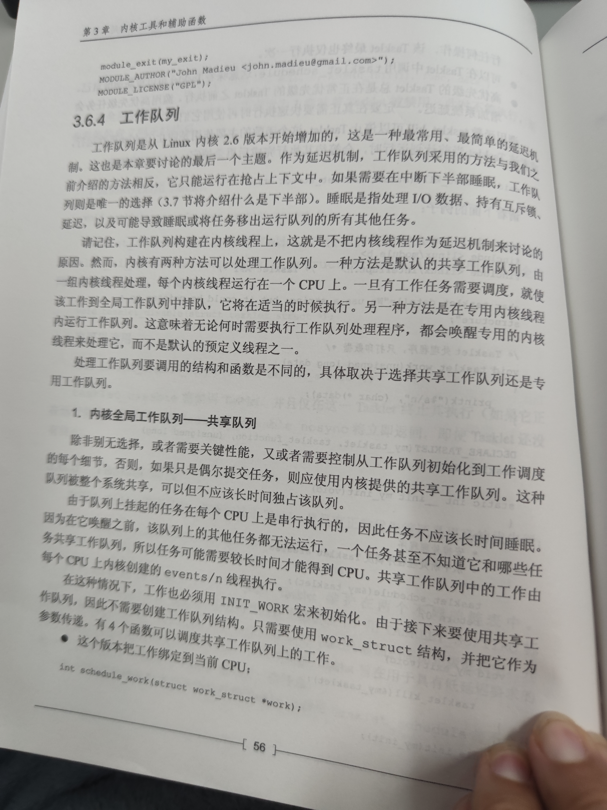
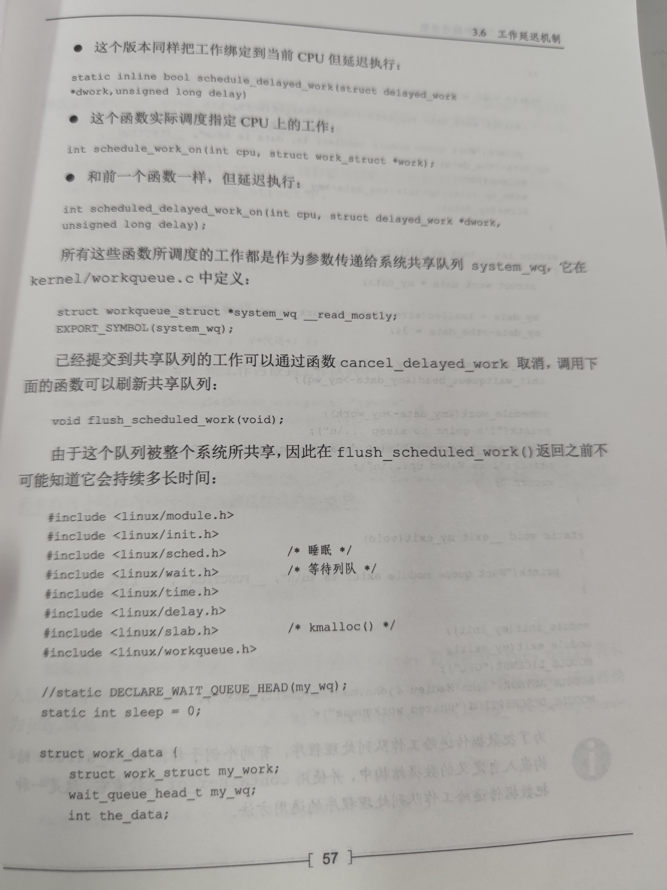
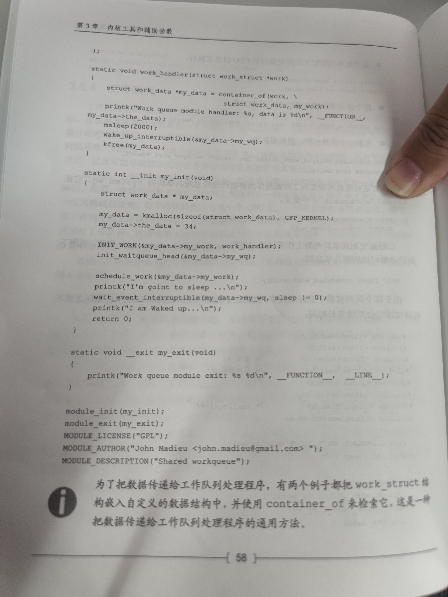
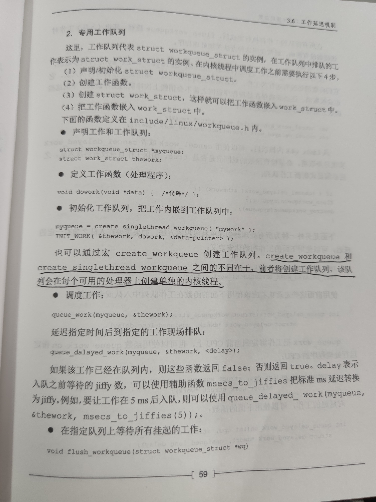
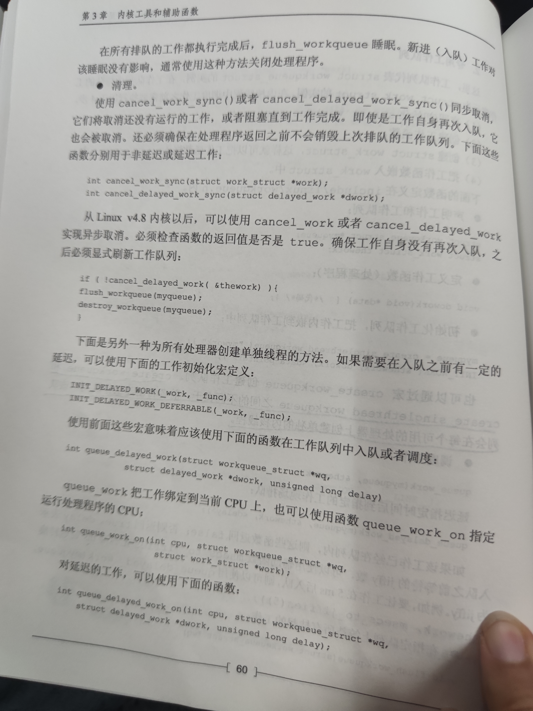
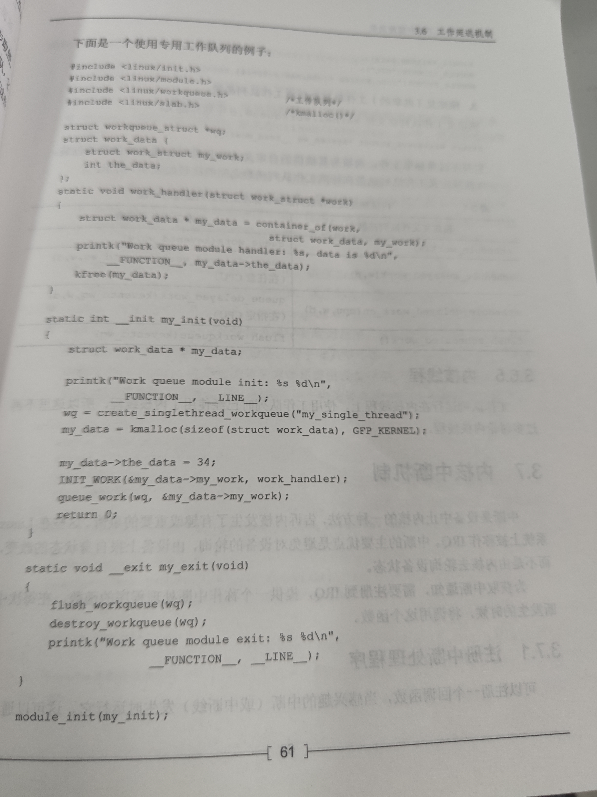
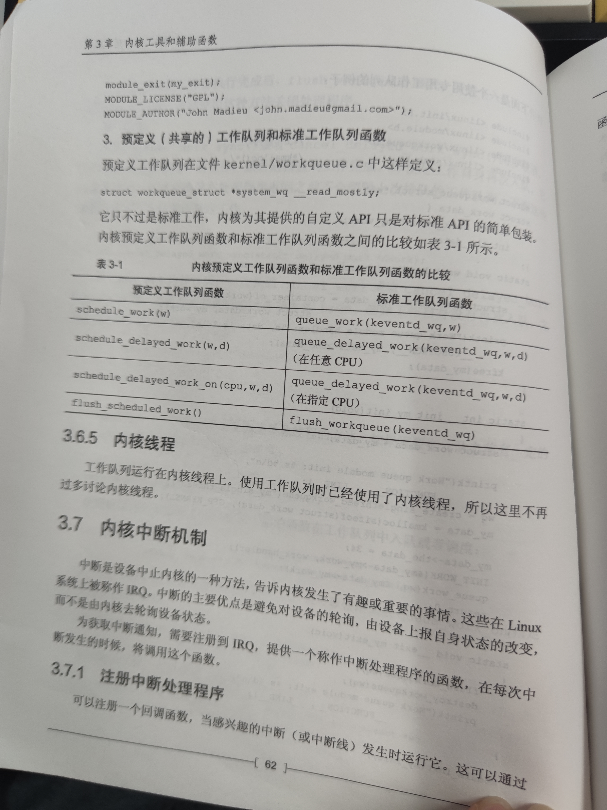

[toc]
# 1 工作延迟机制



 
 
 
 
 
 
 
 
 
 
 
 
 # create_workqueue和create_singlethread_workqueue 的使用和区别
 
Linux中的Workqueue机制就是为了简化内核线程的创建。通过调用workqueue的接口就能创建内核线程。并且可以根据当前系统CPU的个数创建线程的数量，使得线程处理的事务能够并行化。workqueue是内核中实现简单而有效的机制，他显然简化了内核daemon的创建，方便了用户的编程， Workqueue机制的实现Workqueue机制中定义了两个重要的数据结构，分析如下：

1、cpu_workqueue_struct结构
该结构将CPU和内核线程进行了绑定。在创建workqueue的过程中，Linux根据当前系统CPU的个数创建cpu_workqueue_struct。在该结构主要维护了一个任务队列，以及内核线程需要睡眠的等待队列，另外还维护了一个任务上下文，即task_struct。

2、work_struct结构是对任务的抽象。
在该结构中需要维护具体的任务方法，需要处理的数据，以及任务处理的时间。

``` c?linenums
struct work_struct {
	unsigned long pending;
	struct list_head entry;
	void (*func)(void *);
	void *data; 
	void *wq_data;  
	strut timer_list timer; 
};  
```

当用户调用workqueue的初始化接口create_workqueue或者create_singlethread_workqueue对workqueue队列进行初始化时，内核就开始为用户分配一个workqueue对象，并且将其链到一个全局的workqueue队列中。然后Linux根据当前CPU的情况，为workqueue对象分配与CPU个数相同的cpu_workqueue_struct对象，每个cpu_workqueue_struct对象都会存在一条任务队列。紧接着，Linux为每个cpu_workqueue_struct对象分配一个内核thread，即内核daemon去处理每个队列中的任务。至此，用户调用初始化接口将workqueue初始化完毕，返回workqueue的指针。

在初始化workqueue过程中，内核需要初始化内核线程，注册的内核线程工作比较简单，就是不断的扫描对应cpu_workqueue_struct中的任务队列，从中获取一个有效任务，然后执行该任务。所以如果任务队列为空，那么内核daemon就在cpu_workqueue_struct中的等待队列上睡眠，直到有人唤醒daemon去处理任务队列。

Workqueue初始化完毕之后，将任务运行的上下文环境构建起来了，但是具体还没有可执行的任务，所以，需要定义具体的work_struct对象。然后将work_struct加入到任务队列中，Linux会唤醒daemon去处理任务。

上述描述的workqueue内核实现原理可以描述如下：在Workqueue机制中，提供了一个系统默认的workqueue队列——keventd_wq，这个队列是Linux系统在初始化的时候就创建的。用户可以直接初始化一个work_struct对象，然后在该队列中进行调度，使用更加方便。

## 2.2 Workqueue编程接口序号接口函数说明

1. create_workqueue 用于创建一个workqueue队列，为系统中的每个CPU都创建一个内核线程。输入参数：@name：workqueue的名称
2.  create_singlethread_workqueue 用于创建workqueue，只创建一个内核线程。输入参数：@name：workqueue名称
  
**区别：使用create_singlethread_workqueue创建工作队列即使对于多CPU系统，内核也只负责在一个cpu上创建一个worker_thread内核线程；而使用create_workqueue创建工作队列对于多CPU系统，内核将会在每个CPU上创建一个worker_thread内核线程，使得线程处理的事务能够并行化.**

3.  destroy_workqueue 释放workqueue队列。输入参数：@ workqueue_struct：需要释放的workqueue队列指针
4.  schedule_work 调度执行一个具体的任务，执行的任务将会被挂入Linux系统提供的workqueue——keventd_wq输入参数：@ work_struct：具体任务对象指针
5.  schedule_delayed_work 延迟一定时间去执行一个具体的任务，功能与schedule_work类似，多了一个延迟时间，输入参数：@work_struct：具体任务对象指针@delay：延迟时间
6.  queue_work 调度执行一个指定workqueue中的任务。输入参数：@ workqueue_struct：指定的workqueue指针@work_struct：具体任务对象指针
7.  queue_delayed_work 延迟调度执行一个指定workqueue中的任务，功能与queue_work类似，输入参数多了一个delay。