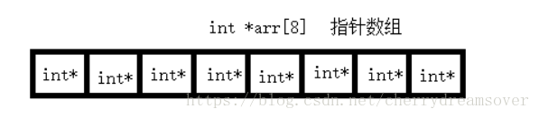
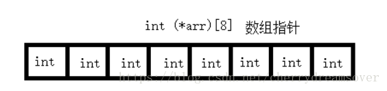

# 指针数组 与 数组指针

## 指针数组

指针数组：它实际上是一个数组，数组的每个元素存放的是一个指针类型的元素。

 - int* arr[8];
 - 优先级问题：[]的优先级比*高
 - 说明arr是一个数组，而int*是数组里面的内容
 - 这句话的意思就是：arr是一个含有8和int*的数组

## 数组指针
数组指针：它实际上是一个指针，该指针指向一个数组。

 - int (*arr)[8];
 - 由于[]的优先级比*高，因此在写数组指针的时候必须将*arr用括号括起来
 - arr先和*结合，说明p是一个指针变量
 - 这句话的意思就是：指针arr指向一个大小为8个整型的数组。

