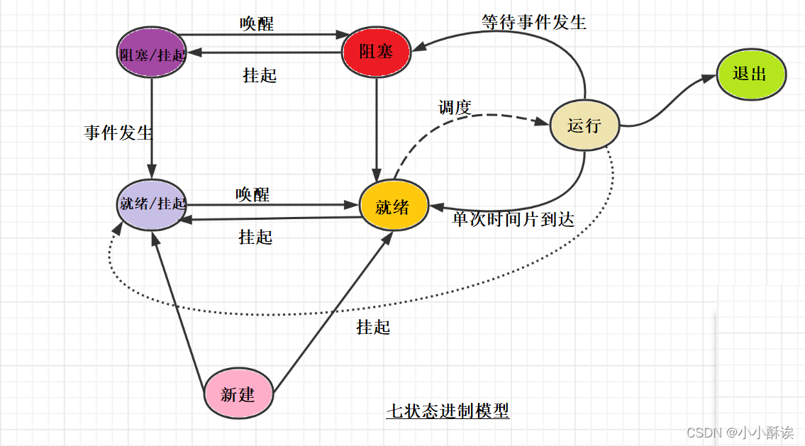

[toc]

# 调度算法和操作系统关系
## 交互式系统
 适合的调度算法：先来先服务、高优先级优先、有多级反馈队列、时间片轮转。
 调度算法目的：较快的响应时间、较均衡的性能。
 ## 批处理系统
 特点：批量处理用户作业、系统资源利用率高、作业吐率高。
 适合的调度算法：先来先服务、高优先级优先、高响应比优先。
 调度算法目的：较短的周转时间、较高的CPU利用率、较大吞吐。
 ## 实时操作系统
调度算法目的：满足截至时间的要求、满足高可靠性要求。
特点：具有较高的可靠性、在严格的时间范围内，实时响应用户的请求、具有较好的过载保护能力。
## 分时操作系统
特点：多个用户在线同时使用计算机、便于调试程序、能够对用户输入的信息及时响应、用户使用计算机时感觉不到计算机同时在为别人服务。
## 分布式操作系统
特点（全选）：系统内所有主机使用同一个操作系统、 系统内资源深度共享、用户无需了解系统内本地主机或异地主机的差异，具有透明性、系统内各主机处于同等地位，不分主次、系统具有较高的可靠性。

# LINUX操作系统
## 进程块数据结构组织方式
线性、索引、链接。
## 进程控制块
进程控制块分为调度信息和现场信息，现场信息为：程序状态字，时钟和界地址寄存器；调度信息：进程名、进程号、存储信息、优先级、当前状态、资源清单、“家族”关系、消息队列指针。
## 进程状态
Linx操作系统，进程有多种状态：运行或就绪状态、休眠状态、睡眠状态、空闲状态、僵尸状态、跟踪状态等。

## 进程状态切换

## 进程的原语
进程控制的源语一般有:创建进程、撤销进程、挂起进程、激活进程、阻塞进程、唤醒进程以及改变进程优先级等。  
## 进程队列
通常系统中的队列分成如下三类:就绪队列、等待队列和运行队列。