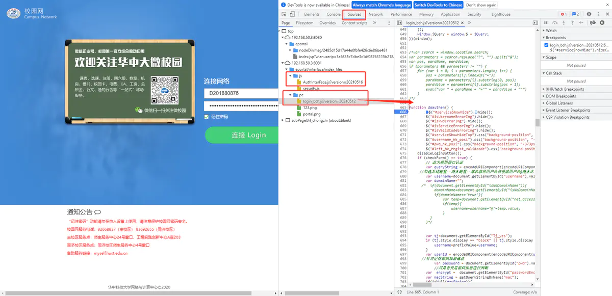
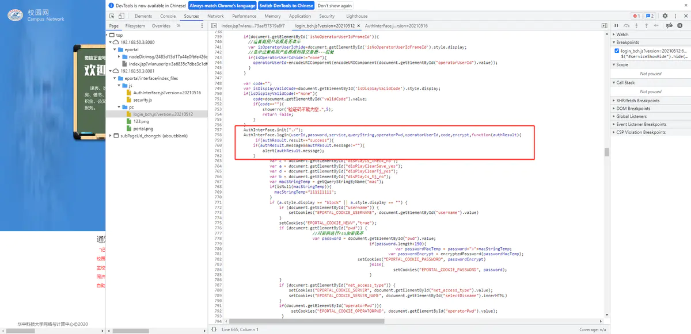
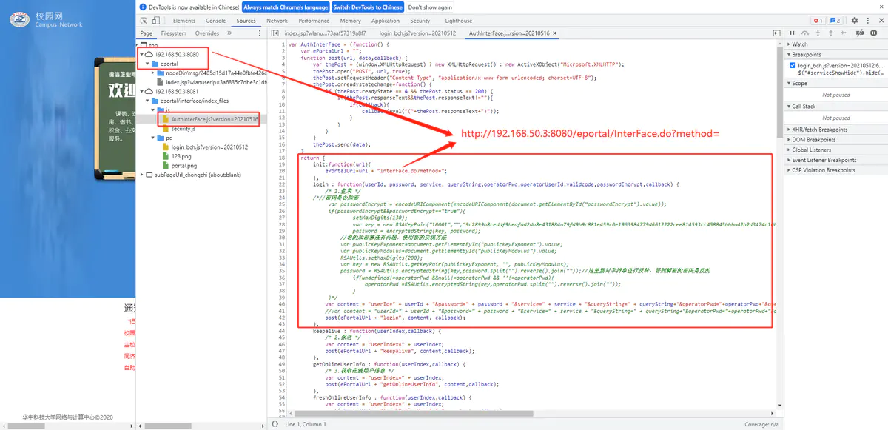
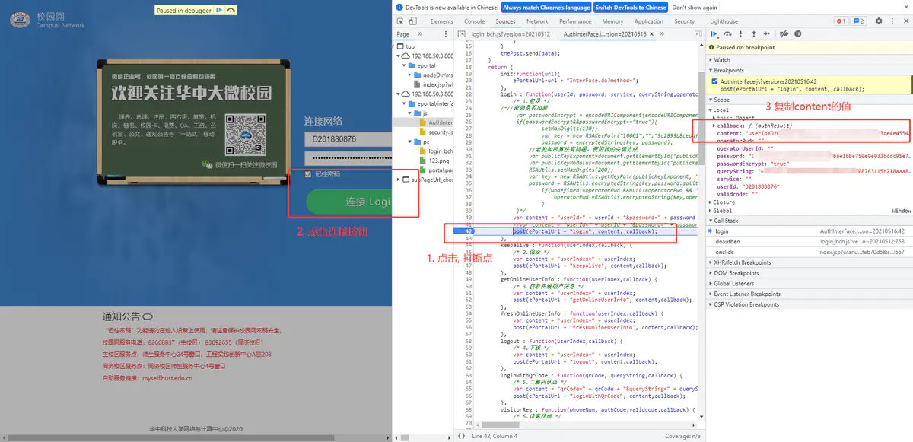
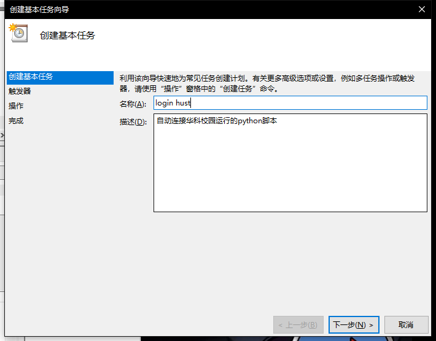
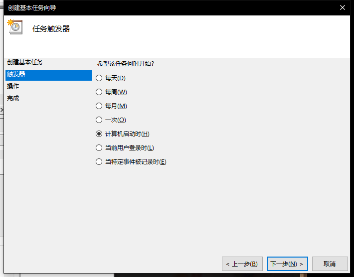
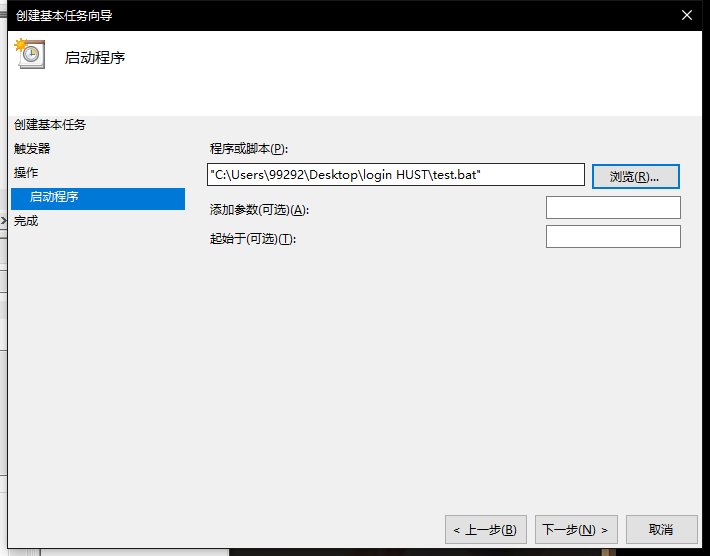
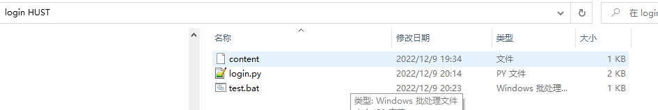

# 源码及分析
每个5秒检查自己还能不能上网, 方式就是ping 8.8.8.8, 这是很常见的方法。如果不能上网, 那么就调用login()函数来自动重连。

我们的校园网认证的过程,本质上就是提交一个HTTP请求, 那我们的login()函数, 其实就是实现了这个过程, 因此我们只需要知道,我们的网页端认证是怎么操作的即可,麻烦的是华科的校园网的代码设计的还是很复杂的,所以还是稍微的耗费了一点时间.

``` py?linenums
import time
import json

from scapy.layers.inet import IP, ICMP
from scapy.packet import Raw
from scapy.sendrecv import sr1

import requests

def login():
    url = 'http://192.168.50.3:8080/eportal/InterFace.do?method=login'
    with open("content", "r") as f:
        data = f.read()
    header = {
        "Content-Type": "application/x-www-form-urlencoded; charset=UTF-8"
    }
    response = requests.post(url, data, headers=header)
    content = json.loads(response.text)
    encoding = response.encoding
    if content['result'] == 'fail':
        print(content['message'].encode(encoding).decode('utf-8'))
    else:
        print("login at --> " + time.asctime(time.localtime(time.time())))
    return

def pong():
    ping_pkt = IP(dst="8.8.8.8") / ICMP() / b'welcome!'
    ping_result = sr1(ping_pkt, timeout=2, verbose=False)
    try:
        if ping_result.getlayer(ICMP).fields['type'] == 0 \
                and ping_result.getlayer(Raw).fields['load'] == b'welcome!':
            return True
        else:
            return False
    except Exception:
        return False

if __name__ == '__main__':
    while True:
        if pong():
            time.sleep(5)
        else:
            login()
            time.sleep(10)
```

# 校园网认证流程
首先我们进入这个[认证的页面](http://192.168.50.3:8080/), 按F12进入开发者模式。会在Source中看到两个重要的JS文件,当我们点击网页中的连接Login的时候就会调用这个函数。


这个函数会收集你的一系列信息,并最终调用:`AuthInterFace.login`


`AuthInterFace`定义在`AuthInterFace.js`中。其中`init()`用于生成请求的url, `login()`首先将传入的参数合并成`content`,最后通过post方法发送请求。


因此需要我们做的就是, 获取`content`的内容, 然后我们就可以用python对指定的url发起post请求。获取`content`的方法也很简单, 只需要在如图位置打上断点, 然后点击网页中连接的按钮,当js执行到断点后,就可以复制`content`的值



# 使用
1. git clone https://github.com/Kingdo777/auto-connect-school-network.git
2. 我们将上一过程获取到的content信息存放到main.py的同目录下的名为content的文件中
3. 然后就可以执行python脚本了
4. 不过windows下需要安装npcap, 可以点击以下链接下载安装：https://nmap.org/npcap/dist/npcap-1.60.exe

# 电脑重启自动运行py脚本
首先在Python脚本文件夹下，创建test.bat批处理文件，其内如如下所示。
``` bat?linenums
cd C:\Users\99292\Desktop\login HUST
python login.py
```



触发器这里选择是计算机启动时。


在浏览中选择


# 后记
1. 如果切换了Wifi, 导致IP地址改变, 那么需要重新获取content的值.

# 运行脚本时遇到的问题
## ModuleNotFoundError: No module named 'scapy'

``` python?linenums
pip install scapy -i http://pypi.douban.com/simple/ --trusted-host pypi.douban.com
```

# 最终文件
login.py会调用content的内容进行登录华科校园网，需要注意一点content里面的内容会由于你IP的变化而变化，因此当IP改变时，要重新修改content的内容。

test.bat时批处理脚本，用处在于电脑重启时，会调用此脚本，连接华科校园网。

