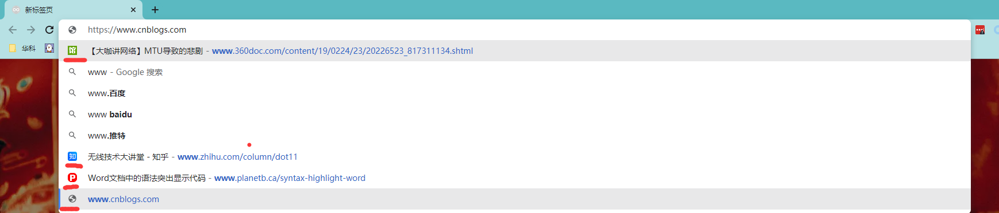

# 本地浏览记录删除

打开Chrome,选择历史记录，清除浏览数据即可。使用RevoUPPort.exe的工具，选择历史清理，清楚所有即可。

# 云端浏览记录删除
[我的 Google 活动记录](myactivity.google.com)，点击左侧栏的选择性删除活动记录，选择所有时间即可。
[Chrome 历史记录](https://myactivity.google.com/page?utm_source=my-activity&hl=zh_CN&page=chrome)，点击左侧栏的全部删除，点击删除即可。

# 其他浏览记录删除

这种提示的网站，应该是你谷歌账户书签栏里面的网站，不想提示，去云端删除即可。