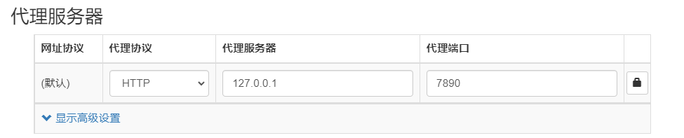

[toc]
# SwitchyOmega：一个代理设置工具
proxy设置：



在运行之前，需要现在软件全局中选择好节点即可。

# Ubuntu挂代理
1. 创建并进入目录： `mkdir clash && cd clash`
2. 下载软件包： `wget https://github.com/Dreamacro/clash/releases/download/v1.7.1/clash-linux-amd64-v1.7.1.gz`
3. 解压软件包： `gzip -dk clash-linux-amd64-v1.7.1.gz`
4. 重命名： `mv clash-linux-amd64-v1.7.1 clash`
5. 给与权限： `chmod +x clash`
6. 载config： `wget -O config.yaml https://xxxxxxxxxx`
7. 运行程序： `./clash -d . &`
8. 切换测试节点网址：`http://clash.razord.top/`
9. 填写系统代理：填写 HTTP 和 HTTPS 代理为 127.0.0.1:7890，填写 Socks 主机为 127.0.0.1:7891，即可启用系统代理，最好默认不要开启。
10. 终端挂载代理：`export http_proxy=http://127.0.0.1:port`
# proxychains4安装与配置
1. 安装proxychains4，`sudo apt-get install proxychains4`
2. 配置proxychains4.conf，`sudo vim /etc/proxychains4.conf`，注释掉最后一行，并在最后一行加上本地的端口`socks5 127.0.0.1 1080`。
# socks安装与配置
``` bash
sudo apt-get install libsodium-dev
sudo apt-get install python3-pip
pip3 install https://github.com/shadowsocks/shadowsocks/archive/master.zip -U
```
1. 安装上面的软件。
2. 创建一个配置文件，`vi shadowsocks.json`。
3. shadowsocks.json内容，如下所示：
	{
    "server":"服务器的ip",
    "server_port":服务器的端口,
    "local_address":"127.0.0.1",
    "local_port":1080,
    "password":"密码",
    "timeout":300,
    "method":"chacha20-ietf",
    "fast_open":false
	}
4. 后台挂载`$HOME/.local/bin/sslocal -c $HOME/SSConfig/shadowsocks.json &`，`proxychains4 wget https://www.google.com --no-cookie --no-check-certificate `查看是否可以访问。
 
5.  Install polipo: `sudo apt-get install polipo`
6.  Populate "/etc/polipo/config" with the following content
	\# This file only needs to list configuration variables that deviate
	\# from the default values. See /usr/share/doc/polipo/examples/config.sample
	\# and "polipo -v" for variables you can tweak and further information.
	logSyslog = false
	logFile = "/var/log/polipo/polipo.log"

	socksParentProxy = "127.0.0.1:1080"
	socksProxyType = socks5

	chunkHighMark = 50331648
	objectHighMark = 16384

	serverMaxSlots = 64
	serverSlots = 16
	serverSlots1 = 32

	proxyAddress = "0.0.0.0"
	
 7. Restart polipo with "/etc/init.d/polipo restart"
 
 8. In firefox browser, setup the HTTP proxy as 127.0.0.1:8123. Remember to tick "Use this proxy server for all protocols" 

# Reference Links
1. [https://github.com/duanjp8617/misc/tree/master/shadowsocks](https://github.com/duanjp8617/misc/tree/master/shadowsocks)
2. [Linux安装配置Shadowsocks客户端及开机自动启动](https://blog.huihut.com/2017/08/25/LinuxInstallConfigShadowsocksClient/)
 