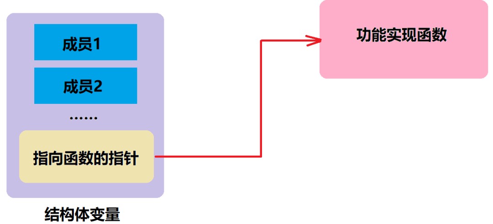
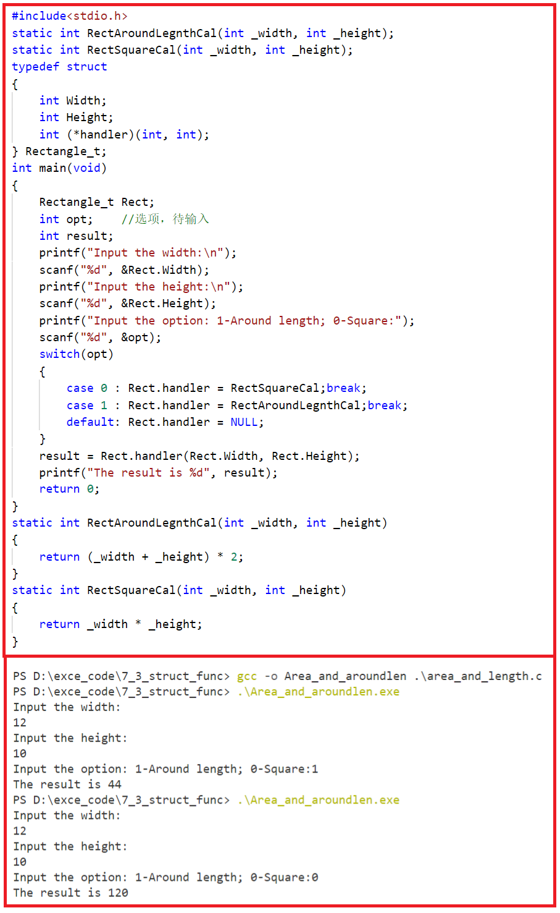

# 结构体函数成员于回调函数
1. 在C语言结构体内部定义一个指向函数的指针；
2. 在具体“对象”初始化的时候，将结构体中的指向函数的指针指向具体实现功能的函数;
3. 在这个函数需要调用时进行调用

通过指向函数的指针指向具体的实现函数，后面再来统一调用，这种方式就是我们在C语言里面常说的回调函数。回调函数的应用有很多，比如当我们在做单片机中断的时候，就可以将单片机中断处理函数写成一个指向函数的指针，在每次单片机程序初始化的时候，将中断里面的函数指针指向具体的中断处理函数，等到中断产生的时候，单片机就可以去调用这个指向函数的指针了。而在程序运行的时候，我们也可以随时去修改这个指向函数的指针指向的对象，使程序更加灵活。

