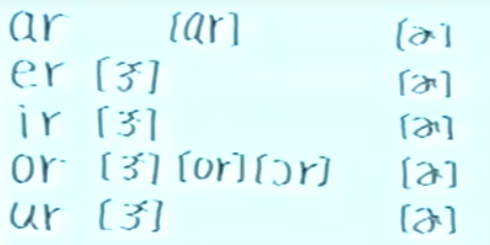

# 音标学习
学习链接：[这个老师的音标课真有意思](https://www.bilibili.com/video/BV1Vb4y1679U/?spm_id_from=333.337.search-card.all.click&vd_source=85143ebef149f78ad6d9c01fb85eb64b)

音标分为元音（母音）和辅音（子音），。

``` javascript
AA	唉唉
BB	卜卜
CC	渴渴
DD	得得
EE	诶诶
FF	扶扶
GG	隔隔
HH	喝喝
II	衣衣
JJ	锯锯
KK	渴渴
LL	前：勒勒 LL 后：嗷嗷
MM	前：么么 MM 后：恩恩（鼻音）
NN	前：呢呢 NN 后：嗯嗯
OO	啊啊（全开嘴巴）
PP	泼泼 
QQ	扩扩
RR	前：若若 RR 后：耳耳
SS	丝丝
TT	特特
UU	啊啊（半开嘴巴）
VV	呜呜（门牙轻咬嘴唇）
WW	巫巫（不咬嘴唇，嘟嘴巴）
XX	咳死咳死
YY	耶耶
ZZ	日日
--------------------

1、字母e在单次最后面不发音，前面母音字母发本身的音
2、元音紧挨R重音（第一次）处：尔 其余位置发：耳 （都是四声且卷舌，但前面重读后面轻读）

AEIOU不发音
OO相连 一般都是读〔U午〕 〔u雾〕


au ou
aw ow 相连 〔aU嗷~〕
th 相连 咬住舌尖不发出音 子~ 日~
ch相连 取~
sh相连 嘘~
ph相连 符~
ng相连在尾巴 嗯~ 有时候都发 嗯割~
nk相连 嗯克
```

其中字母a与e的区别在：【这个老师的音标课真有意思】 【精准空降到 15:23】 https://www.bilibili.com/video/BV1Vb4y1679U/?share_source=copy_web&vd_source=5c5012f1734fd37cda49b293ef1a1a1e&t=923


