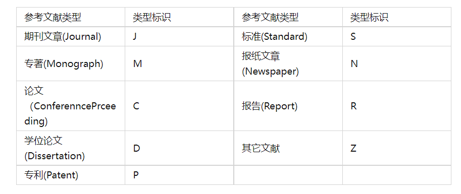

# 论文文献
1. Thumb定律指出，对于传统基于软件方式的网络协议处理，CPU每处理1bit网络数据，将消耗1Hz的处理能力。因此，对10Gbit／s以太网数据的全双工处理，将消耗20GHz的CPU处理资源 ，这是当前主流企业级服务器都很难具备的硬件配置。

>Wang W F，Wang J Y，“JJ．Study on Enhanced Strategies for TCP／IP Offload Engines[c]／／International Conference on Parallel and Distributed Systems，2005．Proceedings．IEEE Xplore，2005
2. 多核处理器技术被广泛的应用来提高网络系统的处理性能。由于处理器设计和工艺等因素的限制，单纯提升处理器主频已经难以满足日益增长的性能需求，还会导致功耗和制造成本的增加。
>奇文，张武，曾学文，等．基于多核处理器的TCP／IP协议栈加速技术[J]．网络新媒体技术，2013，2(1)：58—64
[4]Guenter B，Jain N，Williams C．Managing cost，performance，and reliability tradeoffs for energy—aware server provisioning[C]／／INFOCOM，201 1 Proceedings IEEE．IEEE，201 1

# 参考文献引用
[参考文献格式生成器](http://www.youkud.com/tool/referance/index.html)

# 多链路优化方向
1. [网卡多队列原理及学习](https://blog.csdn.net/linggang_123/article/details/113186750)
2.[深入理解Linux网络之网络性能优化建议](https://blog.csdn.net/QTM_Gitee/article/details/125229447)
 