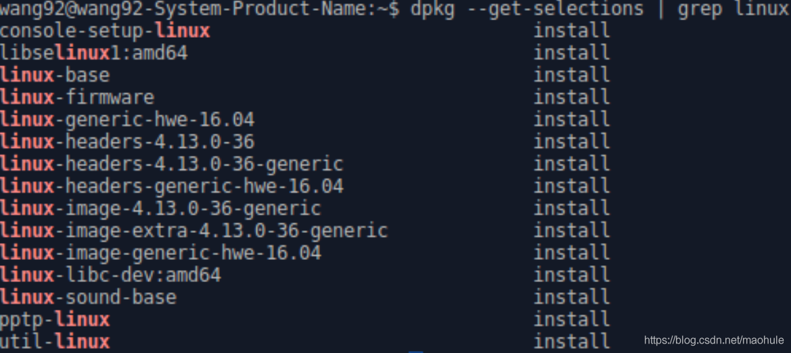
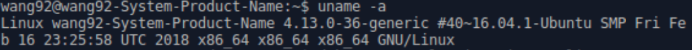
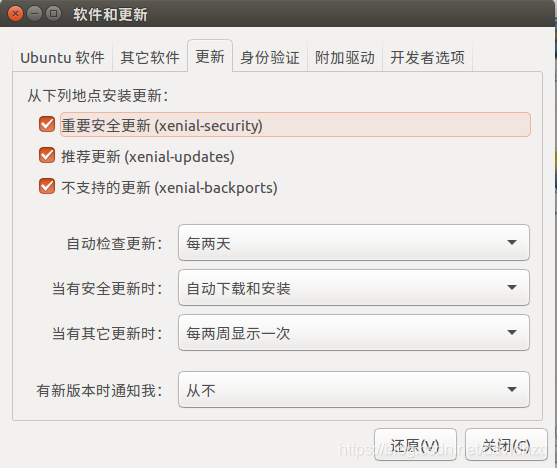
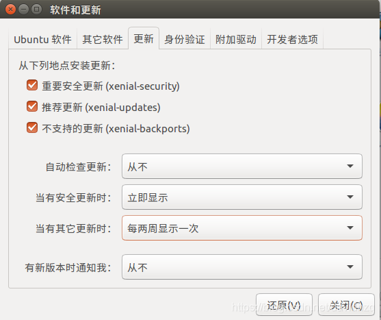
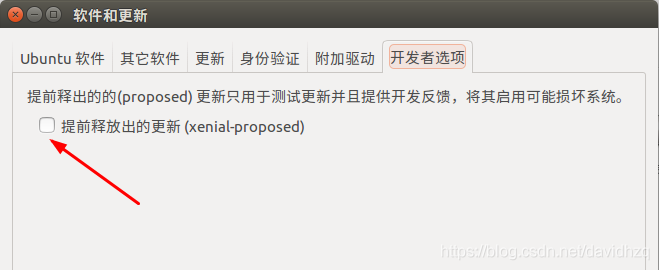

1.查看自己电脑的内核

``` vim
dpkg --get-selections | grep linux
```


查看正在使用的内核

``` vim
uname -a
```
得到如下信息：


禁止更新内核：

``` apache
sudo apt-mark hold linux-image-4.13.0-36-generic
sudo apt-mark hold linux-image-extra-4.13.0-36-generic
sudo apt-mark hold linux-headers-4.13.0-36-generic
```

如果需要恢复原来的设定的话即允许更新内核，执行如下命令即可:

``` apache
sudo apt-mark unhold linux-image-4.13.0-36-generic
sudo apt-mark unhold linux-image-extra-4.13.0-36-generic
sudo apt-mark unhold linux-headers-4.13.0-36-generic
```

检查设置是否生效。如下所示，则设置成功。

``` subunit
$ dpkg --get-selections | grep hold
linux-headers-4.15.0-142			    hold
linux-headers-4.15.0-142-generic		hold
linux-image-4.15.0-142-generic			hold
linux-modules-4.15.0-142-generic		hold
linux-modules-extra-4.15.0-142-generic  hold
```

如果哪天需要使用最新的内核， 则需要取消内核的hold状态。然后更新即可。

``` apache
sudo apt-mark unhold linux-headers-4.15.0-142 \
linux-headers-4.15.0-142-generic \
linux-modules-4.15.0-142-generic \
linux-modules-extra-4.15.0-142-generic \
linux-image-4.15.0-142-generic
```


2.打开“Software & Updates（软件和更新）

原来内容为



修改为：



还有，无论是自动更新还是手工更新，一般情况下不建议安装“提前释放出的更新”，参考如下，这种更新一般非常不稳定，仅供试验之用



3.基于命令行修改配置文件

（1）输入：

``` gradle
sudo gedit /etc/apt/apt.conf.d/10periodic
```

如果要禁止自动更新配置文件设为如下：

``` ruby
APT::Periodic::Update-Package-Lists "0";
APT::Periodic::Download-Upgradeable-Packages "0";
APT::Periodic::AutocleanInterval "0";
APT::Periodic::Unattended-Upgrade "0";
```

如果要打开自动更新配置文件设为如下：

``` ruby
APT::Periodic::Update-Package-Lists "2";
APT::Periodic::Download-Upgradeable-Packages "1";
APT::Periodic::AutocleanInterval "0";
APT::Periodic::Unattended-Upgrade "1";
```

保存退出。

（2）输入：

``` gradle
sudo gedit /etc/apt/apt.conf.d/20auto-upgrades
```

如果要禁止自动更新配置文件设为如下：

``` ruby
APT::Periodic::Update-Package-Lists "0";
APT::Periodic::Download-Upgradeable-Packages "0";
APT::Periodic::AutocleanInterval "0";
APT::Periodic::Unattended-Upgrade "0";
```

如果要打开自动更新配置文件设为如下：

``` ruby
APT::Periodic::Update-Package-Lists "2";
APT::Periodic::Download-Upgradeable-Packages "1";
APT::Periodic::AutocleanInterval "0";
APT::Periodic::Unattended-Upgrade "1";
```

保存退出。

两个文件都要修改，直接修改配置文件可能需要重启。
输入：reboot
